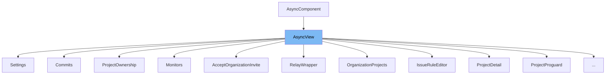

This document will cover the `AsyncView` class in the Sentry repository. We'll cover:

1. What is `AsyncView`
2. Variables and functions in `AsyncView`
3. Usage example of `AsyncView`

# What is AsyncView

`AsyncView` is a class that extends `AsyncComponent`. It is used as a base for other components that need to fetch data asynchronously when they are mounted. It provides a structure for handling loading and error states, and it also sets the document title.

&nbsp;

*This is an auto-generated document by Swimm AI 🌊 and has not yet been verified by a human*

<SwmMeta version="3.0.0" repo-id="Z2l0aHViJTNBJTNBZGVtby1zZW50cnklM0ElM0Fzd2ltbWlv" repo-name="demo-sentry">Powered by [Swimm](/)</SwmMeta>
