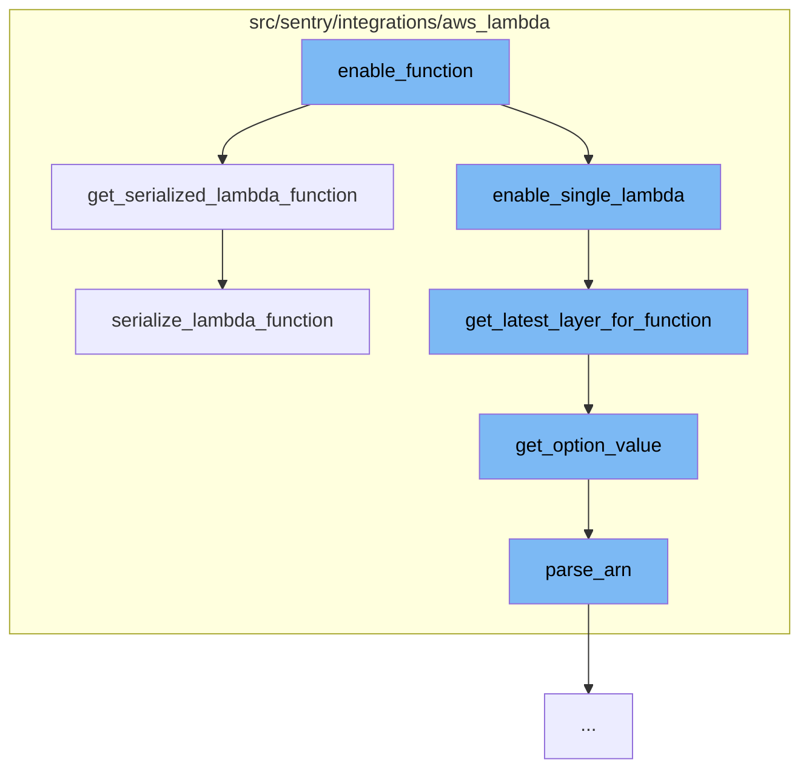

This document will cover the process of enabling a function in the AWS Lambda integration, which includes:

1. Getting a serialized version of the Lambda function
2. Enabling a single Lambda function
3. Getting the latest layer for the function
4. Parsing the Amazon Resource Name (ARN) of the function
5. Serializing the Lambda function



<SwmSnippet path="/src/sentry/integrations/aws_lambda/integration.py" line="88">

---

# Getting a serialized version of the Lambda function

The `get_serialized_lambda_function` function retrieves a specific Lambda function and returns a serialized version of it. This is the first step in the process of enabling a function in the AWS Lambda integration.

```python
    def get_serialized_lambda_function(self, name):
        function = self.get_one_lambda_function(name)
        return self.serialize_lambda_function(function)
```

---

</SwmSnippet>

<SwmSnippet path="/src/sentry/integrations/aws_lambda/utils.py" line="148">

---

# Enabling a single Lambda function

The `enable_single_lambda` function calls the `get_latest_layer_for_function` function to get the latest layer for the function. This is necessary to ensure that the function is using the most up-to-date version of the layer.

```python
def get_latest_layer_for_function(function):
    region = parse_arn(function["FunctionArn"])["region"]
    return "arn:aws:lambda:{}:{}:layer:{}:{}".format(
        region,
        get_option_value(function, OPTION_ACCOUNT_NUMBER),
        get_option_value(function, OPTION_LAYER_NAME),
        get_option_value(function, OPTION_VERSION),
    )
```

---

</SwmSnippet>

<SwmSnippet path="/src/sentry/integrations/aws_lambda/utils.py" line="80">

---

# Getting the latest layer for the function

The `get_option_value` function is used to retrieve specific options for the function, such as the account number, layer name, and version. This information is used to construct the ARN for the latest layer.

```python
def get_option_value(function, option):
    region = parse_arn(function["FunctionArn"])["region"]
    runtime = function["Runtime"]

    # currently only supporting node runtimes
    if runtime.startswith("nodejs"):
        prefix = "node"
    elif runtime.startswith("python"):
        prefix = "python"
    else:
        raise Exception("Unsupported runtime")

    # account number doesn't depend on the runtime prefix
    if option == OPTION_ACCOUNT_NUMBER:
        option_field = "aws-lambda.account-number"
    else:
        option_field = f"aws-lambda.{prefix}.{option}"

    # if we don't have the settings set, read from our options
    if not settings.SENTRY_RELEASE_REGISTRY_BASEURL:
        return options.get(option_field)
```

---

</SwmSnippet>

<SwmSnippet path="/src/sentry/integrations/aws_lambda/utils.py" line="60">

---

# Parsing the Amazon Resource Name (ARN) of the function

The `parse_arn` function is used to parse the ARN of the function. This is necessary to extract information such as the region, account, and resource, which are used in other parts of the process.

```python
# Taken from: https://gist.github.com/gene1wood/5299969edc4ef21d8efcfea52158dd40
def parse_arn(arn):
    # http://docs.aws.amazon.com/general/latest/gr/aws-arns-and-namespaces.html
    elements = arn.split(":", 5)
    result = {
        "arn": elements[0],
        "partition": elements[1],
        "service": elements[2],
        "region": elements[3],
        "account": elements[4],
        "resource": elements[5],
        "resource_type": None,
    }
    if "/" in result["resource"]:
        result["resource_type"], result["resource"] = result["resource"].split("/", 1)
    elif ":" in result["resource"]:
        result["resource_type"], result["resource"] = result["resource"].split(":", 1)
    return result
```

---

</SwmSnippet>

<SwmSnippet path="/src/sentry/integrations/aws_lambda/integration.py" line="92">

---

# Serializing the Lambda function

The `serialize_lambda_function` function is used to serialize the Lambda function. This includes getting the function's layer ARNs, determining if the function's layer is out of date, and returning a dictionary with information about the function.

```python
    def serialize_lambda_function(self, function):
        layers = get_function_layer_arns(function)
        layer_arn = get_latest_layer_for_function(function)
        function_runtime = function["Runtime"]

        # find our sentry layer
        sentry_layer_index = get_index_of_sentry_layer(layers, layer_arn)

        if sentry_layer_index > -1:
            sentry_layer = layers[sentry_layer_index]

            # determine the version and if it's out of date
            latest_version = get_latest_layer_version(function)
            current_version = get_version_of_arn(sentry_layer)
            out_of_date = latest_version > current_version

            if function_runtime.startswith("python"):
                # If env variable "SENTRY_INITIAL_HANDLER" is not present, then
                # it is should be assumed that this function is not enabled!
                env_variables = function.get("Environment", {}).get("Variables", {})
                if "SENTRY_INITIAL_HANDLER" not in env_variables:
```

---

</SwmSnippet>

&nbsp;

*This is an auto-generated document by Swimm AI 🌊 and has not yet been verified by a human*

<SwmMeta version="3.0.0" repo-id="Z2l0aHViJTNBJTNBZGVtby1zZW50cnklM0ElM0Fzd2ltbWlv" repo-name="demo-sentry"><sup>Powered by [Swimm](/)</sup></SwmMeta>
