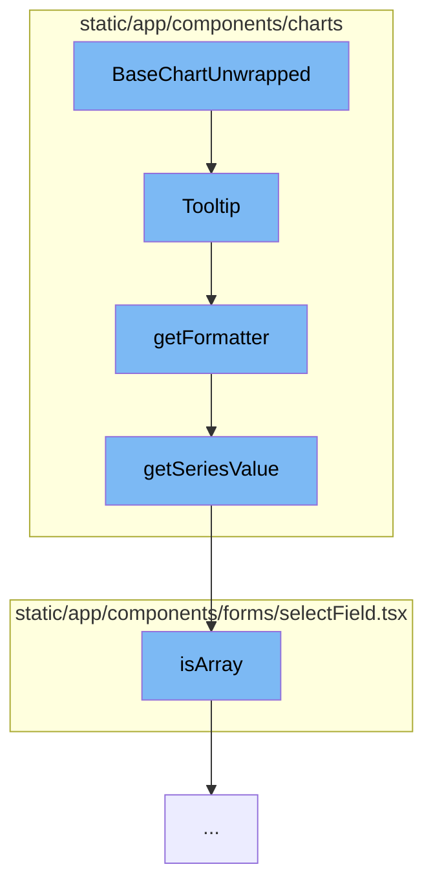

This document will cover the process of rendering a chart in the Sentry application, which includes:

1. Initializing the BaseChartUnwrapped component
2. Configuring the Tooltip component
3. Formatting the tooltip content
4. Checking if the data is an array.



<SwmSnippet path="/static/app/components/charts/baseChart.tsx" line="1">

---

# Initializing the BaseChartUnwrapped component

The `BaseChartUnwrapped` component is the starting point of the chart rendering process. It sets up the basic structure and properties of the chart.

```tsx
import 'echarts/lib/component/grid';
import 'echarts/lib/component/graphic';
import 'echarts/lib/component/toolbox';
import 'zrender/lib/svg/svg';

import {forwardRef, useMemo} from 'react';
import {useTheme} from '@emotion/react';
import styled from '@emotion/styled';
import type {
  AxisPointerComponentOption,
  ECharts,
  EChartsOption,
  GridComponentOption,
  LegendComponentOption,
  LineSeriesOption,
  SeriesOption,
  TooltipComponentFormatterCallback,
  TooltipComponentFormatterCallbackParams,
  TooltipComponentOption,
  VisualMapComponentOption,
  XAXisComponentOption,
```

---

</SwmSnippet>

<SwmSnippet path="/static/app/components/charts/components/tooltip.tsx" line="237">

---

# Configuring the Tooltip component

The `Tooltip` function is called by `BaseChartUnwrapped`. It sets up the tooltip that appears when hovering over data points in the chart. It uses the `getFormatter` function to format the tooltip content.

```tsx
export default function Tooltip({
  filter,
  isGroupedByDate,
  showTimeInTooltip,
  addSecondsToTimeFormat,
  formatter,
  truncate,
  utc,
  bucketSize,
  formatAxisLabel,
  valueFormatter,
  nameFormatter,
  markerFormatter,
  hideDelay,
  indentLabels,
  ...props
}: Props = {}): TooltipComponentOption {
  const theme = useTheme();

  formatter =
    formatter ||
```

---

</SwmSnippet>

<SwmSnippet path="/static/app/components/charts/components/tooltip.tsx" line="104">

---

# Formatting the tooltip content

The `getFormatter` function is used to format the content of the tooltip. It uses the `getSeriesValue` function to retrieve the value of the data point.

```tsx
function getFormatter({
  filter,
  isGroupedByDate,
  showTimeInTooltip,
  truncate,
  formatAxisLabel,
  utc,
  bucketSize,
  valueFormatter = defaultValueFormatter,
  nameFormatter = defaultNameFormatter,
  markerFormatter = defaultMarkerFormatter,
  indentLabels = [],
  addSecondsToTimeFormat = false,
}: FormatterOptions) {
  const getFilter = (seriesParam: any) => {
    // Series do not necessarily have `data` defined, e.g. releases don't have `data`, but rather
    // has a series using strictly `markLine`s.
    // However, real series will have `data` as a tuple of (label, value) or be
    // an object with value/label keys.
    const value = getSeriesValue(seriesParam, 0);
    if (typeof filter === 'function') {
```

---

</SwmSnippet>

<SwmSnippet path="/static/app/components/forms/selectField.tsx" line="51">

---

# Checking if the data is an array

The `isArray` function is used to check if the data is an array. This is important as the data can be either a single value or an array of values.

```tsx
/**
 * Required to type guard for OptionsType<T> which is a readonly Array
 */
function isArray<T>(maybe: T | OptionsType<T>): maybe is OptionsType<T> {
  return Array.isArray(maybe);
}
```

---

</SwmSnippet>

&nbsp;

*This is an auto-generated document by Swimm AI 🌊 and has not yet been verified by a human*

<SwmMeta version="3.0.0" repo-id="Z2l0aHViJTNBJTNBZGVtby1zZW50cnklM0ElM0Fzd2ltbWlv" repo-name="demo-sentry"><sup>Powered by [Swimm](/)</sup></SwmMeta>
