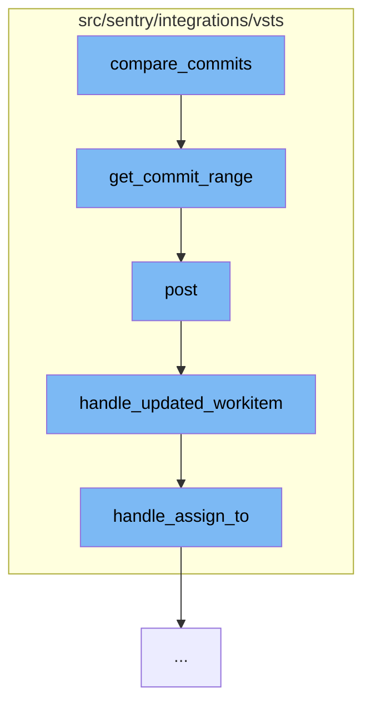

This document will cover the process of comparing commits in the VSTS integration, which includes:

1. Fetching the commit range
2. Posting the commit range data
3. Handling updated work items
4. Assigning work items.



<SwmSnippet path="/src/sentry/integrations/vsts/client.py" line="217">

---

# Fetching the commit range

The function `get_commit_range` is used to fetch the range of commits between two specified versions. It sends a POST request to the VSTS API with the start and end versions.

```python
    def get_commit_range(
        self, instance: str, repo_id: str, start_sha: str, end_sha: str
    ) -> Response:
        return self.post(
            VstsApiPath.commits_batch.format(instance=instance, repo_id=repo_id),
            data={
                "itemVersion": {"versionType": "commit", "version": start_sha},
                "compareVersion": {"versionType": "commit", "version": end_sha},
            },
        )
```

---

</SwmSnippet>

<SwmSnippet path="/src/sentry/integrations/vsts/webhooks.py" line="25">

---

# Posting the commit range data

The `post` function is used to handle the incoming request data. If the event type is 'workitem.updated', it retrieves the integration instance and calls the `handle_updated_workitem` function.

```python
    def post(self, request: Request, *args: Any, **kwargs: Any) -> Response:
        data = request.data
        try:
            event_type = data["eventType"]
            external_id = data["resourceContainers"]["collection"]["id"]
        except KeyError as e:
            logger.info("vsts.invalid-webhook-payload", extra={"error": str(e)})
            return self.respond(status=status.HTTP_400_BAD_REQUEST)

        # https://docs.microsoft.com/en-us/azure/devops/service-hooks/events?view=azure-devops#workitem.updated
        if event_type == "workitem.updated":
            try:
                integration = Integration.objects.get(
                    provider=PROVIDER_KEY, external_id=external_id
                )
            except Integration.DoesNotExist:
                logger.info(
                    "vsts.integration-in-webhook-payload-does-not-exist",
                    extra={"external_id": external_id, "event_type": event_type},
                )
                return self.respond(
```

---

</SwmSnippet>

<SwmSnippet path="/src/sentry/integrations/vsts/webhooks.py" line="128">

---

# Handling updated work items

The `handle_updated_workitem` function is used to handle updates to work items. It extracts the work item ID and project ID from the request data, and then calls the `handle_assign_to` function.

```python
def handle_updated_workitem(data: Mapping[str, Any], integration: Integration) -> None:
    project: str | None = None
    try:
        external_issue_key = data["resource"]["workItemId"]
    except KeyError as e:
        logger.info(
            "vsts.updating-workitem-does-not-have-necessary-information",
            extra={"error": str(e), "integration_id": integration.id},
        )
        return

    try:
        project = data["resourceContainers"]["project"]["id"]
    except KeyError as e:
        logger.info(
            "vsts.updating-workitem-does-not-have-necessary-information",
            extra={"error": str(e), "integration_id": integration.id},
        )

    try:
        assigned_to = data["resource"]["fields"].get("System.AssignedTo")
```

---

</SwmSnippet>

<SwmSnippet path="/src/sentry/integrations/vsts/webhooks.py" line="72">

---

# Assigning work items

The `handle_assign_to` function is used to assign work items. It checks if there is a new assignee, parses their email, and then calls the `sync_group_assignee_inbound` function to update the assignee.

```python
def handle_assign_to(
    integration: Integration,
    external_issue_key: str | None,
    assigned_to: Mapping[str, str] | None,
) -> None:
    if not assigned_to:
        return

    email: str | None = None
    assign = False

    new_value = assigned_to.get("newValue")
    if new_value is not None:
        email = parse_email(new_value)
        if not email:
            logger.info(
                "vsts.failed-to-parse-email-in-handle-assign-to",
                extra={
                    "error": "parse_error",
                    "integration_id": integration.id,
                    "assigned_to_values": assigned_to,
```

---

</SwmSnippet>

&nbsp;

*This is an auto-generated document by Swimm AI 🌊 and has not yet been verified by a human*

<SwmMeta version="3.0.0" repo-id="Z2l0aHViJTNBJTNBZGVtby1zZW50cnklM0ElM0Fzd2ltbWlv" repo-name="demo-sentry"><sup>Powered by [Swimm](/)</sup></SwmMeta>
