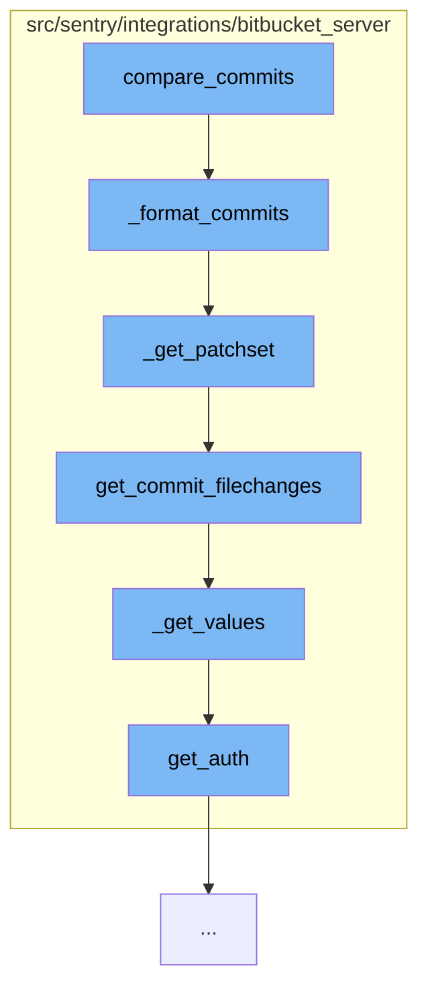

This document will cover the process of comparing commits in the Bitbucket Server integration, which includes:

1. Formatting the commits
2. Getting the patchset for each commit
3. Fetching the file changes for each commit
4. Paginating through the results
5. Authenticating the requests.



<SwmSnippet path="/src/sentry/integrations/bitbucket_server/repository.py" line="87">

---

# Formatting the commits

The function `_format_commits` is used to format the commit data into a more usable structure. It iterates over the list of commits and for each commit, it fetches the patchset using the `_get_patchset` function.

```python
    def _format_commits(self, client, repo, commit_list):
        return [
            {
                "id": c["id"],
                "repository": repo.name,
                "author_email": c["author"]["emailAddress"],
                "author_name": c["author"].get("displayName", c["author"]["name"]),
                "message": c["message"],
                "timestamp": datetime.fromtimestamp(c["authorTimestamp"] / 1000, timezone.utc),
                "patch_set": self._get_patchset(
                    client, repo.config["project"], repo.config["repo"], c["id"]
                ),
            }
            for c in commit_list
        ]
```

---

</SwmSnippet>

<SwmSnippet path="/src/sentry/integrations/bitbucket_server/repository.py" line="121">

---

# Getting the patchset for each commit

The function `_get_patchset` is used to get the modified files for a commit. It first checks if the commit files are in the cache, if not, it fetches the commit file changes using the `get_commit_filechanges` function from the client.

```python
    def _get_patchset(self, client, project, repo, sha):
        """
        Get the modified files for a commit
        """

        key = f"get_changelist:{md5_text(project + repo).hexdigest()}:{sha}"
        commit_files = cache.get(key)
        if commit_files is None:
            commit_files = client.get_commit_filechanges(project, repo, sha)
            cache.set(key, commit_files, 900)

        return self._transform_patchset(commit_files)
```

---

</SwmSnippet>

<SwmSnippet path="/src/sentry/integrations/bitbucket_server/client.py" line="168">

---

# Fetching the file changes for each commit

The function `get_commit_filechanges` is used to fetch the file changes for a commit. It uses the `_get_values` function to paginate through the results.

```python
    def get_commit_filechanges(self, project, repo, commit, limit=1000):
        logger.info(
            "load.filechanges",
            extra={
                "bitbucket_repo": repo,
                "bitbucket_project": project,
                "bitbucket_commit": commit,
            },
        )

        return self._get_values(
            BitbucketServerAPIPath.commit_changes.format(project=project, repo=repo, commit=commit),
            {"limit": limit},
        )
```

---

</SwmSnippet>

<SwmSnippet path="/src/sentry/integrations/bitbucket_server/client.py" line="193">

---

# Paginating through the results

The function `_get_values` is used to paginate through the results of a Bitbucket Server API request. It keeps fetching the next page until it reaches the last page.

```python
    def _get_values(self, uri, params, max_pages=1000000):
        values = []
        start = 0

        logger.info(
            "load.paginated_uri",
            extra={
                "bitbucket_uri": uri,
                "bitbucket_max_pages": max_pages,
                "bitbucket_params": params,
            },
        )

        for i in range(max_pages):
            new_params = dict.copy(params)
            new_params["start"] = start
            logger.debug(
                f"Loading values for paginated uri starting from {start}",
                extra={"uri": uri, "params": new_params},
            )
            data = self.get(uri, auth=self.get_auth(), params=new_params)
```

---

</SwmSnippet>

<SwmSnippet path="/src/sentry/integrations/bitbucket_server/client.py" line="183">

---

# Authenticating the requests

The function `get_auth` is used to authenticate the requests to the Bitbucket Server API. It uses OAuth1 for authentication.

```python
    def get_auth(self):
        return OAuth1(
            client_key=self.credentials["consumer_key"],
            rsa_key=self.credentials["private_key"],
            resource_owner_key=self.credentials["access_token"],
            resource_owner_secret=self.credentials["access_token_secret"],
            signature_method=SIGNATURE_RSA,
            signature_type="auth_header",
        )
```

---

</SwmSnippet>

&nbsp;

*This is an auto-generated document by Swimm AI 🌊 and has not yet been verified by a human*

<SwmMeta version="3.0.0" repo-id="Z2l0aHViJTNBJTNBZGVtby1zZW50cnklM0ElM0Fzd2ltbWlv" repo-name="demo-sentry"><sup>Powered by [Swimm](/)</sup></SwmMeta>
