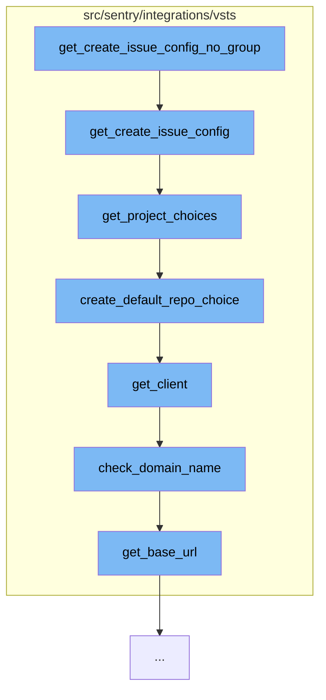

This document will cover the process of creating an issue in the VSTS integration, which includes:

1. Getting the issue configuration without a group
2. Getting the issue configuration
3. Getting project choices
4. Creating a default repository choice
5. Getting the client
6. Checking the domain name
7. Getting the base URL.



<SwmSnippet path="/src/sentry/integrations/vsts/issues.py" line="108">

---

# Getting the issue configuration without a group

The function `get_create_issue_config_no_group` is the entry point for this flow. It calls `get_create_issue_config` to get the configuration for creating an issue.

```python
    def get_create_issue_config(
        self, group: Optional["Group"], user: Optional[User], **kwargs: Any
    ) -> Sequence[Mapping[str, Any]]:
        kwargs["link_referrer"] = "vsts_integration"
        fields = []
        if group:
            fields = super().get_create_issue_config(group, user, **kwargs)
            # Azure/VSTS has BOTH projects and repositories. A project can have many repositories.
            # Workitems (issues) are associated with the project not the repository.
        default_project, project_choices = self.get_project_choices(group, **kwargs)

        work_item_choices: Sequence[Tuple[str, str]] = []
        default_work_item: Optional[str] = None
        if default_project:
            default_work_item, work_item_choices = self.get_work_item_choices(
                default_project, group
            )

        return [
            {
                "name": "project",
```

---

</SwmSnippet>

<SwmSnippet path="/src/sentry/integrations/vsts/issues.py" line="108">

---

# Getting the issue configuration

The function `get_create_issue_config` is responsible for getting the configuration for creating an issue. It calls `get_project_choices` to get the available projects.

```python
    def get_create_issue_config(
        self, group: Optional["Group"], user: Optional[User], **kwargs: Any
    ) -> Sequence[Mapping[str, Any]]:
        kwargs["link_referrer"] = "vsts_integration"
        fields = []
        if group:
            fields = super().get_create_issue_config(group, user, **kwargs)
            # Azure/VSTS has BOTH projects and repositories. A project can have many repositories.
            # Workitems (issues) are associated with the project not the repository.
        default_project, project_choices = self.get_project_choices(group, **kwargs)

        work_item_choices: Sequence[Tuple[str, str]] = []
        default_work_item: Optional[str] = None
        if default_project:
            default_work_item, work_item_choices = self.get_work_item_choices(
                default_project, group
            )

        return [
            {
                "name": "project",
```

---

</SwmSnippet>

<SwmSnippet path="/src/sentry/integrations/vsts/issues.py" line="33">

---

# Getting project choices

The function `get_project_choices` is responsible for getting the available projects. It calls `create_default_repo_choice` to create a default repository choice.

```python
    def get_project_choices(
        self, group: Optional["Group"] = None, **kwargs: Any
    ) -> Tuple[Optional[str], Sequence[Tuple[str, str]]]:
        client = self.get_client()
        try:
            projects = client.get_projects(self.instance)
        except (ApiError, ApiUnauthorized, KeyError) as e:
            raise self.raise_error(e)

        project_choices = [(project["id"], project["name"]) for project in projects]

        params = kwargs.get("params", {})
        project = kwargs.get("project")
        if group:
            default_project_id = group.project_id
        elif project:
            default_project_id = project.id
        else:
            default_project_id = projects[0]["id"]
        defaults = self.get_project_defaults(default_project_id)
        try:
```

---

</SwmSnippet>

<SwmSnippet path="/src/sentry/integrations/vsts/issues.py" line="28">

---

# Creating a default repository choice

The function `create_default_repo_choice` is responsible for creating a default repository choice. It calls `get_client` to get the client.

```python
    def create_default_repo_choice(self, default_repo: str) -> Tuple[str, str]:
        # default_repo should be the project_id
        project = self.get_client().get_project(self.instance, default_repo)
        return (project["id"], project["name"])
```

---

</SwmSnippet>

<SwmSnippet path="/src/sentry/integrations/vsts/integration.py" line="158">

---

# Getting the client

The function `get_client` is responsible for getting the client. It calls `check_domain_name` to check the domain name.

```python
    def get_client(self) -> VstsApiClient:
        if self.default_identity is None:
            self.default_identity = self.get_default_identity()

        self.check_domain_name(self.default_identity)
        return VstsApiClient(self.default_identity, VstsIntegrationProvider.oauth_redirect_url)
```

---

</SwmSnippet>

<SwmSnippet path="/src/sentry/integrations/vsts/integration.py" line="165">

---

# Checking the domain name

The function `check_domain_name` is responsible for checking the domain name. It calls `get_base_url` to get the base URL.

```python
    def check_domain_name(self, default_identity: Identity) -> None:
        if re.match("^https://.+/$", self.model.metadata["domain_name"]):
            return

        base_url = VstsIntegrationProvider.get_base_url(
            default_identity.data["access_token"], self.model.external_id
        )
        self.model.metadata["domain_name"] = base_url
        self.model.save()
```

---

</SwmSnippet>

<SwmSnippet path="/src/sentry/integrations/vsts/integration.py" line="462">

---

# Getting the base URL

The function `get_base_url` is responsible for getting the base URL. This is the final step in the flow.

```python
    def get_base_url(cls, access_token: str, account_id: int) -> str | None:
        """TODO(mgaeta): This should not be allowed to return None."""
        url = VstsIntegrationProvider.VSTS_ACCOUNT_LOOKUP_URL % account_id
        with http.build_session() as session:
            response = session.get(
                url,
                headers={
                    "Content-Type": "application/json",
                    "Authorization": f"Bearer {access_token}",
                },
            )
        if response.status_code == 200:
            # Explicitly typing to satisfy mypy.
            location_url: str | None = response.json()["locationUrl"]
            return location_url
        return None
```

---

</SwmSnippet>

&nbsp;

*This is an auto-generated document by Swimm AI 🌊 and has not yet been verified by a human*

<SwmMeta version="3.0.0" repo-id="Z2l0aHViJTNBJTNBZGVtby1zZW50cnklM0ElM0Fzd2ltbWlv" repo-name="demo-sentry"><sup>Powered by [Swimm](/)</sup></SwmMeta>
