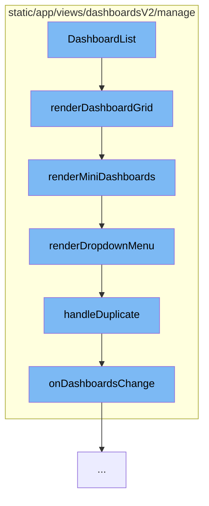

This document will cover the process of managing dashboards in the Sentry application. We'll cover the following steps:

1. Rendering the dashboard grid
2. Rendering mini dashboards within the grid
3. Rendering the dropdown menu for each dashboard
4. Handling the duplication of a dashboard
5. Updating the dashboards after a change.



<SwmSnippet path="/static/app/views/dashboardsV2/manage/dashboardList.tsx" line="183">

---

# Rendering the dashboard grid

The `renderDashboardGrid` function checks if there are any dashboards to display. If there are no dashboards, it returns a message indicating that no dashboards match the filters. If there are dashboards, it calls the `renderMiniDashboards` function to display them in a grid.

```tsx
  function renderDashboardGrid() {
    if (!dashboards?.length) {
      return (
        <EmptyStateWarning>
          <p>{t('Sorry, no Dashboards match your filters.')}</p>
        </EmptyStateWarning>
      );
    }
    return <DashboardGrid>{renderMiniDashboards()}</DashboardGrid>;
  }
```

---

</SwmSnippet>

<SwmSnippet path="/static/app/views/dashboardsV2/manage/dashboardList.tsx" line="156">

---

# Rendering mini dashboards

The `renderMiniDashboards` function iterates over the dashboards and creates a `DashboardCard` for each one. It uses the `renderDropdownMenu` function to create a context menu for each dashboard.

```tsx
  function renderMiniDashboards() {
    const isUsingGrid = organization.features.includes('dashboard-grid-layout');
    return dashboards?.map((dashboard, index) => {
      const widgetRenderer = isUsingGrid ? renderGridPreview : renderDndPreview;
      const widgetCount = isUsingGrid
        ? dashboard.widgetPreview.length
        : dashboard.widgetDisplay.length;
      return (
        <DashboardCard
          key={`${index}-${dashboard.id}`}
          title={dashboard.title}
          to={{
            pathname: `/organizations/${organization.slug}/dashboard/${dashboard.id}/`,
            query: {...location.query},
          }}
          detail={tn('%s widget', '%s widgets', widgetCount)}
          dateStatus={
            dashboard.dateCreated ? <TimeSince date={dashboard.dateCreated} /> : undefined
          }
          createdBy={dashboard.createdBy}
          renderWidgets={() => widgetRenderer(dashboard)}
```

---

</SwmSnippet>

<SwmSnippet path="/static/app/views/dashboardsV2/manage/dashboardList.tsx" line="87">

---

# Rendering the dropdown menu

The `renderDropdownMenu` function creates a dropdown menu for each dashboard. The menu includes options to duplicate or delete the dashboard. The `handleDuplicate` function is called when the 'Duplicate' option is selected.

```tsx
  function renderDropdownMenu(dashboard: DashboardListItem) {
    const menuItems: MenuItemProps[] = [
      {
        key: 'dashboard-duplicate',
        label: t('Duplicate'),
        onAction: () => handleDuplicate(dashboard),
      },
      {
        key: 'dashboard-delete',
        label: t('Delete'),
        priority: 'danger',
        onAction: () => {
          openConfirmModal({
            message: t('Are you sure you want to delete this dashboard?'),
            priority: 'danger',
            onConfirm: () => handleDelete(dashboard),
          });
        },
      },
    ];

```

---

</SwmSnippet>

<SwmSnippet path="/static/app/views/dashboardsV2/manage/dashboardList.tsx" line="67">

---

# Handling dashboard duplication

The `handleDuplicate` function duplicates a dashboard. It fetches the details of the dashboard to be duplicated, creates a new dashboard based on the fetched details, and then creates the new dashboard in the database. After the new dashboard is created, it calls the `onDashboardsChange` function to update the list of dashboards.

```tsx
  async function handleDuplicate(dashboard: DashboardListItem) {
    try {
      const dashboardDetail = await fetchDashboard(api, organization.slug, dashboard.id);
      const newDashboard = cloneDashboard(dashboardDetail);
      newDashboard.widgets.map(widget => (widget.id = undefined));
      await createDashboard(api, organization.slug, newDashboard, true);

      trackAnalyticsEvent({
        eventKey: 'dashboards_manage.duplicate',
        eventName: 'Dashboards Manager: Dashboard Duplicated',
        organization_id: parseInt(organization.id, 10),
        dashboard_id: parseInt(dashboard.id, 10),
      });
      onDashboardsChange();
      addSuccessMessage(t('Dashboard duplicated'));
    } catch (e) {
      addErrorMessage(t('Error duplicating Dashboard'));
    }
  }
```

---

</SwmSnippet>

<SwmSnippet path="/static/app/views/dashboardsV2/manage/index.tsx" line="92">

---

# Updating dashboards after a change

The `onDashboardsChange` function is called after a dashboard is duplicated. It reloads the data to update the list of dashboards.

```tsx
  onDashboardsChange() {
    this.reloadData();
  }
```

---

</SwmSnippet>

&nbsp;

*This is an auto-generated document by Swimm AI 🌊 and has not yet been verified by a human*

<SwmMeta version="3.0.0" repo-id="Z2l0aHViJTNBJTNBZGVtby1zZW50cnklM0ElM0Fzd2ltbWlv" repo-name="demo-sentry"><sup>Powered by [Swimm](/)</sup></SwmMeta>
