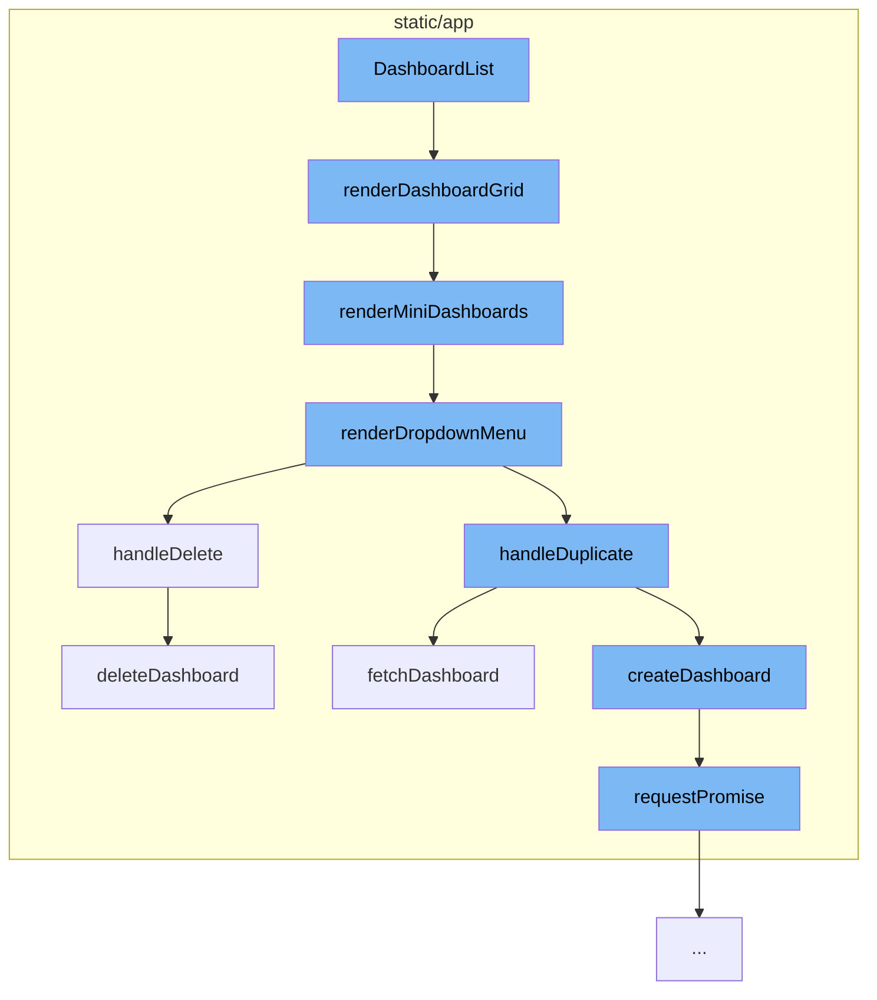

This document will cover the process of managing dashboards in the Sentry application, which includes:

1. Rendering the dashboard grid
2. Rendering mini dashboards within the grid
3. Rendering the dropdown menu for each dashboard
4. Handling dashboard duplication
5. Handling dashboard deletion.



<SwmSnippet path="/static/app/views/dashboardsV2/manage/dashboardList.tsx" line="183">

---

# Rendering the Dashboard Grid

The `renderDashboardGrid` function is responsible for rendering the dashboard grid. If there are no dashboards, it displays a warning message. Otherwise, it calls the `renderMiniDashboards` function to render each individual dashboard.

```tsx
  function renderDashboardGrid() {
    if (!dashboards?.length) {
      return (
        <EmptyStateWarning>
          <p>{t('Sorry, no Dashboards match your filters.')}</p>
        </EmptyStateWarning>
      );
    }
    return <DashboardGrid>{renderMiniDashboards()}</DashboardGrid>;
  }
```

---

</SwmSnippet>

<SwmSnippet path="/static/app/views/dashboardsV2/manage/dashboardList.tsx" line="156">

---

# Rendering Mini Dashboards

The `renderMiniDashboards` function maps over the dashboards and renders each one. It determines the type of widget to render based on the organization's features. It also calls the `renderDropdownMenu` function to render the dropdown menu for each dashboard.

```tsx
  function renderMiniDashboards() {
    const isUsingGrid = organization.features.includes('dashboard-grid-layout');
    return dashboards?.map((dashboard, index) => {
      const widgetRenderer = isUsingGrid ? renderGridPreview : renderDndPreview;
      const widgetCount = isUsingGrid
        ? dashboard.widgetPreview.length
        : dashboard.widgetDisplay.length;
      return (
        <DashboardCard
          key={`${index}-${dashboard.id}`}
          title={dashboard.title}
          to={{
            pathname: `/organizations/${organization.slug}/dashboard/${dashboard.id}/`,
            query: {...location.query},
          }}
          detail={tn('%s widget', '%s widgets', widgetCount)}
          dateStatus={
            dashboard.dateCreated ? <TimeSince date={dashboard.dateCreated} /> : undefined
          }
          createdBy={dashboard.createdBy}
          renderWidgets={() => widgetRenderer(dashboard)}
```

---

</SwmSnippet>

<SwmSnippet path="/static/app/views/dashboardsV2/manage/dashboardList.tsx" line="87">

---

# Rendering the Dropdown Menu

The `renderDropdownMenu` function creates a dropdown menu for each dashboard with options to duplicate or delete the dashboard. It calls the `handleDuplicate` and `handleDelete` functions when the corresponding options are selected.

```tsx
  function renderDropdownMenu(dashboard: DashboardListItem) {
    const menuItems: MenuItemProps[] = [
      {
        key: 'dashboard-duplicate',
        label: t('Duplicate'),
        onAction: () => handleDuplicate(dashboard),
      },
      {
        key: 'dashboard-delete',
        label: t('Delete'),
        priority: 'danger',
        onAction: () => {
          openConfirmModal({
            message: t('Are you sure you want to delete this dashboard?'),
            priority: 'danger',
            onConfirm: () => handleDelete(dashboard),
          });
        },
      },
    ];

```

---

</SwmSnippet>

<SwmSnippet path="/static/app/views/dashboardsV2/manage/dashboardList.tsx" line="50">

---

# Handling Dashboard Duplication

The `handleDuplicate` function duplicates a dashboard by fetching the dashboard data and creating a new dashboard with the same data. It uses the `fetchDashboard` and `createDashboard` functions to accomplish this.

```tsx
  function handleDelete(dashboard: DashboardListItem) {
    deleteDashboard(api, organization.slug, dashboard.id)
      .then(() => {
        trackAnalyticsEvent({
          eventKey: 'dashboards_manage.delete',
          eventName: 'Dashboards Manager: Dashboard Deleted',
          organization_id: parseInt(organization.id, 10),
          dashboard_id: parseInt(dashboard.id, 10),
        });
        onDashboardsChange();
        addSuccessMessage(t('Dashboard deleted'));
      })
      .catch(() => {
        addErrorMessage(t('Error deleting Dashboard'));
      });
  }
```

---

</SwmSnippet>

<SwmSnippet path="/static/app/views/dashboardsV2/manage/dashboardList.tsx" line="50">

---

# Handling Dashboard Deletion

The `handleDelete` function deletes a dashboard by calling the `deleteDashboard` function. It also handles any errors that may occur during the deletion process.

```tsx
  function handleDelete(dashboard: DashboardListItem) {
    deleteDashboard(api, organization.slug, dashboard.id)
      .then(() => {
        trackAnalyticsEvent({
          eventKey: 'dashboards_manage.delete',
          eventName: 'Dashboards Manager: Dashboard Deleted',
          organization_id: parseInt(organization.id, 10),
          dashboard_id: parseInt(dashboard.id, 10),
        });
        onDashboardsChange();
        addSuccessMessage(t('Dashboard deleted'));
      })
      .catch(() => {
        addErrorMessage(t('Error deleting Dashboard'));
      });
  }
```

---

</SwmSnippet>

&nbsp;

*This is an auto-generated document by Swimm AI 🌊 and has not yet been verified by a human*

<SwmMeta version="3.0.0" repo-id="Z2l0aHViJTNBJTNBZGVtby1zZW50cnklM0ElM0Fzd2ltbWlv" repo-name="demo-sentry"><sup>Powered by [Swimm](/)</sup></SwmMeta>
