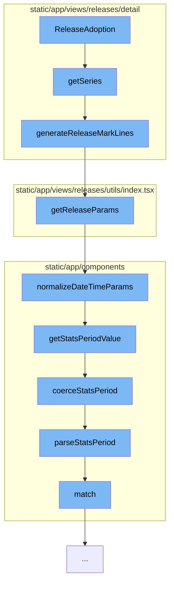

This document will cover the process of generating a series of data for the ReleaseAdoption component in the Sentry application. The process includes the following steps:

1. Invoking the `getSeries` function
2. Calling the `generateReleaseMarkLines` function
3. Utilizing the `getReleaseParams` function
4. Normalizing date and time parameters
5. Parsing the stats period.



<SwmSnippet path="/static/app/views/releases/detail/overview/sidebar/releaseAdoption.tsx" line="69">

---

# Invoking the `getSeries` function

The `getSeries` function is the starting point of the process. It checks if there are any release sessions available. If there are, it generates mark lines for the sessions and constructs a series of data. If the `hasUsers` flag is set, it also generates mark lines for users and adds them to the series.

```tsx
  function getSeries() {
    if (!releaseSessions) {
      return [];
    }

    const sessionsMarkLines = generateReleaseMarkLines(
      release,
      project,
      theme,
      location,
      {
        hideLabel: true,
        axisIndex: sessionsAxisIndex,
      }
    );

    const series = [
      ...sessionsMarkLines,
      {
        seriesName: t('Sessions'),
        connectNulls: true,
```

---

</SwmSnippet>

<SwmSnippet path="/static/app/views/releases/detail/utils.tsx" line="201">

---

# Calling the `generateReleaseMarkLines` function

The `generateReleaseMarkLines` function is used to generate mark lines for the release sessions and users. It takes into account the adoption stages of the release and the project platform. It also adjusts the start and end times based on the stats period.

```tsx
export function generateReleaseMarkLines(
  release: ReleaseWithHealth,
  project: ReleaseProject,
  theme: Theme,
  location: Location,
  options?: GenerateReleaseMarklineOptions
) {
  const markLines: Series[] = [];
  const adoptionStages = release.adoptionStages?.[project.slug];
  const isSingleEnv = decodeList(location.query.environment).length === 1;
  const releaseBounds = getReleaseBounds(release);
  const {statsPeriod, ...releaseParamsRest} = getReleaseParams({
    location,
    releaseBounds,
  });
  let {start, end} = releaseParamsRest;
  const isDefaultPeriod = !(
    location.query.pageStart ||
    location.query.pageEnd ||
    location.query.pageStatsPeriod
  );
```

---

</SwmSnippet>

<SwmSnippet path="/static/app/views/releases/utils/index.tsx" line="178">

---

# Utilizing the `getReleaseParams` function

The `getReleaseParams` function is used to get the release parameters. It normalizes the date and time parameters and sets the start and end times of the release.

```tsx
export function getReleaseParams({location, releaseBounds}: GetReleaseParams) {
  const params = normalizeDateTimeParams(
    pick(location.query, [
      ...Object.values(URL_PARAM),
      ...Object.values(PAGE_URL_PARAM),
      'cursor',
    ]),
    {
      allowAbsolutePageDatetime: true,
      allowEmptyPeriod: true,
    }
  );
  if (
    !Object.keys(params).some(param =>
      [URL_PARAM.START, URL_PARAM.END, URL_PARAM.UTC, URL_PARAM.PERIOD].includes(param)
    )
  ) {
    params[URL_PARAM.START] = releaseBounds.releaseStart;
    params[URL_PARAM.END] = releaseBounds.releaseEnd;
  }

```

---

</SwmSnippet>

<SwmSnippet path="/static/app/components/organizations/pageFilters/parse.tsx" line="206">

---

# Normalizing date and time parameters

The `normalizeDateTimeParams` function is used to normalize the date and time parameters. It takes into account the stats period and the start and end times. If these are not provided, it sets a default stats period.

```tsx
/**
 * Normalizes the DateTime components of the page filters.
 *
 * NOTE: This has some additional functionality for handling `page*` filters
 *       that will override the standard `start`/`end`/`statsPeriod` filters.
 *
 * NOTE: This does *NOT* normalize the `project` or `environment` components of
 *       the page filter parameters. See `getStateFromQuery` for normalization
 *       of the project and environment parameters.
 */
export function normalizeDateTimeParams(
  params: InputParams,
  options: DateTimeNormalizeOptions = {}
): ParsedParams {
  const {
    allowEmptyPeriod = false,
    allowAbsoluteDatetime = true,
    allowAbsolutePageDatetime = false,
    defaultStatsPeriod = DEFAULT_STATS_PERIOD,
  } = options;

```

---

</SwmSnippet>

<SwmSnippet path="/static/app/components/organizations/pageFilters/parse.tsx" line="19">

---

# Parsing the stats period

The `parseStatsPeriod` function is used to parse the stats period into a period and a period length. It is used to adjust the start and end times based on the stats period.

```tsx
/**
 * Parses a stats period into `period` and `periodLength`
 */
export function parseStatsPeriod(input: string | IntervalPeriod) {
  const result = input.match(STATS_PERIOD_PATTERN);

  if (!result) {
    return undefined;
  }

  const period = result[1];

  // default to seconds. this behaviour is based on src/sentry/utils/dates.py
  const periodLength = result[2] || 's';

  return {period, periodLength};
}
```

---

</SwmSnippet>

&nbsp;

*This is an auto-generated document by Swimm AI 🌊 and has not yet been verified by a human*

<SwmMeta version="3.0.0" repo-id="Z2l0aHViJTNBJTNBZGVtby1zZW50cnklM0ElM0Fzd2ltbWlv" repo-name="demo-sentry"><sup>Powered by [Swimm](/)</sup></SwmMeta>
