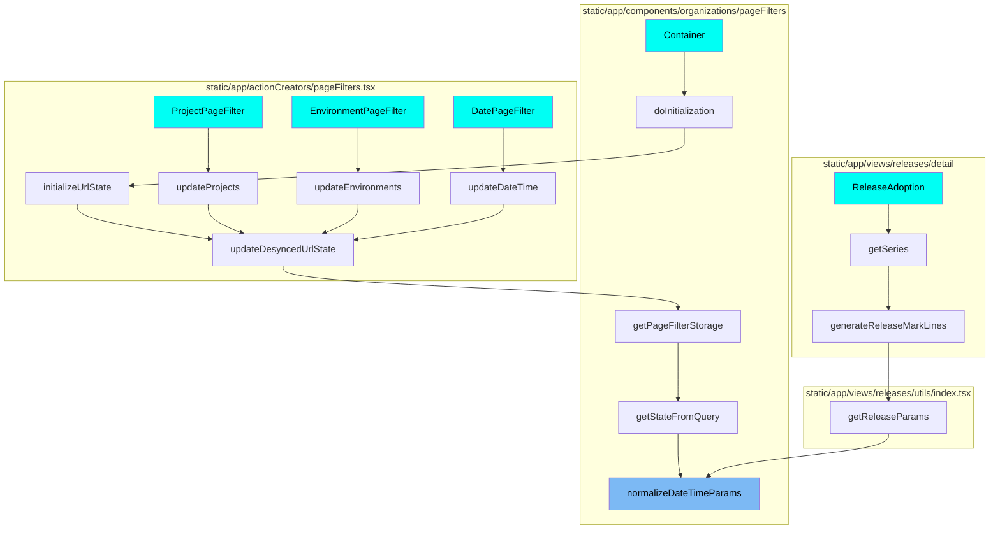
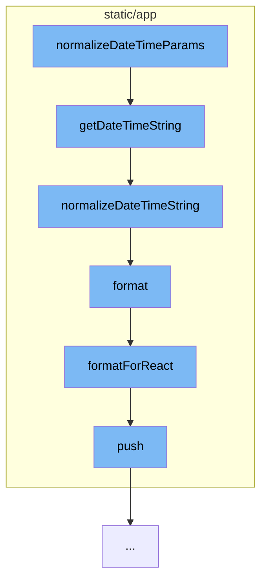

This document will cover the process of normalizing and formatting date and time parameters in the Sentry application. The process includes the following steps:

1. Normalizing the date and time parameters
2. Getting the date and time string
3. Normalizing the date and time string
4. Formatting the date and time string for React
5. Pushing the formatted string to the stream manager.

## Where is this flow used?

The flow starts with the function `normalizeDateTimeParams`. It is called from multiple entry points as represented in the following diagram: (Note - these are only some of the entry points of this flow)



## The flow itself



<SwmSnippet path="/static/app/components/organizations/pageFilters/parse.tsx" line="88">

---

# Normalizing the date and time parameters

The function `getDateTimeString` is used to normalize the date and time parameters. It checks if the input is an array and finds the first valid date and time string. If the input is not an array, it directly passes the input to the next function.

```tsx
/**
 * Normalizes a string or string[] into the date time string.
 *
 * Undefined and null inputs are returned as undefined.
 */
function getDateTimeString(maybe: Date | ParamValue) {
  const result = Array.isArray(maybe)
    ? maybe.find(needle => moment.utc(needle).isValid())
    : maybe;

  return normalizeDateTimeString(result);
}
```

---

</SwmSnippet>

<SwmSnippet path="/static/app/components/organizations/pageFilters/parse.tsx" line="65">

---

# Normalizing the date and time string

The function `normalizeDateTimeString` takes the output from `getDateTimeString` and normalizes it into a specific format that can be parsed by `datetime.strptime`.

```tsx
/**
 * We normalize potential datetime strings into the form that would be valid if
 * it was to be parsed by datetime.strptime using the format
 * %Y-%m-%dT%H:%M:%S.%f
 *
 * This format was transformed to the form that moment.js understands using [0]
 *
 * [0]: https://gist.github.com/asafge/0b13c5066d06ae9a4446
 */
function normalizeDateTimeString(input: Date | SingleParamValue) {
  if (!input) {
    return undefined;
  }

  const parsed = moment.utc(input);

  if (!parsed.isValid()) {
    return undefined;
  }

  return parsed.format('YYYY-MM-DDTHH:mm:ss.SSS');
```

---

</SwmSnippet>

<SwmSnippet path="/static/app/locale.tsx" line="299">

---

# Formatting the date and time string for React

The function `format` checks if the arguments involve React. If they do, it calls `formatForReact` to format the string for React.

```tsx
/**
 * sprintf style string formatting. Does not handle translations.
 *
 * See the sprintf-js library [0] for specifics on the argument
 * parameterization format.
 *
 * [0]: https://github.com/alexei/sprintf.js
 */
export function format(formatString: string, args: FormatArg[]): React.ReactNode {
  if (argsInvolveReact(args)) {
    return formatForReact(formatString, args);
  }

  return sprintf(formatString, ...args) as string;
}
```

---

</SwmSnippet>

<SwmSnippet path="/static/app/utils/streamManager.tsx" line="39">

---

# Pushing the formatted string to the stream manager

The `push` method in the `streamManager` is used to push the formatted date and time string to the stream.

```tsx
  push(items: IdShape | IdShape[] = []) {
    items = Array.isArray(items) ? items : [items];
    if (items.length === 0) {
      return;
    }

    items = items.filter(item => item.hasOwnProperty('id'));
    const ids = items.map(item => item.id);
    this.idList = this.idList.filter(id => !ids.includes(id));
    this.idList = [...this.idList, ...ids];

    this.trim();
    this.store.add(items);
  }
```

---

</SwmSnippet>

&nbsp;

*This is an auto-generated document by Swimm AI 🌊 and has not yet been verified by a human*

<SwmMeta version="3.0.0" repo-id="Z2l0aHViJTNBJTNBZGVtby1zZW50cnklM0ElM0Fzd2ltbWlv" repo-name="demo-sentry"><sup>Powered by [Swimm](/)</sup></SwmMeta>
