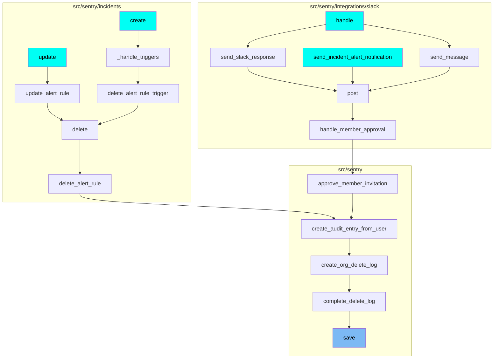

This document will cover the process of saving events in the Sentry application. The process includes:

1. Running background grouping
2. Tracking outcome acceptance
3. Saving transaction events
4. Saving attachments
5. Processing existing aggregates.

## Where is this flow used?

The flow starts with the function `save`. It is called from multiple entry points as represented in the following diagram: (Note - these are only some of the entry points of this flow)



## The flow itself

```mermaid
graph TD;
subgraph src/sentry
  save:::mainFlowStyle --> _run_background_grouping
end
subgraph src/sentry
  save:::mainFlowStyle --> _calculate_event_grouping
end
subgraph src/sentry
  save:::mainFlowStyle --> _save_aggregate
end
subgraph src/sentry
  save:::mainFlowStyle --> save_attachments
end
subgraph src/sentry
  save:::mainFlowStyle --> save_transaction_events
end
subgraph src/sentry
  _run_background_grouping --> _calculate_background_grouping
end
subgraph src/sentry/grouping
  _run_background_grouping --> get_config_dict
end
subgraph src/sentry
  _calculate_background_grouping --> _calculate_event_grouping
end
subgraph src/sentry/grouping
  get_config_dict --> _get_enhancements
end
subgraph src/sentry/stacktraces
  _calculate_event_grouping --> normalize_stacktraces_for_grouping
end
subgraph src/sentry/grouping
  _calculate_event_grouping --> get_grouping_config_dict_for_project
end
subgraph src/sentry/grouping
  _calculate_event_grouping --> get_fingerprinting_config_for_project
end
subgraph src/sentry/grouping
  normalize_stacktraces_for_grouping --> apply_modifications_to_frame
end
subgraph src/sentry/stacktraces
  normalize_stacktraces_for_grouping --> trim_function_name
end
subgraph src/sentry/grouping
  get_grouping_config_dict_for_project --> get_config_dict
end
subgraph src/sentry/grouping
  get_fingerprinting_config_for_project --> from_config_string
end
subgraph src/sentry
  _save_aggregate --> _process_existing_aggregate
end
subgraph src/sentry
  _save_aggregate --> killswitch_matches_context
end
subgraph src/sentry
  _process_existing_aggregate --> _handle_regression
end
subgraph src/sentry
  killswitch_matches_context --> _value_matches
end
subgraph src/sentry
  killswitch_matches_context --> incr
end
subgraph src/sentry
  save_attachments --> save_attachment
end
subgraph src/sentry/utils
  save_attachment --> track_outcome
end
subgraph src/sentry/models
  save_attachment --> putfile
end
subgraph src/sentry
  save_transaction_events:::mainFlowStyle --> _track_outcome_accepted_many
end
subgraph src/sentry
  save_transaction_events:::mainFlowStyle --> _get_or_create_release_many
end
subgraph src/sentry
  save_transaction_events:::mainFlowStyle --> get_many_from_cache
end
subgraph src/sentry
  save_transaction_events:::mainFlowStyle --> _get_event_user_many
end
subgraph src/sentry
  save_transaction_events:::mainFlowStyle --> _eventstream_insert_many
end
subgraph src/sentry/utils
  _track_outcome_accepted_many --> track_outcome
end
subgraph src/sentry/utils
  track_outcome --> incr
end
subgraph src/sentry/utils
  track_outcome --> publish
end
subgraph src/sentry/models
  _get_or_create_release_many --> add_dist
end
subgraph src/sentry/models
  add_dist --> get_or_create
end
subgraph src/sentry
  get_many_from_cache --> __post_save
end
subgraph src/sentry/utils
  get_many_from_cache --> zip
end
subgraph src/sentry
  zip --> list
end
subgraph src/sentry
  _get_event_user_many --> _get_event_user
end
subgraph src/sentry
  _get_event_user_many --> set_tag
end
subgraph src/sentry/utils
  _get_event_user --> timer
end
subgraph src/sentry
  _get_event_user --> _get_event_user_impl
end
subgraph src/sentry
  _eventstream_insert_many:::mainFlowStyle --> get_primary_hash
end
subgraph src/sentry
  get_primary_hash:::mainFlowStyle --> get_hashes
end
subgraph src/sentry
  get_hashes:::mainFlowStyle --> get_sorted_grouping_variants
end
subgraph src/sentry
  get_sorted_grouping_variants:::mainFlowStyle --> get_grouping_variants
end
subgraph src/sentry
  get_grouping_variants:::mainFlowStyle --> get_grouping_config
end
subgraph src/sentry/grouping
  get_grouping_variants:::mainFlowStyle --> get_grouping_variants_for_event
end
subgraph src/sentry/grouping
  get_grouping_config --> get_grouping_config_dict_for_event_data
end
subgraph src/sentry/grouping
  get_grouping_config_dict_for_event_data --> get_grouping_config_dict_for_project
end
subgraph src/sentry/grouping
  get_grouping_variants_for_event:::mainFlowStyle --> resolve_fingerprint_values
end
subgraph src/sentry/grouping
  get_grouping_variants_for_event:::mainFlowStyle --> _get_calculated_grouping_variants_for_event
end
subgraph src/sentry/grouping
  resolve_fingerprint_values --> _get_fingerprint_value
end
subgraph src/sentry/grouping
  _get_calculated_grouping_variants_for_event:::mainFlowStyle --> get_grouping_component_variants
end
  get_grouping_component_variants:::mainFlowStyle --> ...

 classDef mainFlowStyle color:#000000,fill:#7CB9F4
  classDef rootsStyle color:#000000,fill:#00FFF4
```



<SwmSnippet path="/src/sentry/event_manager.py" line="582">

---

# Running Background Grouping

The function `_run_background_grouping` is used to run a fraction of events with a third grouping config. This does not affect actual grouping but can be helpful to measure its performance impact.

```python
def _run_background_grouping(project, job):
    """Optionally run a fraction of events with a third grouping config
    This can be helpful to measure its performance impact.
    This does not affect actual grouping.
    """
    try:
        sample_rate = options.get("store.background-grouping-sample-rate")
        if sample_rate and random.random() <= sample_rate:
            config = BackgroundGroupingConfigLoader().get_config_dict(project)
            if config["id"]:
                copied_event = copy.deepcopy(job["event"])
                _calculate_background_grouping(project, copied_event, config)
    except Exception:
        sentry_sdk.capture_exception()
```

---

</SwmSnippet>

<SwmSnippet path="/src/sentry/event_manager.py" line="895">

---

# Tracking Outcome Acceptance

The function `_track_outcome_accepted_many` is used to track the outcome of multiple jobs. It iterates over the jobs and for each job, it tracks the outcome as accepted.

```python
def _track_outcome_accepted_many(jobs):
    for job in jobs:
        event = job["event"]

        track_outcome(
            org_id=event.project.organization_id,
            project_id=job["project_id"],
            key_id=job["key_id"],
            outcome=Outcome.ACCEPTED,
            reason=None,
            timestamp=to_datetime(job["start_time"]),
            event_id=event.event_id,
            category=job["category"],
        )
```

---

</SwmSnippet>

<SwmSnippet path="/src/sentry/event_manager.py" line="895">

---

# Saving Transaction Events

The function `save_transaction_events` is used to save multiple transaction events. It calls several other functions to get or create releases, get many from cache, get event user many, and insert many into the event stream.

```python
def _track_outcome_accepted_many(jobs):
    for job in jobs:
        event = job["event"]

        track_outcome(
            org_id=event.project.organization_id,
            project_id=job["project_id"],
            key_id=job["key_id"],
            outcome=Outcome.ACCEPTED,
            reason=None,
            timestamp=to_datetime(job["start_time"]),
            event_id=event.event_id,
            category=job["category"],
        )
```

---

</SwmSnippet>

<SwmSnippet path="/src/sentry/event_manager.py" line="1588">

---

# Saving Attachments

The function `save_attachment` is used to persist a cached event attachment into the file store. It emits one outcome, either ACCEPTED on success or INVALID(missing_chunks) if retrieving the attachment data fails.

```python
def save_attachment(
    cache_key, attachment, project, event_id, key_id=None, group_id=None, start_time=None
):
    """
    Persists a cached event attachments into the file store.

    Emits one outcome, either ACCEPTED on success or INVALID(missing_chunks) if
    retrieving the attachment data fails.

    :param cache_key:  The cache key at which the attachment is stored for
                       debugging purposes.
    :param attachment: The ``CachedAttachment`` instance to store.
    :param project:    The project model that this attachment belongs to.
    :param event_id:   Identifier of the event that this attachment belongs to.
                       The event does not have to be stored yet.
    :param key_id:     Optional identifier of the DSN that was used to ingest
                       the attachment.
    :param group_id:   Optional group identifier for the event. May be empty if
                       the event has not been stored yet, or if it is not
                       grouped.
    :param start_time: UNIX Timestamp (float) when the attachment was ingested.
```

---

</SwmSnippet>

<SwmSnippet path="/src/sentry/event_manager.py" line="1384">

---

# Processing Existing Aggregates

The function `_process_existing_aggregate` is used to process existing aggregates. It updates the group with the latest event data and handles any regression.

```python
def _process_existing_aggregate(group, event, data, release):
    date = max(event.datetime, group.last_seen)
    extra = {"last_seen": date, "score": ScoreClause(group), "data": data["data"]}
```

---

</SwmSnippet>

&nbsp;

*This is an auto-generated document by Swimm AI 🌊 and has not yet been verified by a human*

<SwmMeta version="3.0.0" repo-id="Z2l0aHViJTNBJTNBZGVtby1zZW50cnklM0ElM0Fzd2ltbWlv" repo-name="demo-sentry"><sup>Powered by [Swimm](/)</sup></SwmMeta>
