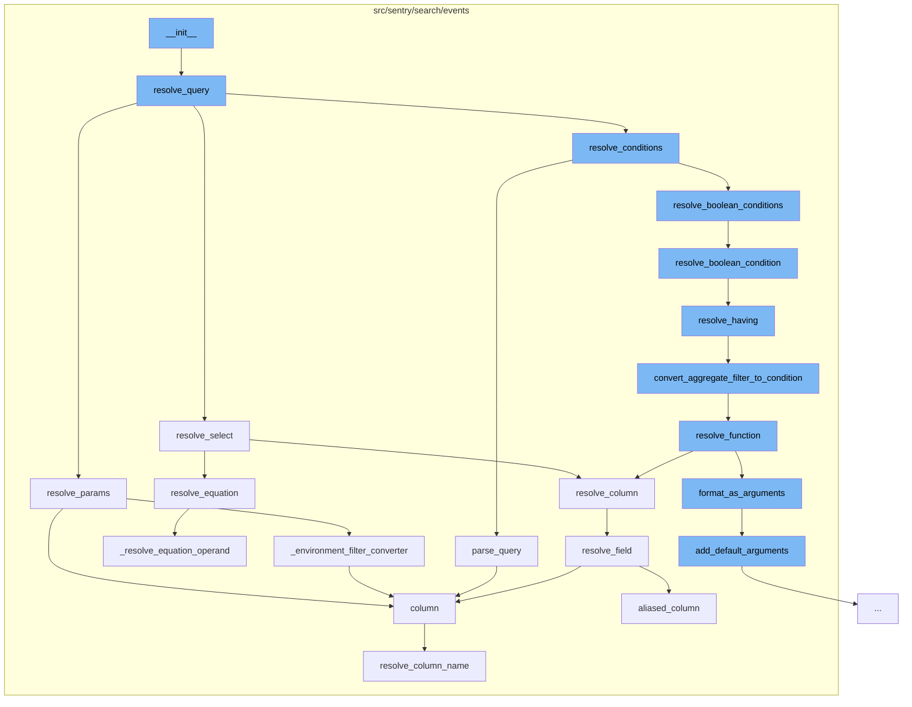

This document will cover the process of event search query resolution in the Sentry application. The process includes the following steps:

 1. Initialization of the query builder
 2. Resolving the query parameters
 3. Parsing the query
 4. Resolving conditions
 5. Resolving boolean conditions
 6. Resolving having conditions
 7. Converting aggregate filter to condition
 8. Resolving functions
 9. Resolving columns
10. Adding default arguments.



<SwmSnippet path="/src/sentry/search/events/builder.py" line="154">

---

# Initialization of the Query Builder

The `__init__` function initializes the Query Builder. It calls the `resolve_query` function which is responsible for resolving conditions, parameters, columns, orderby, and groupby.

```python
    def resolve_query(
        self,
        query: Optional[str] = None,
        use_aggregate_conditions: bool = False,
        selected_columns: Optional[List[str]] = None,
        equations: Optional[List[str]] = None,
        orderby: Optional[List[str]] = None,
    ) -> None:
        with sentry_sdk.start_span(op="QueryBuilder", description="resolve_conditions"):
            self.where, self.having = self.resolve_conditions(
                query, use_aggregate_conditions=use_aggregate_conditions
            )
        with sentry_sdk.start_span(op="QueryBuilder", description="resolve_params"):
            # params depends on parse_query, and conditions being resolved first since there may be projects in conditions
            self.where += self.resolve_params()
        with sentry_sdk.start_span(op="QueryBuilder", description="resolve_columns"):
            self.columns = self.resolve_select(selected_columns, equations)
        with sentry_sdk.start_span(op="QueryBuilder", description="resolve_orderby"):
            self.orderby = self.resolve_orderby(orderby)
        with sentry_sdk.start_span(op="QueryBuilder", description="resolve_groupby"):
            self.groupby = self.resolve_groupby()
```

---

</SwmSnippet>

<SwmSnippet path="/src/sentry/search/events/builder.py" line="353">

---

# Resolving the Query Parameters

The `resolve_params` function is responsible for resolving the parameters of the query. It checks for the presence of start and end parameters, validates them, and constructs conditions based on these parameters and other parameters like project_id and environment.

```python
    def resolve_params(self) -> List[WhereType]:
        """Keys included as url params take precedent if same key is included in search
        They are also considered safe and to have had access rules applied unlike conditions
        from the query string.
        """
        conditions = []

        # start/end are required so that we can run a query in a reasonable amount of time
        if "start" not in self.params or "end" not in self.params:
            raise InvalidSearchQuery("Cannot query without a valid date range")

        start: datetime
        end: datetime
        start, end = self.params["start"], self.params["end"]  # type: ignore
        # Update start to be within retention
        expired, start = outside_retention_with_modified_start(
            start, end, Organization(self.params.get("organization_id"))
        )

        # TODO: this validation should be done when we create the params dataclass instead
        assert isinstance(start, datetime) and isinstance(
```

---

</SwmSnippet>

<SwmSnippet path="/src/sentry/search/events/builder.py" line="848">

---

# Parsing the Query

The `parse_query` function parses the user's query string and constructs a list of filters that can be used to construct the conditions of the Query.

```python
    def parse_query(self, query: Optional[str]) -> ParsedTerms:
        """Given a user's query, string construct a list of filters that can be
        then used to construct the conditions of the Query"""
        if query is None:
            return []

        try:
            parsed_terms = parse_search_query(query, params=self.params, builder=self)
        except ParseError as e:
            raise InvalidSearchQuery(f"Parse error: {e.expr.name} (column {e.column():d})")

        if not parsed_terms:
            return []

```

---

</SwmSnippet>

<SwmSnippet path="/src/sentry/search/events/builder.py" line="338">

---

# Resolving Conditions

The `resolve_boolean_condition` function is responsible for resolving boolean conditions. It checks if the term is a ParenExpression and if so, it resolves the boolean conditions. If the term is a SearchFilter or AggregateFilter, it resolves the where and having conditions respectively.

```python
    def resolve_boolean_condition(
        self, term: ParsedTerm, use_aggregate_conditions: bool
    ) -> Tuple[List[WhereType], List[WhereType]]:
        if isinstance(term, ParenExpression):
            return self.resolve_boolean_conditions(term.children, use_aggregate_conditions)

        where, having = [], []

        if isinstance(term, SearchFilter):
            where = self.resolve_where([term])
        elif isinstance(term, AggregateFilter):
            having = self.resolve_having([term], use_aggregate_conditions)

        return where, having
```

---

</SwmSnippet>

<SwmSnippet path="/src/sentry/search/events/builder.py" line="232">

---

# Resolving Having Conditions

The `resolve_having` function is responsible for resolving having conditions. It checks if the term is an AggregateFilter and if so, it converts the aggregate filter to a condition.

```python
    def resolve_having(
        self, parsed_terms: ParsedTerms, use_aggregate_conditions: bool
    ) -> List[WhereType]:
        """Given a list of parsed terms, construct their equivalent snql having
        conditions, filtering only for aggregate conditions"""

        if not use_aggregate_conditions:
            return []

        having_conditions: List[WhereType] = []
        for term in parsed_terms:
            if isinstance(term, AggregateFilter):
                condition = self.convert_aggregate_filter_to_condition(term)
                if condition:
                    having_conditions.append(condition)

        return having_conditions
```

---

</SwmSnippet>

<SwmSnippet path="/src/sentry/search/events/builder.py" line="898">

---

# Converting Aggregate Filter to Condition

The `convert_aggregate_filter_to_condition` function converts an AggregateFilter to a condition. It resolves the function and returns a Condition.

```python
    def convert_aggregate_filter_to_condition(
        self, aggregate_filter: AggregateFilter
    ) -> Optional[WhereType]:
        name = aggregate_filter.key.name
        value = aggregate_filter.value.value

        value = (
            int(to_timestamp(value))
            if isinstance(value, datetime) and name != "timestamp"
            else value
        )

        if aggregate_filter.operator in {"=", "!="} and value == "":
            operator = Op.IS_NULL if aggregate_filter.operator == "=" else Op.IS_NOT_NULL
            return Condition(name, operator)

        # When resolving functions in conditions we don't want to add them to the list of aggregates
        function = self.resolve_function(name, resolve_only=True)

        return Condition(function, Op(aggregate_filter.operator), value)
```

---

</SwmSnippet>

<SwmSnippet path="/src/sentry/search/events/builder.py" line="486">

---

# Resolving Functions

The `resolve_function` function resolves a function. It formats the arguments as needed, resolves the function, and returns a resolved function or a snql column.

```python
    def resolve_function(
        self,
        function: str,
        match: Optional[Match[str]] = None,
        resolve_only: bool = False,
        overwrite_alias: Optional[str] = None,
    ) -> SelectType:
        """Given a public function, resolve to the corresponding Snql function


        :param function: the public alias for a function eg. "p50(transaction.duration)"
        :param match: the Match so we don't have to run the regex twice
        :param resolve_only: whether we should add the aggregate to self.aggregates
        :param overwrite_alias: ignore the alias in the parsed_function and use this string instead
        """
        if match is None:
            match = is_function(function)

        if not match:
            raise InvalidSearchQuery(f"Invalid characters in field {function}")

```

---

</SwmSnippet>

<SwmSnippet path="/src/sentry/search/events/builder.py" line="692">

---

# Resolving Columns

The `resolve_column` function resolves a column. It checks if the field is a function, a field alias, or a field and calls the corresponding resolver.

```python
    def resolve_column(self, field: str, alias: bool = False) -> SelectType:
        """Given a public field, construct the corresponding Snql, this
        function will determine the type of the field alias, whether its a
        column, field alias or function and call the corresponding resolver

        :param field: The public field string to resolve into Snql. This may
                      be a column, field alias, or even a function.
        :param alias: Whether or not the resolved column is aliased to the
                      original name. If false, it may still have an alias
                      but is not guaranteed.
        """
        match = is_function(field)
        if match:
            return self.resolve_function(field, match)
        elif self.is_field_alias(field):
            return self.resolve_field_alias(field)
        else:
            return self.resolve_field(field, alias=alias)
```

---

</SwmSnippet>

<SwmSnippet path="/src/sentry/search/events/fields.py" line="1499">

---

# Adding Default Arguments

The `add_default_arguments` function adds default arguments to the function. It validates the argument count and populates optional arguments with default values.

```python
    def add_default_arguments(
        self, field: str, columns: List[str], params: ParamsType
    ) -> List[str]:
        # make sure to validate the argument count first to
        # ensure the right number of arguments have been passed
        self.validate_argument_count(field, columns)

        columns = [column for column in columns]

        # use default values to populate optional arguments if any
        for argument in self.args[len(columns) :]:
            try:
                default = argument.get_default(params)
            except InvalidFunctionArgument as e:
                raise InvalidSearchQuery(f"{field}: invalid arguments: {e}")

            # Hacky, but we expect column arguments to be strings so easiest to convert it back
            columns.append(str(default) if default else default)

        return columns
```

---

</SwmSnippet>

&nbsp;

*This is an auto-generated document by Swimm AI 🌊 and has not yet been verified by a human*

<SwmMeta version="3.0.0" repo-id="Z2l0aHViJTNBJTNBZGVtby1zZW50cnklM0ElM0Fzd2ltbWlv" repo-name="demo-sentry"><sup>Powered by [Swimm](/)</sup></SwmMeta>
