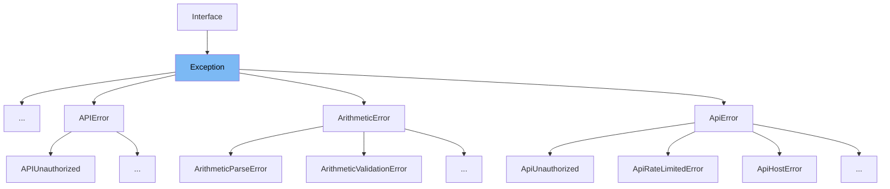

This document will cover the following aspects of the `Exception` class in `src/sentry/interfaces/exception.py`:

1. What is `Exception` and its purpose.
2. The variables and functions defined in `Exception`.
3. An example of how `Exception` is used in `InvalidPayload`.



# What is Exception

The `Exception` class in `src/sentry/interfaces/exception.py` is a part of Sentry's interfaces. It is used to handle and manage exceptions that occur within the Sentry application. It provides a structured way to catch and handle different types of exceptions, allowing for better error reporting and debugging.

<SwmSnippet path="/src/sentry/interfaces/exception.py" line="335">

---

# Variables and functions

The `Exception` class has a `score` variable and `grouping_variants` variable. The `score` variable is used for internal ranking, while `grouping_variants` is used to categorize exceptions.

```python
class Exception(Interface):
    """
    An exception consists of a list of values. In most cases, this list
    contains a single exception, with an optional stacktrace interface.

    Each exception has a mandatory ``value`` argument and optional ``type`` and
    ``module`` arguments describing the exception class type and module
    namespace.

    You can also optionally bind a stacktrace interface to an exception. The
    spec is identical to ``stacktrace``.

    >>> {
    >>>     "values": [{
    >>>         "type": "ValueError",
    >>>         "value": "My exception value",
    >>>         "module": "__builtins__",
    >>>         "mechanism": {
    >>>             # see sentry.interfaces.Mechanism
    >>>         },
    >>>         "stacktrace": {
```

---

</SwmSnippet>

<SwmSnippet path="/src/sentry/interfaces/exception.py" line="384">

---

The `to_python` function is used to convert the data into a Python object. It takes in the data and returns a Python object that represents the exception.

```python
    def to_python(cls, data, **kwargs):
        values = []
        for i, v in enumerate(get_path(data, "values", default=[])):
            if not v:
                # Cannot skip over None-values, need to preserve offsets
                values.append(v)
            else:
                values.append(SingleException.to_python_subpath(data, ["values", i], **kwargs))

        return super().to_python(
            {"values": values, "exc_omitted": data.get("exc_omitted")}, **kwargs
        )
```

---

</SwmSnippet>

<SwmSnippet path="/src/sentry/api/endpoints/accept_project_transfer.py" line="26">

---

# Usage example

`InvalidPayload` is an example of how `Exception` is used. It is a custom exception class that inherits from `Exception`. It is raised when the payload of a project transfer is invalid.

```python
class InvalidPayload(Exception):
    pass
```

---

</SwmSnippet>

&nbsp;

*This is an auto-generated document by Swimm AI 🌊 and has not yet been verified by a human*

<SwmMeta version="3.0.0" repo-id="Z2l0aHViJTNBJTNBZGVtby1zZW50cnklM0ElM0Fzd2ltbWlv" repo-name="demo-sentry"><sup>Powered by [Swimm](/)</sup></SwmMeta>
