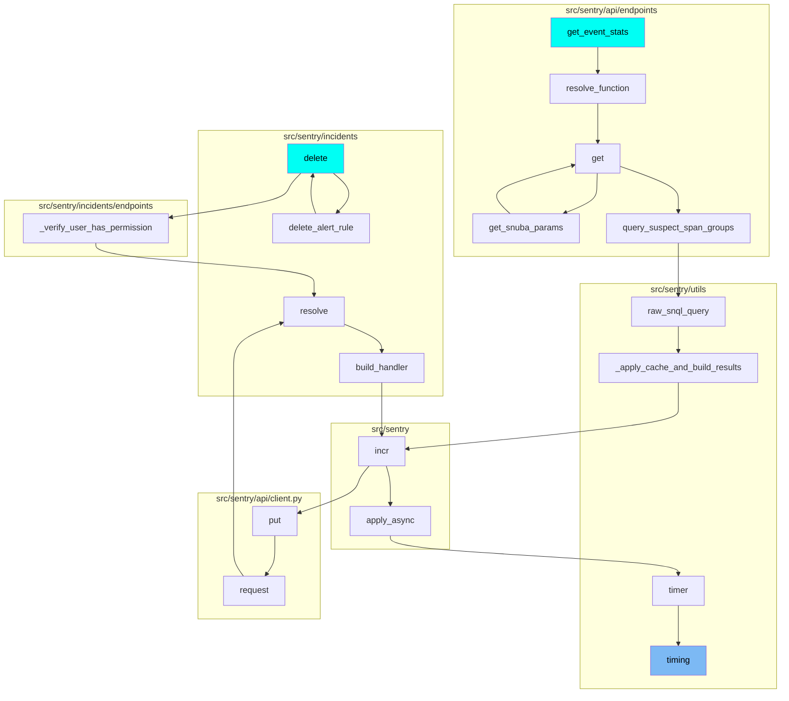
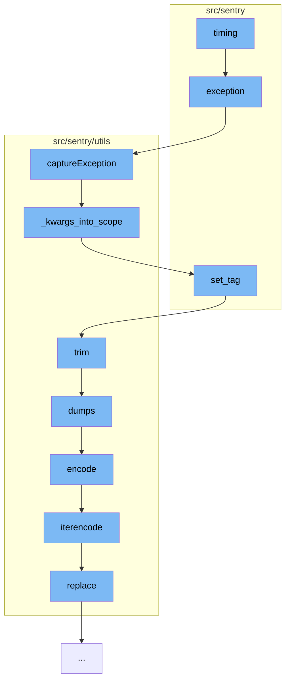

This document will cover the process of handling exceptions and data processing in Sentry, which includes:

1. Raising and capturing exceptions
2. Configuring scope and setting tags
3. Trimming and encoding data

## Where is this flow used?

The flow starts with the function `timing`. It is called from multiple entry points as represented in the following diagram:



## The flow itself



<SwmSnippet path="/src/sentry/management/commands/send_fake_data.py" line="25">

---

# Raising and Capturing Exceptions

The function `exception` is used to simulate an exception event. It raises an exception and then captures it using the `captureException` function from the Sentry SDK.

```python
    def exception(client):
        timestamp = datetime.datetime.utcnow() - datetime.timedelta(
            seconds=random.randint(0, timestamp_max)
        )
        try:
            raise next(exceptions)
        except Exception as exc:
            email = next(emails)
            with client.configure_scope() as scope:
                scope.user = {"id": email, "email": email}
                scope.logger = next(loggers)
                scope.site = "web"
                scope.date = timestamp
                return client.captureException(exc)
```

---

</SwmSnippet>

<SwmSnippet path="/src/sentry/utils/sdk.py" line="345">

---

# Configuring Scope and Setting Tags

The `captureException` function configures the scope of the event and sets tags using the `_kwargs_into_scope` function.

```python
    def captureException(self, exc_info=None, **kwargs):
        with sentry_sdk.push_scope() as scope:
            self._kwargs_into_scope(scope, **kwargs)
            return capture_exception(exc_info)
```

---

</SwmSnippet>

<SwmSnippet path="/src/sentry/utils/safe.py" line="45">

---

# Trimming and Encoding Data

The `trim` function is used to truncate a value to a maximum size. The method of truncation depends on the type of value. The trimmed value is then encoded using the `dumps` function in `src/sentry/utils/json.py`.

````python
def trim(
    value,
    max_size=settings.SENTRY_MAX_VARIABLE_SIZE,
    max_depth=6,
    object_hook=None,
    _depth=0,
    _size=0,
    **kwargs,
):
    """
    Truncates a value to ```MAX_VARIABLE_SIZE```.

    The method of truncation depends on the type of value.
    """
    options = {
        "max_depth": max_depth,
        "max_size": max_size,
        "object_hook": object_hook,
        "_depth": _depth + 1,
    }

````

---

</SwmSnippet>

&nbsp;

*This is an auto-generated document by Swimm AI 🌊 and has not yet been verified by a human*

<SwmMeta version="3.0.0" repo-id="Z2l0aHViJTNBJTNBZGVtby1zZW50cnklM0ElM0Fzd2ltbWlv" repo-name="demo-sentry"><sup>Powered by [Swimm](/)</sup></SwmMeta>
