This document will cover the process of executing the `top_events_timeseries` function in the `src/sentry/snuba/discover.py` file. We'll cover:

1. The purpose of the `top_events_timeseries` function
2. The flow of function calls initiated by `top_events_timeseries`

```mermaid
graph TD;
subgraph src/sentry
  top_events_timeseries:::mainFlowStyle --> get_timeseries_snuba_filter
end
subgraph src/sentry/search/events
  top_events_timeseries:::mainFlowStyle --> run_query
end
subgraph src/sentry/utils
  top_events_timeseries:::mainFlowStyle --> bulk_snql_query
end
subgraph src/sentry/utils
  top_events_timeseries:::mainFlowStyle --> raw_query
end
subgraph src/sentry
  top_events_timeseries:::mainFlowStyle --> query
end
subgraph src/sentry/search/events
  get_timeseries_snuba_filter --> resolve_field_list
end
subgraph src/sentry
  get_timeseries_snuba_filter --> resolve_discover_aliases
end
subgraph src/sentry/search/events
  resolve_field_list --> resolve_field
end
subgraph src/sentry/utils
  resolve_discover_aliases --> resolve_snuba_aliases
end
subgraph src/sentry/utils
  run_query --> raw_snql_query
end
subgraph src/sentry/utils
  raw_snql_query --> _apply_cache_and_build_results
end
subgraph src/sentry/utils
  raw_snql_query --> incr
end
subgraph src/sentry/utils
  bulk_snql_query --> _apply_cache_and_build_results
end
subgraph src/sentry/utils
  bulk_snql_query --> incr
end
subgraph src/sentry/utils
  _apply_cache_and_build_results --> incr
end
subgraph src/sentry/utils
  _apply_cache_and_build_results --> _bulk_snuba_query
end
subgraph src/sentry/api
  incr --> put
end
subgraph src/sentry/utils
  incr --> _start
end
subgraph src/sentry/utils
  raw_query --> bulk_raw_query
end
subgraph src/sentry/utils
  bulk_raw_query --> _apply_cache_and_build_results
end
subgraph src/sentry/search/events
  query:::mainFlowStyle --> run_query
end
subgraph src/sentry/utils
  query:::mainFlowStyle --> raw_query
end
subgraph src/sentry
  query:::mainFlowStyle --> transform_results
end
subgraph src/sentry
  query:::mainFlowStyle --> prepare_discover_query
end
subgraph src/sentry
  transform_results --> transform_data
end
subgraph src/sentry
  transform_results --> transform_meta
end
subgraph src/sentry
  transform_data --> zerofill
end
subgraph src/sentry
  transform_data --> get_row
end
subgraph src/bitfield/types.py
  transform_data --> items
end
subgraph src/sentry/search/events
  transform_meta --> get_json_meta_type
end
subgraph src/sentry/search/events
  prepare_discover_query:::mainFlowStyle --> resolve_field_list
end
subgraph src/sentry
  prepare_discover_query:::mainFlowStyle --> resolve_discover_aliases
end
subgraph src/sentry/search/events
  prepare_discover_query:::mainFlowStyle --> get_filter
end
subgraph src/sentry/search/events
  resolve_field --> resolve_function
end
subgraph src/bitfield/types.py
  resolve_snuba_aliases --> items
end
subgraph src/sentry/api
  get_filter:::mainFlowStyle --> parse_search_query
end
subgraph src/sentry/search/events
  get_filter:::mainFlowStyle --> column
end
subgraph src/sentry/search/events
  get_filter:::mainFlowStyle --> convert_search_boolean_to_snuba_query
end
subgraph src/sentry/search/events
  parse_search_query --> column
end
subgraph src/sentry/search/events
  column --> resolve_column_name
end
subgraph src/sentry/search/events
  resolve_column_name --> resolve_column
end
subgraph src/sentry/search/events
  convert_search_boolean_to_snuba_query:::mainFlowStyle --> convert_snuba_condition_to_function
end
subgraph src/sentry/search/events
  convert_snuba_condition_to_function:::mainFlowStyle --> format_search_filter
end
subgraph src/sentry/models
  format_search_filter:::mainFlowStyle --> by_qualified_short_id_bulk
end
subgraph src/sentry/search/utils.py
  format_search_filter:::mainFlowStyle --> parse_release
end
subgraph src/bitfield/types.py
  by_qualified_short_id_bulk --> items
end
subgraph src/sentry
  by_qualified_short_id_bulk --> list
end
subgraph src/sentry
  items --> list
end
subgraph src/sentry/utils
  list --> echo
end
subgraph src/sentry/search/utils.py
  parse_release:::mainFlowStyle --> get_latest_release
end
subgraph src/sentry
  get_latest_release:::mainFlowStyle --> list
end
subgraph src/sentry/search/utils.py
  get_latest_release:::mainFlowStyle --> _run_latest_release_query
end
subgraph src/sentry/models
  get_latest_release:::mainFlowStyle --> follows_semver_versioning_scheme
end
subgraph src/sentry
  echo --> write
end
  follows_semver_versioning_scheme:::mainFlowStyle --> ...

 classDef mainFlowStyle color:#000000,fill:#7CB9F4
  classDef rootsStyle color:#000000,fill:#00FFF4
```



<SwmSnippet path="/src/sentry/snuba/discover.py" line="430">

---

# The Purpose of the `top_events_timeseries` Function

The `top_events_timeseries` function is used to get a timeseries result for the top events. It first constructs a snuba filter from the provided query and parameters. It then resolves the selected columns and updates the snuba filter accordingly. The function also handles the calculation of project level thresholds for certain aggregates. Finally, it checks if the snuba filter has any aggregations and if not, raises an error.

```python
def get_timeseries_snuba_filter(selected_columns, query, params):
    snuba_filter = get_filter(query, params)
    if not snuba_filter.start and not snuba_filter.end:
        raise InvalidSearchQuery("Cannot get timeseries result without a start and end.")

    equations, columns = categorize_columns(selected_columns)

    if len(equations) > 0:
        resolved_equations, updated_columns, _ = resolve_equation_list(
            equations, columns, aggregates_only=True, auto_add=True
        )
    else:
        resolved_equations = []
        updated_columns = columns

    # For the new apdex, we need to add project threshold config as a selected
    # column which means the group by for the time series won't work.
    # As a temporary solution, we will calculate the mean of all the project
    # level thresholds in the request and use the legacy apdex, user_misery
    # or count_miserable calculation.
    # TODO(snql): Alias the project_threshold_config column so it doesn't
```

---

</SwmSnippet>

<SwmSnippet path="/src/sentry/snuba/discover.py" line="430">

---

# The Flow of Function Calls Initiated by `top_events_timeseries`

The `top_events_timeseries` function initiates a series of function calls to execute its task. It first calls `get_timeseries_snuba_filter` to get the snuba filter. Then it calls `run_query` to run the query. The `run_query` function in turn calls `raw_snql_query` which applies cache and builds results. The `top_events_timeseries` function also calls `bulk_snql_query` which also applies cache and builds results. The function `query` is also called by `top_events_timeseries` which further calls `run_query`, `raw_query`, `transform_results`, and `prepare_discover_query`.

```python
def get_timeseries_snuba_filter(selected_columns, query, params):
    snuba_filter = get_filter(query, params)
    if not snuba_filter.start and not snuba_filter.end:
        raise InvalidSearchQuery("Cannot get timeseries result without a start and end.")

    equations, columns = categorize_columns(selected_columns)

    if len(equations) > 0:
        resolved_equations, updated_columns, _ = resolve_equation_list(
            equations, columns, aggregates_only=True, auto_add=True
        )
    else:
        resolved_equations = []
        updated_columns = columns

    # For the new apdex, we need to add project threshold config as a selected
    # column which means the group by for the time series won't work.
    # As a temporary solution, we will calculate the mean of all the project
    # level thresholds in the request and use the legacy apdex, user_misery
    # or count_miserable calculation.
    # TODO(snql): Alias the project_threshold_config column so it doesn't
```

---

</SwmSnippet>

&nbsp;

*This is an auto-generated document by Swimm AI 🌊 and has not yet been verified by a human*

<SwmMeta version="3.0.0" repo-id="Z2l0aHViJTNBJTNBZGVtby1zZW50cnklM0ElM0Fzd2ltbWlv" repo-name="demo-sentry"><sup>Powered by [Swimm](/)</sup></SwmMeta>
