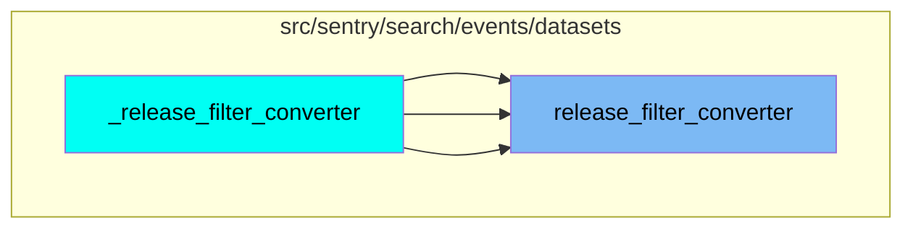
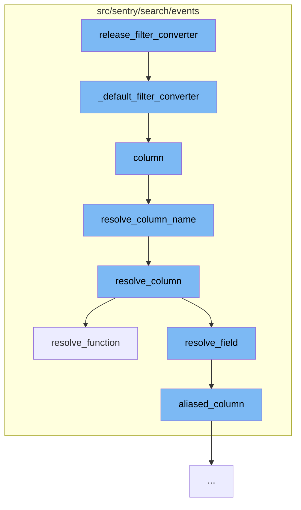

This document will cover the process of filtering and resolving columns in the Sentry search events, which includes:

1. Converting the default filter
2. Resolving the column name
3. Resolving the column
4. Resolving the function or field

## Where is this flow used?

The flow starts with the function `release_filter_converter`. It is called from multiple entry points as represented in the following diagram:



## The flow itself



<SwmSnippet path="/src/sentry/search/events/builder.py" line="931">

---

# Converting the Default Filter

The function `_default_filter_converter` is used to convert the search filter into a condition that can be used in a SQL WHERE clause. It first resolves the column name, then checks if it's in the array fields. Depending on the operator and value of the search filter, it constructs the appropriate condition.

```python
    def _default_filter_converter(self, search_filter: SearchFilter) -> Optional[WhereType]:
        name = search_filter.key.name
        operator = search_filter.operator
        value = search_filter.value.value

        lhs = self.resolve_column(name)

        if name in ARRAY_FIELDS:
            if search_filter.value.is_wildcard():
                # TODO: There are rare cases where this chaining don't
                # work. For example, a wildcard like '\**' will incorrectly
                # be replaced with '\%%'.
                return Condition(
                    lhs,
                    Op.LIKE if operator == "=" else Op.NOT_LIKE,
                    # Slashes have to be double escaped so they are
                    # interpreted as a string literal.
                    search_filter.value.raw_value.replace("\\", "\\\\")
                    .replace("%", "\\%")
                    .replace("_", "\\_")
                    .replace("*", "%"),
```

---

</SwmSnippet>

<SwmSnippet path="/src/sentry/search/events/builder.py" line="149">

---

# Resolving the Column Name

The function `resolve_column_name` is used to resolve the column name. It uses the `resolve_column` function from the utils/snuba.py file to get the actual column name in the database.

```python
    def resolve_column_name(self, col: str) -> str:
        # TODO when utils/snuba.py becomes typed don't need this extra annotation
        column_resolver: Callable[[str], str] = resolve_column(self.dataset)
        return column_resolver(col)
```

---

</SwmSnippet>

<SwmSnippet path="/src/sentry/search/events/builder.py" line="692">

---

# Resolving the Column

The function `resolve_column` is used to resolve the column. It checks if the field is a function, a field alias, or a field, and calls the corresponding resolver.

```python
    def resolve_column(self, field: str, alias: bool = False) -> SelectType:
        """Given a public field, construct the corresponding Snql, this
        function will determine the type of the field alias, whether its a
        column, field alias or function and call the corresponding resolver

        :param field: The public field string to resolve into Snql. This may
                      be a column, field alias, or even a function.
        :param alias: Whether or not the resolved column is aliased to the
                      original name. If false, it may still have an alias
                      but is not guaranteed.
        """
        match = is_function(field)
        if match:
            return self.resolve_function(field, match)
        elif self.is_field_alias(field):
            return self.resolve_field_alias(field)
        else:
            return self.resolve_field(field, alias=alias)
```

---

</SwmSnippet>

<SwmSnippet path="/src/sentry/search/events/builder.py" line="486">

---

# Resolving the Function or Field

The function `resolve_function` is used to resolve the function. It parses the function, checks if it's accessible, formats the arguments, and then resolves the SnQL function.

```python
    def resolve_function(
        self,
        function: str,
        match: Optional[Match[str]] = None,
        resolve_only: bool = False,
        overwrite_alias: Optional[str] = None,
    ) -> SelectType:
        """Given a public function, resolve to the corresponding Snql function


        :param function: the public alias for a function eg. "p50(transaction.duration)"
        :param match: the Match so we don't have to run the regex twice
        :param resolve_only: whether we should add the aggregate to self.aggregates
        :param overwrite_alias: ignore the alias in the parsed_function and use this string instead
        """
        if match is None:
            match = is_function(function)

        if not match:
            raise InvalidSearchQuery(f"Invalid characters in field {function}")

```

---

</SwmSnippet>

&nbsp;

*This is an auto-generated document by Swimm AI 🌊 and has not yet been verified by a human*

<SwmMeta version="3.0.0" repo-id="Z2l0aHViJTNBJTNBZGVtby1zZW50cnklM0ElM0Fzd2ltbWlv" repo-name="demo-sentry"><sup>Powered by [Swimm](/)</sup></SwmMeta>
