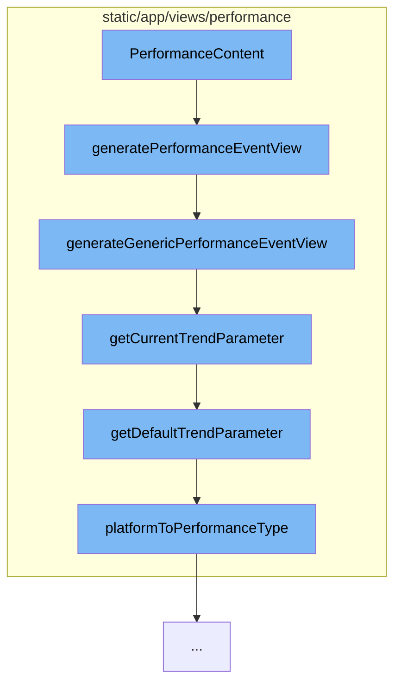

This document will cover the process of generating a performance event view in the Sentry application. The process includes the following steps:

1. Invoking the `PerformanceContent` function
2. Calling the `generatePerformanceEventView` function
3. Invoking the `generateGenericPerformanceEventView` function
4. Calling the `getCurrentTrendParameter` function
5. Invoking the `getDefaultTrendParameter` function
6. Calling the `platformToPerformanceType` function.



<SwmSnippet path="/static/app/views/performance/content.tsx" line="1">

---

# Invoking the PerformanceContent function

The `PerformanceContent` function is the entry point for generating a performance event view. It is responsible for initiating the process by calling the `generatePerformanceEventView` function.

```tsx
import {useEffect, useRef, useState} from 'react';
```

---

</SwmSnippet>

<SwmSnippet path="/static/app/views/performance/data.tsx" line="739">

---

# Calling the generatePerformanceEventView function

The `generatePerformanceEventView` function is responsible for creating a generic performance event view. Depending on the `isTrends` parameter, it either returns the generated event view or proceeds to generate a specific type of performance event view based on the `display.field` value.

```tsx
export function generatePerformanceEventView(
  location: Location,
  projects: Project[],
  {isTrends = false} = {}
) {
  const eventView = generateGenericPerformanceEventView(location);

  if (isTrends) {
    return eventView;
  }

  const display = getCurrentLandingDisplay(location, projects, eventView);
  switch (display?.field) {
    case LandingDisplayField.FRONTEND_PAGELOAD:
      return generateFrontendPageloadPerformanceEventView(location);
    case LandingDisplayField.FRONTEND_OTHER:
      return generateFrontendOtherPerformanceEventView(location);
    case LandingDisplayField.BACKEND:
      return generateBackendPerformanceEventView(location);
    case LandingDisplayField.MOBILE:
      return generateMobilePerformanceEventView(location, projects, eventView);
```

---

</SwmSnippet>

<SwmSnippet path="/static/app/views/performance/data.tsx" line="392">

---

# Invoking the generateGenericPerformanceEventView function

The `generateGenericPerformanceEventView` function creates a generic performance event view. It sets up the necessary fields and conditions for the event view, and adds additional conditions based on the `trendParameter` query.

```tsx
function generateGenericPerformanceEventView(location: Location): EventView {
  const {query} = location;

  const fields = [
    'team_key_transaction',
    'transaction',
    'project',
    'tpm()',
    'p50()',
    'p95()',
    'failure_rate()',
    'apdex()',
    'count_unique(user)',
    'count_miserable(user)',
    'user_misery()',
  ];

  const hasStartAndEnd = query.start && query.end;
  const savedQuery: NewQuery = {
    id: undefined,
    name: t('Performance'),
```

---

</SwmSnippet>

<SwmSnippet path="/static/app/views/performance/trends/utils.tsx" line="160">

---

# Calling the getCurrentTrendParameter function

The `getCurrentTrendParameter` function retrieves the current trend parameter from the location query. If the trend parameter is not found, it calls the `getDefaultTrendParameter` function to get the default trend parameter.

```tsx
export function getCurrentTrendParameter(
  location: Location,
  projects: Project[],
  projectIds: Readonly<number[]>
): TrendParameter {
  const trendParameterLabel = decodeScalar(location?.query?.trendParameter);
  const trendParameter = TRENDS_PARAMETERS.find(
    ({label}) => label === trendParameterLabel
  );

  if (trendParameter) {
    return trendParameter;
  }

  const defaultTrendParameter = getDefaultTrendParameter(projects, projectIds);
  return defaultTrendParameter;
}
```

---

</SwmSnippet>

<SwmSnippet path="/static/app/views/performance/trends/utils.tsx" line="150">

---

# Invoking the getDefaultTrendParameter function

The `getDefaultTrendParameter` function determines the default trend parameter based on the project's performance type. It calls the `platformToPerformanceType` function to get the performance type.

```tsx
function getDefaultTrendParameter(
  projects: Project[],
  projectIds: Readonly<number[]>
): TrendParameter {
  const performanceType = platformToPerformanceType(projects, projectIds);
  const trendParameter = performanceTypeToTrendParameterLabel(performanceType);

  return trendParameter;
}
```

---

</SwmSnippet>

<SwmSnippet path="/static/app/views/performance/utils.tsx" line="51">

---

# Calling the platformToPerformanceType function

The `platformToPerformanceType` function determines the performance type based on the project's platform. It checks if the platform belongs to frontend, backend, or mobile, and returns the corresponding performance type.

```tsx
export function platformToPerformanceType(
  projects: (Project | ReleaseProject)[],
  projectIds: readonly number[]
) {
  if (projectIds.length === 0 || projectIds[0] === ALL_ACCESS_PROJECTS) {
    return PROJECT_PERFORMANCE_TYPE.ANY;
  }

  const selectedProjects = projects.filter(p =>
    projectIds.includes(parseInt(`${p.id}`, 10))
  );

  if (selectedProjects.length === 0 || selectedProjects.some(p => !p.platform)) {
    return PROJECT_PERFORMANCE_TYPE.ANY;
  }

  if (
    selectedProjects.every(project =>
      FRONTEND_PLATFORMS.includes(project.platform as string)
    )
  ) {
```

---

</SwmSnippet>

&nbsp;

*This is an auto-generated document by Swimm AI 🌊 and has not yet been verified by a human*

<SwmMeta version="3.0.0" repo-id="Z2l0aHViJTNBJTNBZGVtby1zZW50cnklM0ElM0Fzd2ltbWlv" repo-name="demo-sentry"><sup>Powered by [Swimm](/)</sup></SwmMeta>
