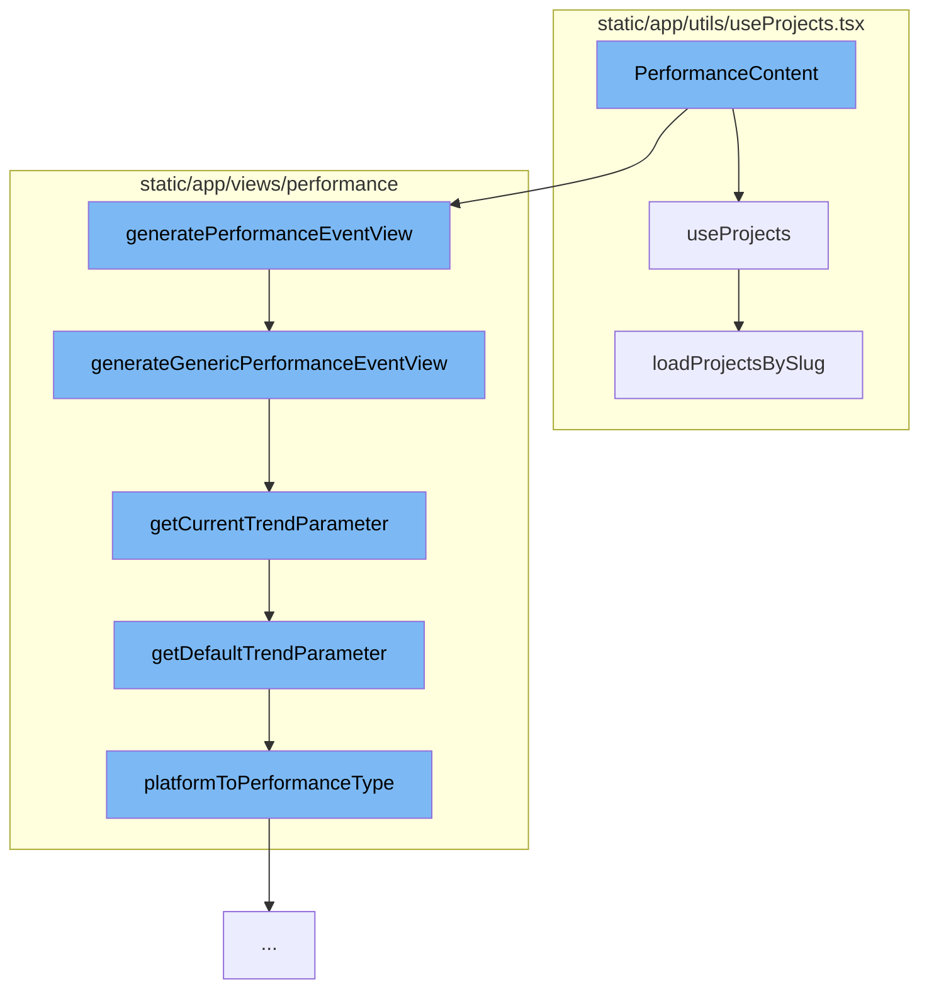

This document will cover the process of generating performance event views in the Sentry application. The process includes the following steps:

1. Fetching project data using the `useProjects` function.
2. Generating a performance event view using the `generatePerformanceEventView` function.
3. Determining the current trend parameter using the `getCurrentTrendParameter` function.
4. Determining the default trend parameter using the `getDefaultTrendParameter` function.
5. Mapping the platform to a performance type using the `platformToPerformanceType` function.



<SwmSnippet path="/static/app/utils/useProjects.tsx" line="142">

---

# Fetching Project Data

The `useProjects` function fetches project data from the ProjectStore. It provides a way to select specific project slugs and search for more projects that may not be in the project store. The function `loadProjectsBySlug` is used to load specific projects by their slugs.

```tsx
/**
 * Provides projects from the ProjectStore
 *
 * This hook also provides a way to select specific project slugs, and search
 * (type-ahead) for more projects that may not be in the project store.
 *
 * NOTE: Currently ALL projects are always loaded, but this hook is designed
 * for future-compat in a world where we do _not_ load all projects.
 */
function useProjects({limit, slugs, orgId: propOrgId}: Options = {}) {
  const api = useApi();

  const {organization} = useLegacyStore(OrganizationStore);
  const store = useLegacyStore(ProjectsStore);

  const orgId = propOrgId ?? organization?.slug;

  const storeSlugs = new Set(store.projects.map(t => t.slug));
  const slugsToLoad = slugs?.filter(slug => !storeSlugs.has(slug)) ?? [];
  const shouldLoadSlugs = slugsToLoad.length > 0;

```

---

</SwmSnippet>

<SwmSnippet path="/static/app/views/performance/data.tsx" line="392">

---

# Generating Performance Event View

The `generateGenericPerformanceEventView` function generates a performance event view based on the location query. It sets up the fields, query, and other parameters for the event view. If a trend parameter is present in the query, it adds a filter for the trend parameter.

```tsx
function generateGenericPerformanceEventView(location: Location): EventView {
  const {query} = location;

  const fields = [
    'team_key_transaction',
    'transaction',
    'project',
    'tpm()',
    'p50()',
    'p95()',
    'failure_rate()',
    'apdex()',
    'count_unique(user)',
    'count_miserable(user)',
    'user_misery()',
  ];

  const hasStartAndEnd = query.start && query.end;
  const savedQuery: NewQuery = {
    id: undefined,
    name: t('Performance'),
```

---

</SwmSnippet>

<SwmSnippet path="/static/app/views/performance/trends/utils.tsx" line="160">

---

# Determining Current Trend Parameter

The `getCurrentTrendParameter` function determines the current trend parameter based on the location and project data. If a trend parameter is present in the location query, it is returned. Otherwise, the default trend parameter is determined and returned.

```tsx
export function getCurrentTrendParameter(
  location: Location,
  projects: Project[],
  projectIds: Readonly<number[]>
): TrendParameter {
  const trendParameterLabel = decodeScalar(location?.query?.trendParameter);
  const trendParameter = TRENDS_PARAMETERS.find(
    ({label}) => label === trendParameterLabel
  );

  if (trendParameter) {
    return trendParameter;
  }

  const defaultTrendParameter = getDefaultTrendParameter(projects, projectIds);
  return defaultTrendParameter;
}
```

---

</SwmSnippet>

<SwmSnippet path="/static/app/views/performance/trends/utils.tsx" line="150">

---

# Determining Default Trend Parameter

The `getDefaultTrendParameter` function determines the default trend parameter based on the projects and project IDs. It uses the `platformToPerformanceType` function to map the platform to a performance type, which is then used to determine the trend parameter.

```tsx
function getDefaultTrendParameter(
  projects: Project[],
  projectIds: Readonly<number[]>
): TrendParameter {
  const performanceType = platformToPerformanceType(projects, projectIds);
  const trendParameter = performanceTypeToTrendParameterLabel(performanceType);

  return trendParameter;
}
```

---

</SwmSnippet>

&nbsp;

*This is an auto-generated document by Swimm AI 🌊 and has not yet been verified by a human*

<SwmMeta version="3.0.0" repo-id="Z2l0aHViJTNBJTNBZGVtby1zZW50cnklM0ElM0Fzd2ltbWlv" repo-name="demo-sentry"><sup>Powered by [Swimm](/)</sup></SwmMeta>
