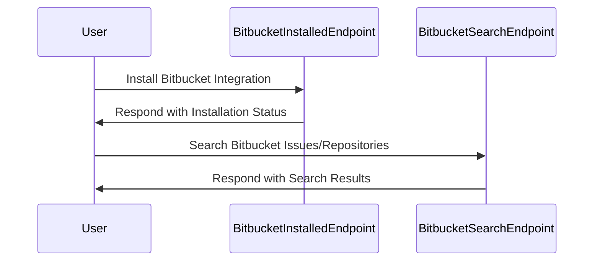

Bitbucket is a web-based version control repository hosting service owned by Atlassian, for source code and development projects that use either Mercurial or Git revision control systems. In the context of the `demo-sentry` repository, Bitbucket is integrated to provide several features. These include tracking commits and releases, resolving Sentry issues via Bitbucket commits, and creating Bitbucket issues from Sentry. The `BitbucketIntegrationProvider` class in `src/sentry/integrations/bitbucket/integration.py` is a key component of this integration. It defines the metadata, scopes, and features of the integration. The Bitbucket API is used extensively in `src/sentry/integrations/bitbucket/client.py` to interact with Bitbucket services, such as fetching and creating issues. The Bitbucket integration also includes handling of Bitbucket webhooks, with IP verification implemented using the defined Bitbucket IP ranges in `src/sentry/integrations/bitbucket/constants.py`.

<SwmSnippet path="/src/sentry/integrations/bitbucket/installed.py" line="11">

---

# Bitbucket Integration Endpoints

The `BitbucketInstalledEndpoint` class defines the endpoint that is called when the Bitbucket integration is installed. It uses the `post` method to handle the installation process, which includes building the integration data and ensuring the integration is set up correctly.

```python
class BitbucketInstalledEndpoint(Endpoint):
    authentication_classes = ()
    permission_classes = ()

    @csrf_exempt
    def dispatch(self, request: Request, *args, **kwargs) -> Response:
        return super().dispatch(request, *args, **kwargs)

    def post(self, request: Request, *args, **kwargs) -> Response:
        state = request.data
        data = BitbucketIntegrationProvider().build_integration(state)
        ensure_integration("bitbucket", data)

        return self.respond()
```

---

</SwmSnippet>

<SwmSnippet path="/src/sentry/integrations/bitbucket/search.py" line="13">

---

The `BitbucketSearchEndpoint` class defines the endpoint for searching Bitbucket issues and repositories. The `get` method is used to handle the search request, which includes validating the request parameters, performing the search, and returning the search results.

```python
class BitbucketSearchEndpoint(IntegrationEndpoint):
    def get(self, request: Request, organization, integration_id) -> Response:
        try:
            integration = Integration.objects.get(
                organizations=organization, id=integration_id, provider="bitbucket"
            )
        except Integration.DoesNotExist:
            return Response(status=404)

        field = request.GET.get("field")
        query = request.GET.get("query")
        if field is None:
            return Response({"detail": "field is a required parameter"}, status=400)
        if not query:
            return Response({"detail": "query is a required parameter"}, status=400)

        installation = integration.get_installation(organization.id)

        if field == "externalIssue":
            repo = request.GET.get("repo")
            if not repo:
```

---

</SwmSnippet>



&nbsp;

*This is an auto-generated document by Swimm AI 🌊 and has not yet been verified by a human*

<SwmMeta version="3.0.0" repo-id="Z2l0aHViJTNBJTNBZGVtby1zZW50cnklM0ElM0Fzd2ltbWlv" repo-name="demo-sentry"><sup>Powered by [Swimm](/)</sup></SwmMeta>
