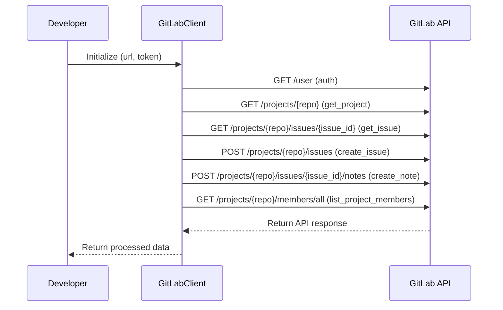

GitLab is a web-based DevOps lifecycle tool that provides a Git-repository manager providing wiki, issue-tracking and continuous integration/continuous deployment pipeline features. In the context of the `demo-sentry` repository, GitLab is integrated as a plugin. The `GitLabClient` class in `src/sentry_plugins/gitlab/client.py` is used to interact with the GitLab API. The `GitLabPlugin` class in `src/sentry_plugins/gitlab/plugin.py` is used to integrate GitLab issues by linking a repository to a project in Sentry. The `slug` variable is used to identify the plugin, the `conf_key` is used for configuration, and the `required_field` indicates that a `gitlab_url` is necessary for the plugin to function.

<SwmSnippet path="/src/sentry_plugins/gitlab/client.py" line="7">

---

# GitLabClient Class

The `GitLabClient` class is a wrapper around the GitLab API. It is initialized with a base URL and a token. The `request` method is a generic method for making API requests, and it is used by other methods to perform specific actions. For example, `get_project` method uses it to fetch project details, `get_issue` to fetch issue details, `create_issue` to create a new issue, `create_note` to create a note for an issue, and `list_project_members` to get a list of all project members.

```python
class GitLabClient(ApiClient):
    allow_redirects = False
    plugin_name = "gitlab"

    def __init__(self, url, token):
        super().__init__()
        self.base_url = url
        self.token = token

    def build_url(self, path):
        return "{}/api/v4/{}".format(self.base_url, path.lstrip("/"))

    def request(self, method, path, data=None, params=None):
        headers = {"Private-Token": self.token}
        return self._request(method, path, headers=headers, params=params, data=data)

    def auth(self):
        return self.request("GET", "/user")

    def get_project(self, repo):
        return self.request("GET", "/projects/{}".format(quote(repo, safe="")))
```

---

</SwmSnippet>



&nbsp;

*This is an auto-generated document by Swimm AI 🌊 and has not yet been verified by a human*

<SwmMeta version="3.0.0" repo-id="Z2l0aHViJTNBJTNBZGVtby1zZW50cnklM0ElM0Fzd2ltbWlv" repo-name="demo-sentry"><sup>Powered by [Swimm](/)</sup></SwmMeta>
