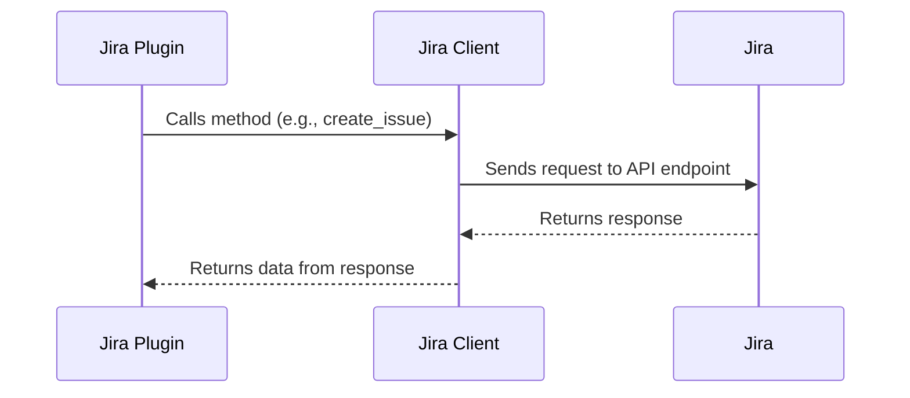

Jira is a popular issue tracking and project management tool developed by Atlassian. In the context of the `demo-sentry` repository, Jira is integrated through the `JiraPlugin` class in `src/sentry_plugins/jira/plugin.py`. This plugin allows Sentry to create and link issues directly to a Jira ticket in any of your projects. The `JiraClient` class in `src/sentry_plugins/jira/client.py` is used to communicate with the Jira API. It includes methods for getting project metadata, creating issues, and searching for users, among other things. The `get_jira_client` function in `src/sentry_plugins/jira/plugin.py` is used to create an instance of the `JiraClient` with the appropriate credentials. The `get_new_issue_fields` function in the same file is used to get the fields required for creating a new issue in Jira.

<SwmSnippet path="/src/sentry_plugins/jira/plugin.py" line="30">

---

# Jira Plugin in Sentry

The `plugin.py` file defines the `JiraPlugin` class, which is the main entry point for the Jira plugin in Sentry. This class contains methods for configuring the plugin, creating and linking Jira issues, and interacting with Jira's API. For example, the `get_new_issue_fields` method retrieves the fields required to create a new Jira issue, while the `create_issue` method sends a request to Jira's API to create a new issue.

```python
class JiraPlugin(CorePluginMixin, IssuePlugin2):
    description = "Integrate JIRA issues by linking a project."
    slug = "jira"
    title = "JIRA"
    conf_title = title
    conf_key = slug
    required_field = "username"
    feature_descriptions = [
        FeatureDescription(
            """
            Create and link Sentry issue groups directly to a Jira ticket in any of your
            projects, providing a quick way to jump from a Sentry bug to tracked ticket!
            """,
            IntegrationFeatures.ISSUE_BASIC,
        )
    ]

    def get_group_urls(self):
        _patterns = super().get_group_urls()
        _patterns.append(
            url(
```

---

</SwmSnippet>

<SwmSnippet path="/src/sentry_plugins/jira/client.py" line="18">

---

# Jira API Client

The `client.py` file defines the `JiraClient` class, which is used by the `JiraPlugin` class to interact with Jira's API. This class contains methods for sending requests to various Jira API endpoints. For example, the `get_projects_list` method retrieves a list of all Jira projects, while the `create_issue` method sends a request to the `CREATE_URL` endpoint to create a new Jira issue.

```python
class JiraClient(ApiClient):
    """
    The JIRA API Client, so you don't have to.
    """

    PROJECT_URL = "/rest/api/2/project"
    META_URL = "/rest/api/2/issue/createmeta"
    CREATE_URL = "/rest/api/2/issue"
    PRIORITIES_URL = "/rest/api/2/priority"
    VERSIONS_URL = "/rest/api/2/project/{}/versions"
    USERS_URL = "/rest/api/2/user/assignable/search"
    ISSUE_URL = "/rest/api/2/issue/{}"
    SEARCH_URL = "/rest/api/2/search/"
    COMMENT_URL = "/rest/api/2/issue/{}/comment"
    HTTP_TIMEOUT = 5
    plugin_name = "jira"

    def __init__(self, instance_uri, username, password):
        self.base_url = instance_uri.rstrip("/")
        self.username = username
        self.password = password
```

---

</SwmSnippet>



&nbsp;

*This is an auto-generated document by Swimm AI 🌊 and has not yet been verified by a human*

<SwmMeta version="3.0.0" repo-id="Z2l0aHViJTNBJTNBZGVtby1zZW50cnklM0ElM0Fzd2ltbWlv" repo-name="demo-sentry"><sup>Powered by [Swimm](/)</sup></SwmMeta>
