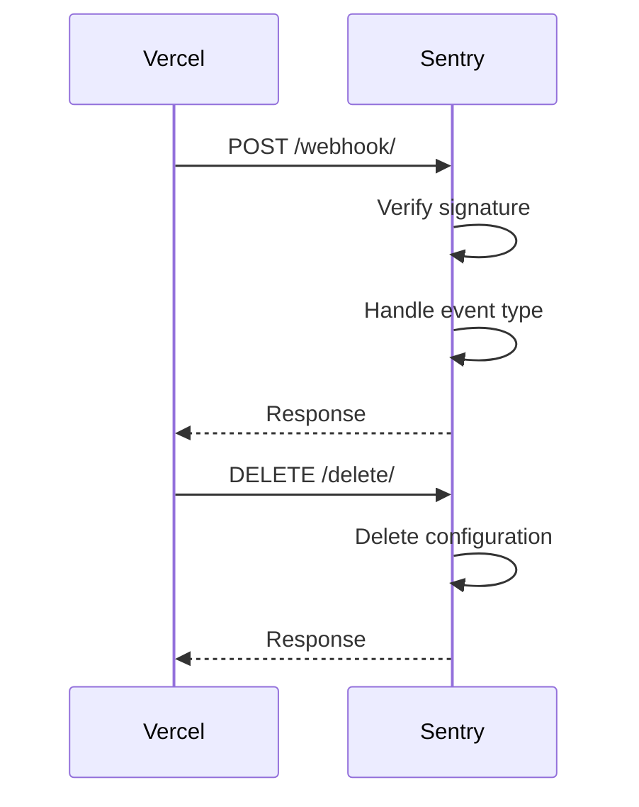

Vercel is an all-in-one platform with Global CDN supporting static & JAMstack deployment and Serverless Functions. In the context of the Sentry repository, Vercel is integrated to automatically upload source maps and notify Sentry of new releases being deployed. This integration is facilitated by the `VercelIntegrationProvider` class in `src/sentry/integrations/vercel/integration.py`. The class includes methods for installing and configuring the integration, as well as post-installation processes. The `VercelClient` class in `src/sentry/integrations/vercel/client.py` is used to interact with the Vercel API.

<SwmSnippet path="/src/sentry/integrations/vercel/urls.py" line="8">

---

# Vercel Endpoints

This file defines three endpoints for the Vercel integration. The `/webhook/` endpoint is handled by the `VercelWebhookEndpoint` class, the `/configure/` endpoint is handled by the `VercelExtensionConfigurationView` class, and the `/delete/` endpoint is handled by the `VercelGenericWebhookEndpoint` class.

```python
urlpatterns = [
    url(r"^webhook/$", VercelWebhookEndpoint.as_view(), name="sentry-extensions-vercel-webhook"),
    url(
        r"^configure/$",
        VercelExtensionConfigurationView.as_view(),
        name="sentry-extensions-vercel-configure",
    ),
    # XXX(meredith): This route has become our generic hook, in
    # the future we'll need to update the route name to reflect that.
    url(
        r"^delete/$",
        VercelGenericWebhookEndpoint.as_view(),
        name="sentry-extensions-vercel-generic-webhook",
    ),
]
```

---

</SwmSnippet>

<SwmSnippet path="/src/sentry/integrations/vercel/generic_webhook.py" line="128">

---

# Vercel Generic Webhook

The `VercelGenericWebhookEndpoint` class handles POST and DELETE requests from Vercel. It verifies the signature of the request, checks the event type, and performs actions based on the event type. For example, if the event type is `integration-configuration-removed`, it deletes the corresponding configuration. If the event type is `deployment`, it handles the creation of a new deployment.

```python
class VercelGenericWebhookEndpoint(Endpoint):
    authentication_classes = ()
    permission_classes = ()
    provider = "vercel"

    @csrf_exempt
    def dispatch(self, request: Request, *args, **kwargs) -> Response:
        return super().dispatch(request, *args, **kwargs)

    def post(self, request: Request) -> Response:
        if not request.META.get("HTTP_X_VERCEL_SIGNATURE"):
            logger.error("vercel.webhook.missing-signature")
            return self.respond(status=401)

        is_valid = verify_signature(request)

        if not is_valid:
            logger.error("vercel.webhook.invalid-signature")
            return self.respond(status=401)

        # Vercel's generic webhook allows you to subscribe to different events,
```

---

</SwmSnippet>



&nbsp;

*This is an auto-generated document by Swimm AI 🌊 and has not yet been verified by a human*

<SwmMeta version="3.0.0" repo-id="Z2l0aHViJTNBJTNBZGVtby1zZW50cnklM0ElM0Fzd2ltbWlv" repo-name="demo-sentry"><sup>Powered by [Swimm](/)</sup></SwmMeta>
