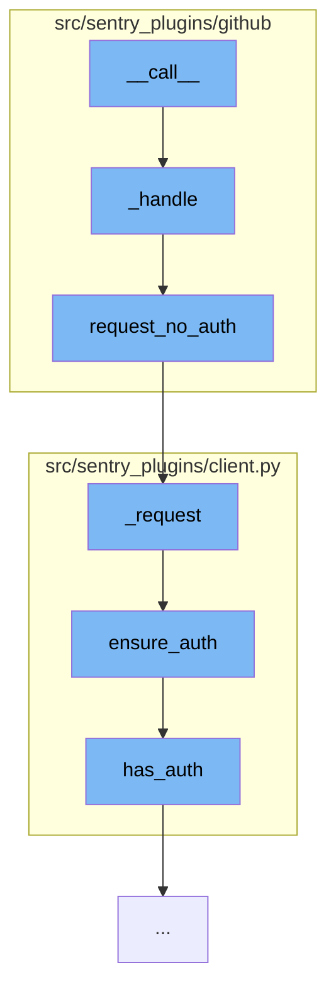

This document will cover the process of handling GitHub webhook events in the Sentry application. The process includes:

1. Invoking the webhook event handler
2. Processing the event data
3. Making an unauthenticated request to the GitHub API
4. Ensuring the request is authenticated
5. Checking if the request has valid authentication tokens.



<SwmSnippet path="/src/sentry_plugins/github/webhooks/events/push.py" line="19">

---

# Invoking the webhook event handler

The function `_handle` is the main event handler for GitHub webhook events. It processes the event data, identifies the repository and author details, and creates or updates commits in the Sentry application.

```python
    def _handle(self, event, organization, is_apps):
        authors = {}

        gh_username_cache = {}

        try:
            repo = Repository.objects.get(
                organization_id=organization.id,
                provider="github_apps" if is_apps else "github",
                external_id=str(event["repository"]["id"]),
            )
        except Repository.DoesNotExist:
            raise Http404()

        # We need to track GitHub's "full_name" which is the repository slug.
        # This is needed to access the API since `external_id` isn't sufficient.
        if repo.config.get("name") != event["repository"]["full_name"]:
            repo.config["name"] = event["repository"]["full_name"]
            repo.save()

        for commit in event["commits"]:
```

---

</SwmSnippet>

<SwmSnippet path="/src/sentry_plugins/github/client.py" line="39">

---

# Making an unauthenticated request to the GitHub API

The function `request_no_auth` is used to make an unauthenticated request to the GitHub API. This is used when the GitHub username needs to be fetched from the GitHub API.

```python
    def request_no_auth(self, method, path, data=None, params=None):
        if params is None:
            params = {}

        return self._request(method, path, auth=None, data=data, params=params)
```

---

</SwmSnippet>

<SwmSnippet path="/src/sentry_plugins/client.py" line="28">

---

# Ensuring the request is authenticated

The function `ensure_auth` checks if the request has an 'Authorization' header and if the request has valid authentication tokens. If not, it binds the authentication to the request.

```python
    def ensure_auth(self, **kwargs):
        headers = kwargs["headers"]
        if "Authorization" not in headers and self.has_auth() and "auth" not in kwargs:
            kwargs = self.bind_auth(**kwargs)
        return kwargs
```

---

</SwmSnippet>

&nbsp;

*This is an auto-generated document by Swimm AI 🌊 and has not yet been verified by a human*

<SwmMeta version="3.0.0" repo-id="Z2l0aHViJTNBJTNBZGVtby1zZW50cnklM0ElM0Fzd2ltbWlv" repo-name="demo-sentry"><sup>Powered by [Swimm](/)</sup></SwmMeta>
