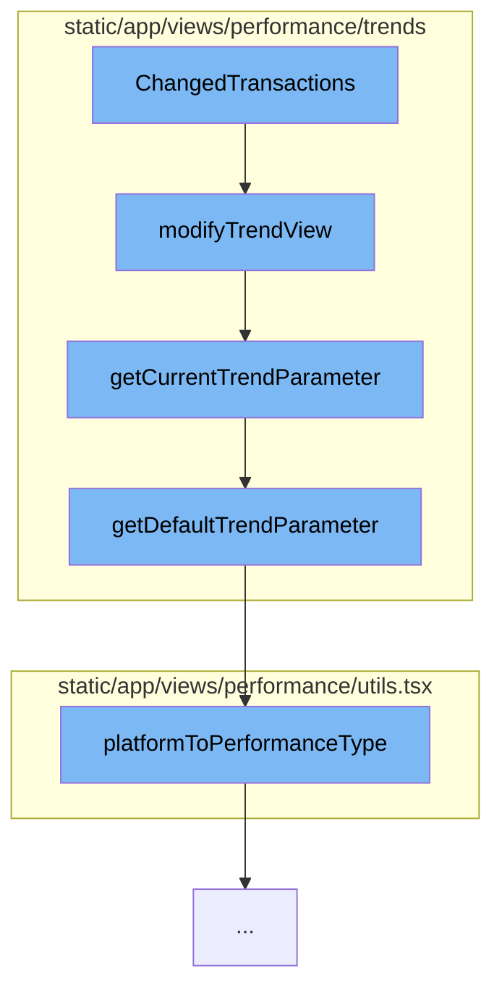

This document will cover the process of handling changed transactions in the Sentry application. The process includes:

1. Modifying the trend view
2. Getting the current trend parameter
3. Getting the default trend parameter
4. Mapping the platform to performance type.



<SwmSnippet path="/static/app/views/performance/trends/utils.tsx" line="228">

---

# Modifying the Trend View

The function `modifyTrendView` is the entry point for this process. It takes in a `trendView`, `location`, `trendsType`, `projects`, and an optional `isProjectOnly` flag. It modifies the `trendView` based on the `trendsType` and other parameters.

```tsx
export function modifyTrendView(
  trendView: TrendView,
  location: Location,
  trendsType: TrendChangeType,
  projects: Project[],
  isProjectOnly?: boolean
) {
  const trendFunction = getCurrentTrendFunction(location);
  const trendParameter = getCurrentTrendParameter(location, projects, trendView.project);

  const transactionField = isProjectOnly ? [] : ['transaction'];
  const fields = [...transactionField, 'project'].map(field => ({
    field,
  })) as Field[];

  const trendSort = {
    field: 'trend_percentage()',
    kind: 'asc',
  } as Sort;

  trendView.trendType = trendsType;
```

---

</SwmSnippet>

<SwmSnippet path="/static/app/views/performance/trends/utils.tsx" line="160">

---

# Getting the Current Trend Parameter

The function `getCurrentTrendParameter` is called within `modifyTrendView`. It retrieves the current trend parameter from the location query or defaults to the default trend parameter if none is found.

```tsx
export function getCurrentTrendParameter(
  location: Location,
  projects: Project[],
  projectIds: Readonly<number[]>
): TrendParameter {
  const trendParameterLabel = decodeScalar(location?.query?.trendParameter);
  const trendParameter = TRENDS_PARAMETERS.find(
    ({label}) => label === trendParameterLabel
  );

  if (trendParameter) {
    return trendParameter;
  }

  const defaultTrendParameter = getDefaultTrendParameter(projects, projectIds);
  return defaultTrendParameter;
}
```

---

</SwmSnippet>

<SwmSnippet path="/static/app/views/performance/trends/utils.tsx" line="150">

---

# Getting the Default Trend Parameter

The function `getDefaultTrendParameter` is called within `getCurrentTrendParameter`. It determines the default trend parameter based on the platform performance type.

```tsx
function getDefaultTrendParameter(
  projects: Project[],
  projectIds: Readonly<number[]>
): TrendParameter {
  const performanceType = platformToPerformanceType(projects, projectIds);
  const trendParameter = performanceTypeToTrendParameterLabel(performanceType);

  return trendParameter;
}
```

---

</SwmSnippet>

<SwmSnippet path="/static/app/views/performance/utils.tsx" line="51">

---

# Mapping the Platform to Performance Type

The function `platformToPerformanceType` is called within `getDefaultTrendParameter`. It maps the platform of the projects to a performance type, which is used to determine the default trend parameter.

```tsx
export function platformToPerformanceType(
  projects: (Project | ReleaseProject)[],
  projectIds: readonly number[]
) {
  if (projectIds.length === 0 || projectIds[0] === ALL_ACCESS_PROJECTS) {
    return PROJECT_PERFORMANCE_TYPE.ANY;
  }

  const selectedProjects = projects.filter(p =>
    projectIds.includes(parseInt(`${p.id}`, 10))
  );

  if (selectedProjects.length === 0 || selectedProjects.some(p => !p.platform)) {
    return PROJECT_PERFORMANCE_TYPE.ANY;
  }

  if (
    selectedProjects.every(project =>
      FRONTEND_PLATFORMS.includes(project.platform as string)
    )
  ) {
```

---

</SwmSnippet>

&nbsp;

*This is an auto-generated document by Swimm AI 🌊 and has not yet been verified by a human*

<SwmMeta version="3.0.0" repo-id="Z2l0aHViJTNBJTNBZGVtby1zZW50cnklM0ElM0Fzd2ltbWlv" repo-name="demo-sentry"><sup>Powered by [Swimm](/)</sup></SwmMeta>
