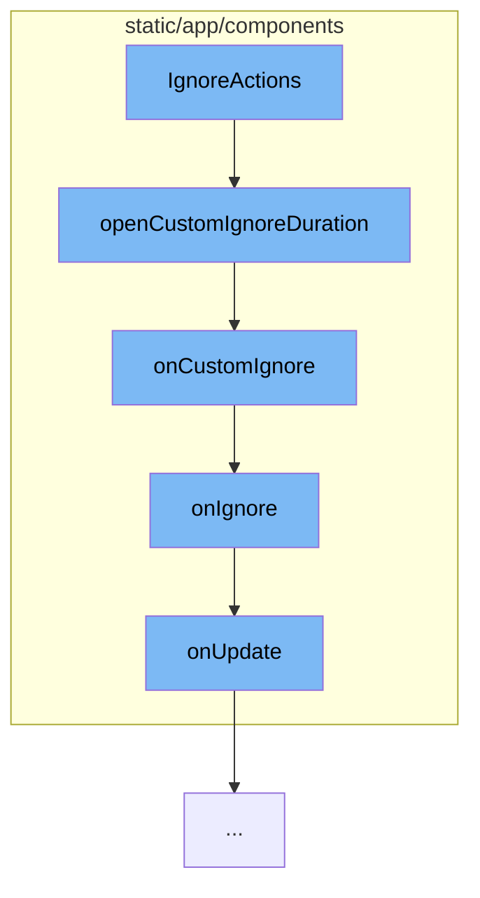

This document will cover the process of handling ignore actions in the Sentry application. The process includes the following steps:

1. Opening the custom ignore duration modal.
2. Handling custom ignore action.
3. Handling ignore action.
4. Updating the issue status.



<SwmSnippet path="/static/app/components/actions/ignore.tsx" line="78">

---

# Opening the custom ignore duration modal

The function `openCustomIgnoreDuration` is used to open a modal for custom ignore duration. It uses the `openModal` function to render `CustomIgnoreDurationModal` and passes `onCustomIgnore` as a callback for when a duration is selected.

```tsx
  const openCustomIgnoreDuration = () =>
    openModal(deps => (
      <CustomIgnoreDurationModal
        {...deps}
        onSelected={details => onCustomIgnore(details)}
      />
    ));
```

---

</SwmSnippet>

<SwmSnippet path="/static/app/components/actions/ignore.tsx" line="60">

---

# Handling custom ignore action

The function `onCustomIgnore` is a callback that is triggered when a custom ignore duration is selected in the modal. It takes the selected duration details and passes them to the `onIgnore` function.

```tsx
  const onCustomIgnore = (statusDetails: ResolutionStatusDetails) => {
    onIgnore(statusDetails);
  };
```

---

</SwmSnippet>

<SwmSnippet path="/static/app/components/actions/ignore.tsx" line="47">

---

# Handling ignore action

The function `onIgnore` is used to handle the ignore action. It opens a confirmation modal and upon confirmation, it calls the `onUpdate` function with the new status details.

```tsx
  const onIgnore = (statusDetails?: ResolutionStatusDetails) => {
    openConfirmModal({
      bypass: !shouldConfirm,
      onConfirm: () =>
        onUpdate({
          status: ResolutionStatus.IGNORED,
          statusDetails,
        }),
      message: confirmMessage,
      confirmText: confirmLabel,
    });
  };
```

---

</SwmSnippet>

<SwmSnippet path="/static/app/components/issues/compactIssue.tsx" line="130">

---

# Updating the issue status

The method `onUpdate` is used to update the status of an issue. It uses the `bulkUpdate` function to update the status of the issue in the database.

```tsx
  onUpdate(data: Record<string, string>) {
    const issue = this.state.issue;
    if (!issue) {
      return;
    }
    addLoadingMessage(t('Saving changes\u2026'));

    bulkUpdate(
      this.props.api,
      {
        orgId: this.props.organization.slug,
        projectId: issue.project.slug,
        itemIds: [issue.id],
        data,
      },
      {
        complete: () => {
          clearIndicators();
        },
      }
    );
```

---

</SwmSnippet>

&nbsp;

*This is an auto-generated document by Swimm AI 🌊 and has not yet been verified by a human*

<SwmMeta version="3.0.0" repo-id="Z2l0aHViJTNBJTNBZGVtby1zZW50cnklM0ElM0Fzd2ltbWlv" repo-name="demo-sentry"><sup>Powered by [Swimm](/)</sup></SwmMeta>
