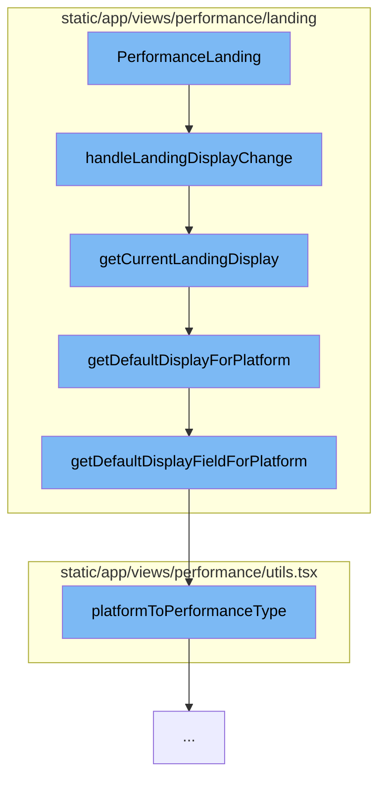

This document will cover the process of handling landing display changes in the Sentry application. We'll cover the following steps:

1. Invoking the `handleLandingDisplayChange` function
2. Determining the current landing display
3. Getting the default display for the platform
4. Determining the default display field for the platform
5. Mapping the platform to a performance type.



<SwmSnippet path="/static/app/views/performance/landing/utils.tsx" line="110">

---

# Invoking the `handleLandingDisplayChange` function

The `handleLandingDisplayChange` function is the entry point for this flow. It takes in several parameters including the field, location, projects, organization, and an optional event view. It removes the 'transaction.op' filter from the search conditions and then determines the default and current displays. It then pushes a new query to the browser history.

```tsx
export function handleLandingDisplayChange(
  field: LandingDisplayField,
  location: Location,
  projects: Project[],
  organization: Organization,
  eventView?: EventView
) {
  // Transaction op can affect the display and show no results if it is explicitly set.
  const query = decodeScalar(location.query.query, '');
  const searchConditions = new MutableSearch(query);
  searchConditions.removeFilter('transaction.op');

  const queryWithConditions = {
    ...omit(location.query, ['landingDisplay', 'sort']),
    query: searchConditions.formatString(),
  };

  delete queryWithConditions[LEFT_AXIS_QUERY_KEY];
  delete queryWithConditions[RIGHT_AXIS_QUERY_KEY];

  const defaultDisplay = getDefaultDisplayFieldForPlatform(projects, eventView);
```

---

</SwmSnippet>

<SwmSnippet path="/static/app/views/performance/landing/utils.tsx" line="97">

---

# Determining the current landing display

The `getCurrentLandingDisplay` function is called within `handleLandingDisplayChange`. It first tries to get the landing display from the location parameter. If it can't find it, it calls `getDefaultDisplayForPlatform` to get the default display.

```tsx
export function getCurrentLandingDisplay(
  location: Location,
  projects: Project[],
  eventView?: EventView
): LandingDisplay {
  const display = getLandingDisplayFromParam(location);
  if (display) {
    return display;
  }

  return getDefaultDisplayForPlatform(projects, eventView);
}
```

---

</SwmSnippet>

<SwmSnippet path="/static/app/views/performance/landing/utils.tsx" line="88">

---

# Getting the default display for the platform

The `getDefaultDisplayForPlatform` function is called within `getCurrentLandingDisplay`. It calls `getDefaultDisplayFieldForPlatform` to get the default display field and then finds the corresponding display in the `LANDING_DISPLAYS` array.

```tsx
export function getDefaultDisplayForPlatform(projects: Project[], eventView?: EventView) {
  const defaultDisplayField = getDefaultDisplayFieldForPlatform(projects, eventView);

  const defaultDisplay = LANDING_DISPLAYS.find(
    ({field}) => field === defaultDisplayField
  );
  return defaultDisplay || LANDING_DISPLAYS[0];
}
```

---

</SwmSnippet>

<SwmSnippet path="/static/app/views/performance/landing/utils.tsx" line="161">

---

# Determining the default display field for the platform

The `getDefaultDisplayFieldForPlatform` function is called within `getDefaultDisplayForPlatform`. It maps the performance type of the platform to a landing display field.

```tsx
export function getDefaultDisplayFieldForPlatform(
  projects: Project[],
  eventView?: EventView
) {
  if (!eventView) {
    return LandingDisplayField.ALL;
  }
  const projectIds = eventView.project;

  const performanceTypeToDisplay = {
    [PROJECT_PERFORMANCE_TYPE.ANY]: LandingDisplayField.ALL,
    [PROJECT_PERFORMANCE_TYPE.FRONTEND]: LandingDisplayField.FRONTEND_PAGELOAD,
    [PROJECT_PERFORMANCE_TYPE.BACKEND]: LandingDisplayField.BACKEND,
    [PROJECT_PERFORMANCE_TYPE.MOBILE]: LandingDisplayField.MOBILE,
  };
  const performanceType = platformToPerformanceType(projects, projectIds);
  const landingField =
    performanceTypeToDisplay[performanceType] ?? LandingDisplayField.ALL;
  return landingField;
}
```

---

</SwmSnippet>

<SwmSnippet path="/static/app/views/performance/utils.tsx" line="51">

---

# Mapping the platform to a performance type

The `platformToPerformanceType` function is called within `getDefaultDisplayFieldForPlatform`. It determines the performance type based on the platform of the selected projects.

```tsx
export function platformToPerformanceType(
  projects: (Project | ReleaseProject)[],
  projectIds: readonly number[]
) {
  if (projectIds.length === 0 || projectIds[0] === ALL_ACCESS_PROJECTS) {
    return PROJECT_PERFORMANCE_TYPE.ANY;
  }

  const selectedProjects = projects.filter(p =>
    projectIds.includes(parseInt(`${p.id}`, 10))
  );

  if (selectedProjects.length === 0 || selectedProjects.some(p => !p.platform)) {
    return PROJECT_PERFORMANCE_TYPE.ANY;
  }

  if (
    selectedProjects.every(project =>
      FRONTEND_PLATFORMS.includes(project.platform as string)
    )
  ) {
```

---

</SwmSnippet>

&nbsp;

*This is an auto-generated document by Swimm AI 🌊 and has not yet been verified by a human*

<SwmMeta version="3.0.0" repo-id="Z2l0aHViJTNBJTNBZGVtby1zZW50cnklM0ElM0Fzd2ltbWlv" repo-name="demo-sentry"><sup>Powered by [Swimm](/)</sup></SwmMeta>
