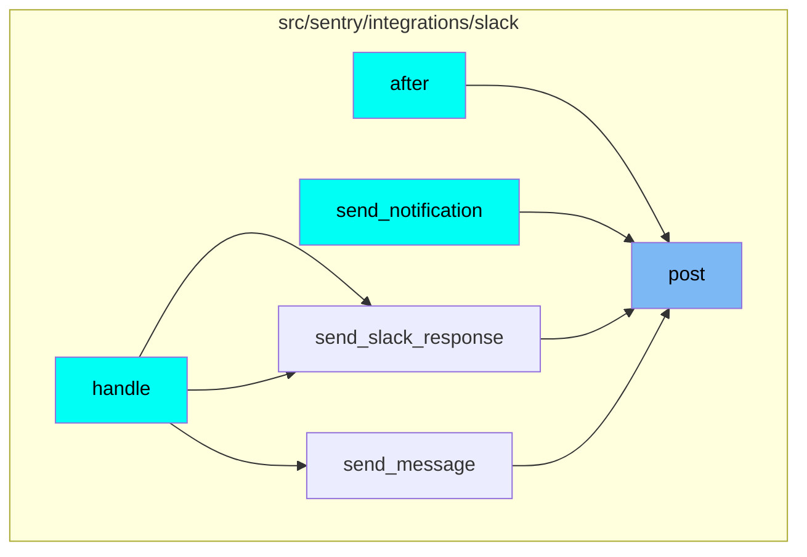
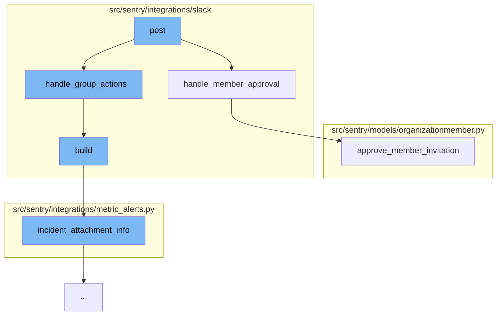

This document will cover the process of handling Slack actions in the Sentry integration, which includes:

1. Handling member approval
2. Handling group actions
3. Building incident messages
4. Approving member invitations.

## Where is this flow used?

The flow starts with the function `post`. It is called from multiple entry points as represented in the following diagram: (Note - these are only some of the entry points of this flow)



## The flow itself



<SwmSnippet path="/src/sentry/integrations/slack/endpoints/action.py" line="413">

---

# Handling member approval

The function `handle_member_approval` is used to handle the approval of a member in a Slack action. It checks the identity of the member, validates the organization access and member permissions, and then either approves or rejects the member invitation based on the action.

```python
    def handle_member_approval(self, slack_request: SlackActionRequest, action: str) -> Response:
        try:
            # get_identity can return nobody
            identity = slack_request.get_identity()
        except IdentityProvider.DoesNotExist:
            identity = None

        if not identity:
            return self.respond_with_text(NO_IDENTITY_MESSAGE)

        member_id = slack_request.callback_data["member_id"]

        try:
            member = OrganizationMember.objects.get_member_invite_query(member_id).get()
        except OrganizationMember.DoesNotExist:
            # member request is gone, likely someone else rejected it
            member_email = slack_request.callback_data["member_email"]
            return self.respond_with_text(f"Member invitation for {member_email} no longer exists.")

        organization = member.organization

```

---

</SwmSnippet>

<SwmSnippet path="/src/sentry/integrations/slack/endpoints/action.py" line="1">

---

# Handling group actions

The function `_handle_group_actions` is used to handle group actions in a Slack action. It calls the `build` function to construct the incident message.

```python
from __future__ import annotations
```

---

</SwmSnippet>

<SwmSnippet path="/src/sentry/integrations/slack/message_builder/incidents.py" line="37">

---

# Building incident messages

The function `build` is used to construct the incident message. It calls the `incident_attachment_info` function to get the necessary information for the incident.

```python
    def build(self, unfurl: bool = False) -> SlackBody:
        data = incident_attachment_info(
            self.incident, self.new_status, self.metric_value, unfurl=unfurl
        )

        return self._build(
            actions=[],
            color=INCIDENT_COLOR_MAPPING.get(data["status"]),
            fallback=data["title"],
            fields=[],
            footer=get_footer(data["ts"]),
            text=data["text"],
            title=data["title"],
            title_link=data["title_link"],
        )
```

---

</SwmSnippet>

<SwmSnippet path="/src/sentry/models/organizationmember.py" line="398">

---

# Approving member invitations

The function `approve_member_invitation` is used to approve a member invitation. It updates the member status, sends an invite email, and logs the action in the audit log.

```python
    def approve_member_invitation(
        self, user_to_approve, api_key=None, ip_address=None, referrer=None
    ):
        """
        Approve a member invite/join request and send an audit log entry
        """
        from sentry.models.auditlogentry import AuditLogEntryEvent
        from sentry.utils.audit import create_audit_entry_from_user

        self.approve_invite()
        self.save()

        if settings.SENTRY_ENABLE_INVITES:
            self.send_invite_email()
            member_invited.send_robust(
                member=self,
                user=user_to_approve,
                sender=self.approve_member_invitation,
                referrer=referrer,
            )

```

---

</SwmSnippet>

&nbsp;

*This is an auto-generated document by Swimm AI 🌊 and has not yet been verified by a human*

<SwmMeta version="3.0.0" repo-id="Z2l0aHViJTNBJTNBZGVtby1zZW50cnklM0ElM0Fzd2ltbWlv" repo-name="demo-sentry"><sup>Powered by [Swimm](/)</sup></SwmMeta>
