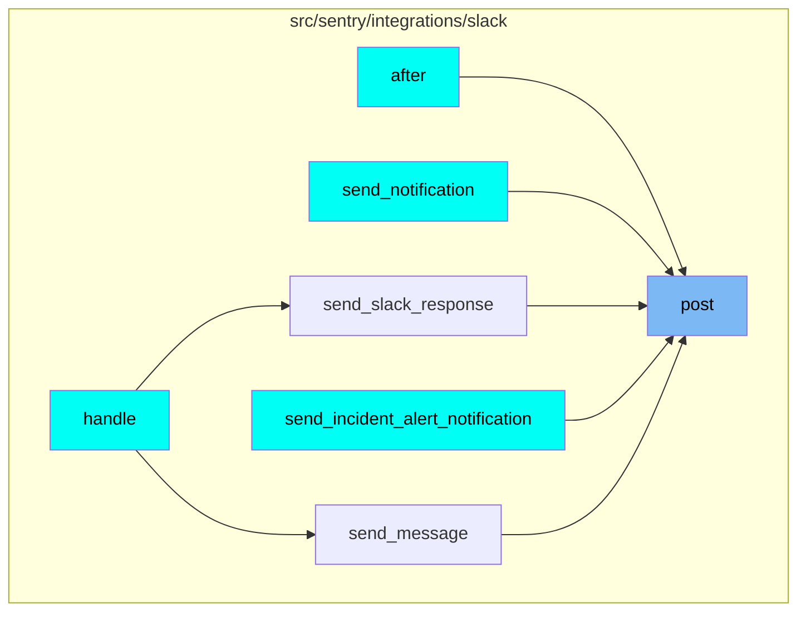
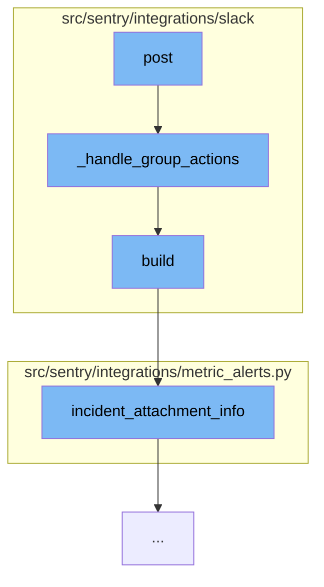

This document will cover the process of handling Slack group actions in the Sentry integration, which includes:

1. Processing the Slack request and determining the acting user
2. Handling status dialog submission
3. Handling interaction actions
4. Updating the message with the list of actions taken.

## Where is this flow used?

The flow starts with the function `post`. It is called from multiple entry points as represented in the following diagram: (Note - these are only some of the entry points of this flow)



## The flow itself



<SwmSnippet path="/src/sentry/integrations/slack/endpoints/action.py" line="256">

---

# Processing the Slack request and determining the acting user

The function `_handle_group_actions` is used to process the Slack request and determine the acting user. If the user's identity is not found, a URL is built to associate the user's identity.

```python
    def _handle_group_actions(
        self,
        slack_request: SlackActionRequest,
        request: Request,
        action_list: Sequence[MessageAction],
    ) -> Response:
        group = get_group(slack_request)
        if not group:
            return self.respond(status=403)

        # Determine the acting user by Slack identity.
        try:
            identity = slack_request.get_identity()
        except IdentityProvider.DoesNotExist:
            return self.respond(status=403)

        if not identity:
            associate_url = build_linking_url(
                integration=slack_request.integration,
                slack_id=slack_request.user_id,
                channel_id=slack_request.channel_id,
```

---

</SwmSnippet>

<SwmSnippet path="/src/sentry/integrations/slack/endpoints/action.py" line="281">

---

# Handling status dialog submission

If the Slack request type is a dialog submission and contains a resolve type, a status action is created and processed. The message is then updated with the new status.

```python
        # Handle status dialog submission
        if (
            slack_request.type == "dialog_submission"
            and "resolve_type" in slack_request.data["submission"]
        ):
            # Masquerade a status action
            action = MessageAction(
                name="status",
                value=slack_request.data["submission"]["resolve_type"],
            )

            try:
                self.on_status(request, identity, group, action)
            except client.ApiError as error:
                return self.api_error(slack_request, group, identity, error, "status_dialog")

            attachment = SlackIssuesMessageBuilder(
                group, identity=identity, actions=[action]
            ).build()
            body = self.construct_reply(
                attachment, is_message=slack_request.callback_data["is_message"]
```

---

</SwmSnippet>

<SwmSnippet path="/src/sentry/integrations/slack/endpoints/action.py" line="321">

---

# Handling interaction actions

The function also handles interaction actions such as status, assign, and resolve dialog. After each action, the group is reloaded and the message is updated with the list of actions taken.

```python
        # Handle interaction actions
        for action in action_list:
            try:
                if action.name == "status":
                    self.on_status(request, identity, group, action)
                elif action.name == "assign":
                    self.on_assign(request, identity, group, action)
                elif action.name == "resolve_dialog":
                    self.open_resolve_dialog(slack_request, group)
                    defer_attachment_update = True
            except client.ApiError as error:
                return self.api_error(slack_request, group, identity, error, action.name)

        if defer_attachment_update:
            return self.respond()

        # Reload group as it may have been mutated by the action
        group = Group.objects.get(id=group.id)

        attachment = SlackIssuesMessageBuilder(
            group, identity=identity, actions=action_list
```

---

</SwmSnippet>

&nbsp;

*This is an auto-generated document by Swimm AI 🌊 and has not yet been verified by a human*

<SwmMeta version="3.0.0" repo-id="Z2l0aHViJTNBJTNBZGVtby1zZW50cnklM0ElM0Fzd2ltbWlv" repo-name="demo-sentry"><sup>Powered by [Swimm](/)</sup></SwmMeta>
