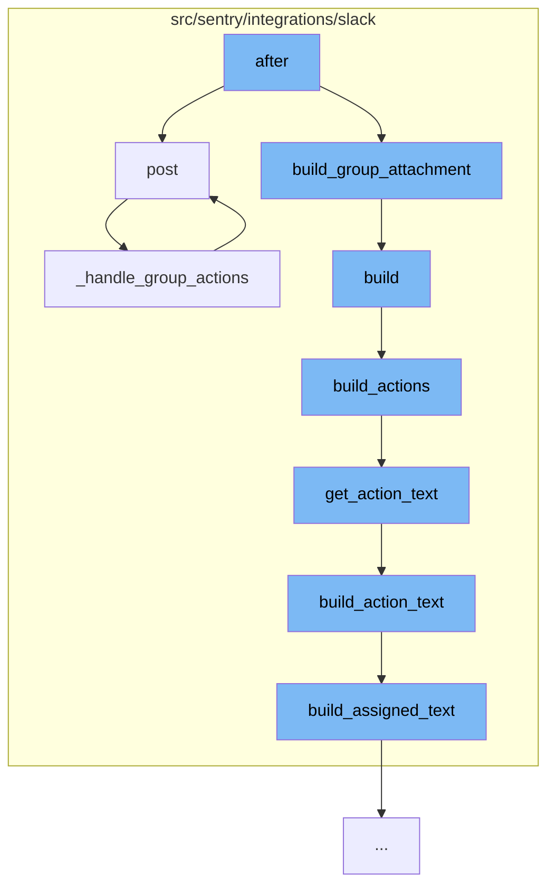

This document will cover the process of handling Slack notifications in the Sentry application. The process includes:

1. Posting a request to the Slack API.
2. Building a group attachment for the Slack message.
3. Building the actions for the Slack message.
4. Handling group actions in the Slack message.



<SwmSnippet path="/src/sentry/integrations/slack/endpoints/action.py" line="364">

---

# Posting a request to the Slack API

The `post` function is responsible for handling the incoming request from Slack. It validates the request, processes the actions, and handles different types of actions such as 'ignore', 'approve_member', 'reject_member', and 'enable_notifications'.

```python
    def post(self, request: Request) -> Response:
        try:
            slack_request = SlackActionRequest(request)
            slack_request.validate()
        except SlackRequestError as e:
            return self.respond(status=e.status)

        # Actions list may be empty when receiving a dialog response.
        action_list_raw = slack_request.data.get("actions", [])

        action_list = []
        action_option = None
        for action_data in action_list_raw:
            # Get the _first_ value in the action list.
            value = action_data.get("value")
            if value and not action_option:
                action_option = value
            if "name" in action_data:
                action_list.append(MessageAction(**action_data))

        # If a user is just clicking our auto response in the messages tab we just return a 200
```

---

</SwmSnippet>

<SwmSnippet path="/src/sentry/integrations/slack/message_builder/issues.py" line="333">

---

# Building a group attachment for the Slack message

The `build` function is used to construct the Slack message body. It includes the text, color, fields, footer, title, and other properties of the Slack message.

```python
    def build(self) -> SlackBody:
        # XXX(dcramer): options are limited to 100 choices, even when nested
        text = build_attachment_text(self.group, self.event) or ""
        project = Project.objects.get_from_cache(id=self.group.project_id)

        # If an event is unspecified, use the tags of the latest event (if one exists).
        event_for_tags = self.event or self.group.get_latest_event()
        color = get_color(event_for_tags, self.notification)
        fields = build_tag_fields(event_for_tags, self.tags)
        footer = (
            self.notification.build_notification_footer(self.recipient)
            if self.notification and self.recipient
            else build_footer(self.group, project, self.rules)
        )
        obj = self.event if self.event is not None else self.group
        if not self.issue_details or (self.recipient and isinstance(self.recipient, Team)):
            payload_actions, text, color = build_actions(
                self.group, project, text, color, self.actions, self.identity
            )
        else:
            payload_actions = []
```

---

</SwmSnippet>

<SwmSnippet path="/src/sentry/integrations/slack/message_builder/issues.py" line="207">

---

# Building the actions for the Slack message

The `build_actions` function is used to construct the actions that will be included in the Slack message. These actions include buttons such as 'Ignore', 'Resolve', and 'Assign'.

```python
def build_actions(
    group: Group,
    project: Project,
    text: str,
    color: str,
    actions: Sequence[MessageAction] | None = None,
    identity: Identity | None = None,
) -> tuple[Sequence[MessageAction], str, str]:
    """Having actions means a button will be shown on the Slack message e.g. ignore, resolve, assign."""
    if actions:
        text += get_action_text(text, actions, identity)
        return [], text, "_actioned_issue"

    ignore_button = MessageAction(
        name="status",
        label="Ignore",
        value="ignored",
    )

    resolve_button = MessageAction(
        name="resolve_dialog",
```

---

</SwmSnippet>

<SwmSnippet path="/src/sentry/integrations/slack/endpoints/action.py" line="256">

---

# Handling group actions in the Slack message

The `_handle_group_actions` function is responsible for handling the actions related to a group in the Slack message. It determines the acting user, handles status dialog submission, and handles interaction actions such as 'status', 'assign', and 'resolve_dialog'.

```python
    def _handle_group_actions(
        self,
        slack_request: SlackActionRequest,
        request: Request,
        action_list: Sequence[MessageAction],
    ) -> Response:
        group = get_group(slack_request)
        if not group:
            return self.respond(status=403)

        # Determine the acting user by Slack identity.
        try:
            identity = slack_request.get_identity()
        except IdentityProvider.DoesNotExist:
            return self.respond(status=403)

        if not identity:
            associate_url = build_linking_url(
                integration=slack_request.integration,
                slack_id=slack_request.user_id,
                channel_id=slack_request.channel_id,
```

---

</SwmSnippet>

&nbsp;

*This is an auto-generated document by Swimm AI 🌊 and has not yet been verified by a human*

<SwmMeta version="3.0.0" repo-id="Z2l0aHViJTNBJTNBZGVtby1zZW50cnklM0ElM0Fzd2ltbWlv" repo-name="demo-sentry"><sup>Powered by [Swimm](/)</sup></SwmMeta>
