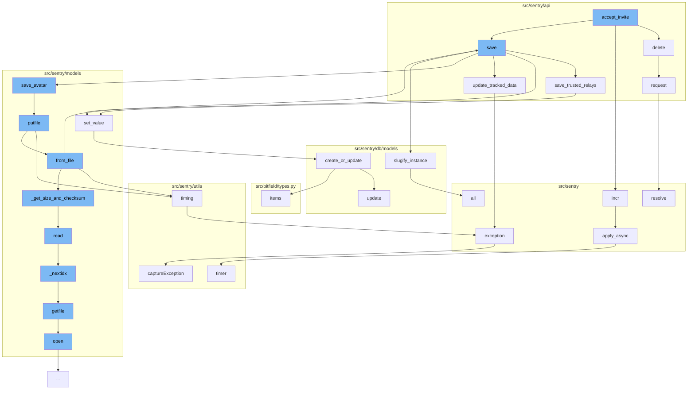

This document will cover the process of accepting an invite in the Sentry application, which includes:

1. Deleting the invite
2. Incrementing the invite count
3. Saving the organization details
4. Updating the tracked data
5. Saving the avatar
6. Handling exceptions
7. Applying asynchronous tasks.



<SwmSnippet path="/src/sentry/api/client.py" line="114">

---

# Deleting the invite

The `delete` function in `src/sentry/api/client.py` is used to delete the invite. It does this by making a DELETE request.

```python
    def delete(self, *args, **kwargs):
        return self.request("DELETE", *args, **kwargs)
```

---

</SwmSnippet>

<SwmSnippet path="/src/sentry/buffer/base.py" line="1">

---

# Incrementing the invite count

The `incr` function in `src/sentry/buffer/base.py` is used to increment the invite count. This is part of the process of accepting an invite.

```python
import logging
```

---

</SwmSnippet>

<SwmSnippet path="/src/sentry/api/endpoints/organization_details.py" line="285">

---

# Saving the organization details

The `save_trusted_relays` function in `src/sentry/api/endpoints/organization_details.py` is used to save the organization details. This includes the trusted relays for the organization.

```python
    def save_trusted_relays(self, incoming, changed_data, organization):
        timestamp_now = datetime.utcnow().replace(tzinfo=UTC).isoformat()
        option_key = "sentry:trusted-relays"
        try:
            # get what we already have
            existing = OrganizationOption.objects.get(organization=organization, key=option_key)

            key_dict = {val.get("public_key"): val for val in existing.value}
            original_number_of_keys = len(existing.value)
        except OrganizationOption.DoesNotExist:
            key_dict = {}  # we don't have anything set
            original_number_of_keys = 0
            existing = None

        modified = False
        for option in incoming:
            public_key = option.get("public_key")
            existing_info = key_dict.get(public_key, {})

            option["created"] = existing_info.get("created", timestamp_now)
            option["last_modified"] = existing_info.get("last_modified")
```

---

</SwmSnippet>

<SwmSnippet path="/src/sentry/api/endpoints/organization_details.py" line="1">

---

# Updating the tracked data

The `update_tracked_data` function in `src/sentry/api/endpoints/organization_details.py` is used to update the tracked data for the organization. This is part of the process of accepting an invite.

```python
import logging
```

---

</SwmSnippet>

<SwmSnippet path="/src/sentry/models/avatars/base.py" line="389">

---

# Saving the avatar

The `putfile` function in `src/sentry/models/file.py` is used to save the avatar for the user. This is part of the process of accepting an invite.

```python

```

---

</SwmSnippet>

<SwmSnippet path="/src/sentry/management/commands/send_fake_data.py" line="25">

---

# Handling exceptions

The `exception` function in `src/sentry/management/commands/send_fake_data.py` is used to handle exceptions during the invite acceptance process. This includes capturing the exception and sending it to Sentry for tracking.

```python
    def exception(client):
        timestamp = datetime.datetime.utcnow() - datetime.timedelta(
            seconds=random.randint(0, timestamp_max)
        )
        try:
            raise next(exceptions)
        except Exception as exc:
            email = next(emails)
            with client.configure_scope() as scope:
                scope.user = {"id": email, "email": email}
                scope.logger = next(loggers)
                scope.site = "web"
                scope.date = timestamp
                return client.captureException(exc)
```

---

</SwmSnippet>

<SwmSnippet path="/src/sentry/celery.py" line="56">

---

# Applying asynchronous tasks

The `apply_async` function in `src/sentry/celery.py` is used to apply asynchronous tasks. This is part of the process of accepting an invite.

```python
    def apply_async(self, *args, **kwargs):
        with metrics.timer("jobs.delay", instance=self.name):
            return Task.apply_async(self, *args, **kwargs)
```

---

</SwmSnippet>

&nbsp;

*This is an auto-generated document by Swimm AI 🌊 and has not yet been verified by a human*

<SwmMeta version="3.0.0" repo-id="Z2l0aHViJTNBJTNBZGVtby1zZW50cnklM0ElM0Fzd2ltbWlv" repo-name="demo-sentry"><sup>Powered by [Swimm](/)</sup></SwmMeta>
