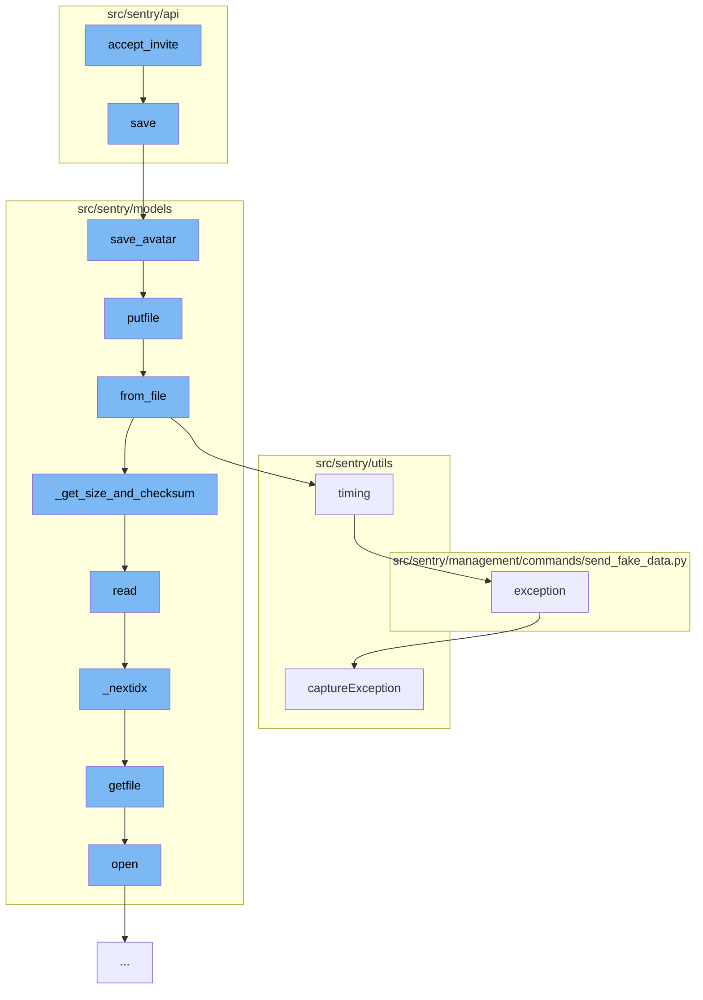

This document will cover the process of accepting an invite in the Sentry application. We'll cover:

1. Saving organization details
2. Saving avatar details
3. Uploading file details
4. Handling exceptions



<SwmSnippet path="/src/sentry/api/endpoints/organization_details.py" line="336">

---

# Saving organization details

The `save` function is responsible for saving the details of an organization. It checks if the organization has any changes and updates the tracked data accordingly. It also handles avatar details and certain flags related to the organization.

```python
    def save(self):
        from sentry import features

        org = self.context["organization"]
        changed_data = {}
        if not hasattr(org, "__data"):
            update_tracked_data(org)

        for key, option, type_, default_value in ORG_OPTIONS:
            if key not in self.initial_data:
                continue
            try:
                option_inst = OrganizationOption.objects.get(organization=org, key=option)
                update_tracked_data(option_inst)
            except OrganizationOption.DoesNotExist:
                OrganizationOption.objects.set_value(
                    organization=org, key=option, value=type_(self.initial_data[key])
                )

                if self.initial_data[key] != default_value:
                    changed_data[key] = f"to {self.initial_data[key]}"
```

---

</SwmSnippet>

<SwmSnippet path="/src/sentry/models/avatars/base.py" line="82">

---

# Saving avatar details

The `save_avatar` function is used to save the avatar of the organization. It creates a new file for the avatar and saves it. If an avatar already exists, it deletes the old one and replaces it with the new one.

```python
    def save_avatar(cls, relation, type, avatar=None, filename=None, color=None):
        from sentry.models import File

        if avatar:
            with atomic_transaction(using=router.db_for_write(File)):
                photo = File.objects.create(name=filename, type=cls.FILE_TYPE)
                # XXX: Avatar may come in as a string instance in python2
                # if it's not wrapped in BytesIO.
                if isinstance(avatar, str):
                    avatar = BytesIO(force_bytes(avatar))

                # XXX: Avatar processing may adjust file position; reset before saving.
                avatar.seek(0)
                photo.putfile(avatar)
        else:
            photo = None

        with atomic_transaction(
            using=(
                router.db_for_write(cls),
                router.db_for_write(File),
```

---

</SwmSnippet>

<SwmSnippet path="/src/sentry/models/file.py" line="389">

---

# Uploading file details

The `putfile` function is used to save a file into a number of chunks. It calculates the size and checksum of the file and saves it.

```python
    def putfile(self, fileobj, blob_size=DEFAULT_BLOB_SIZE, commit=True, logger=nooplogger):
        """
        Save a fileobj into a number of chunks.

        Returns a list of `FileBlobIndex` items.

        >>> indexes = file.putfile(fileobj)
        """
        results = []
        offset = 0
        checksum = sha1(b"")

        while True:
            contents = fileobj.read(blob_size)
            if not contents:
                break
            checksum.update(contents)

            blob_fileobj = ContentFile(contents)
            blob = FileBlob.from_file(blob_fileobj, logger=logger)
            results.append(FileBlobIndex.objects.create(file=self, blob=blob, offset=offset))
```

---

</SwmSnippet>

<SwmSnippet path="/src/sentry/management/commands/send_fake_data.py" line="25">

---

# Handling exceptions

The `exception` function is used to handle exceptions that occur during the process. It captures the exception and logs the details for further analysis.

```python
    def exception(client):
        timestamp = datetime.datetime.utcnow() - datetime.timedelta(
            seconds=random.randint(0, timestamp_max)
        )
        try:
            raise next(exceptions)
        except Exception as exc:
            email = next(emails)
            with client.configure_scope() as scope:
                scope.user = {"id": email, "email": email}
                scope.logger = next(loggers)
                scope.site = "web"
                scope.date = timestamp
                return client.captureException(exc)
```

---

</SwmSnippet>

&nbsp;

*This is an auto-generated document by Swimm AI 🌊 and has not yet been verified by a human*

<SwmMeta version="3.0.0" repo-id="Z2l0aHViJTNBJTNBZGVtby1zZW50cnklM0ElM0Fzd2ltbWlv" repo-name="demo-sentry"><sup>Powered by [Swimm](/)</sup></SwmMeta>
