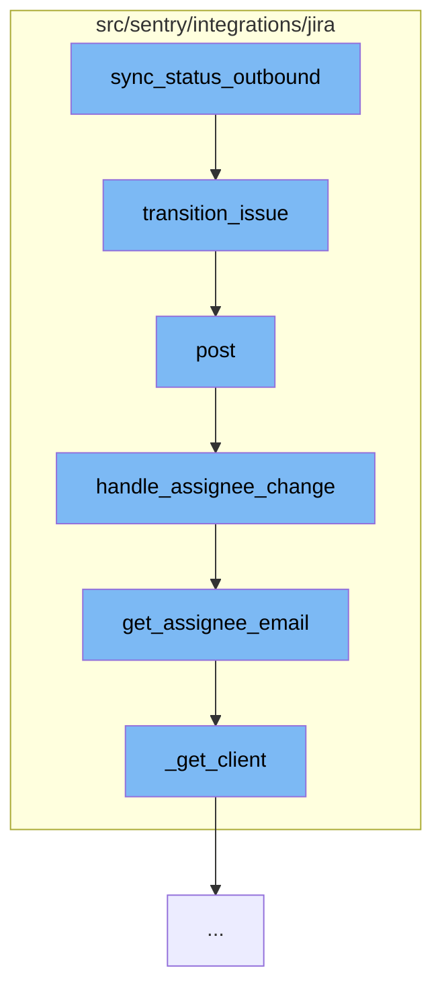

This document will cover the process of syncing issue status from Sentry to Jira, which includes:

1. Transitioning the issue in Jira
2. Handling assignee changes
3. Fetching the assignee email



<SwmSnippet path="/src/sentry/integrations/jira/client.py" line="229">

---

# Transitioning the issue in Jira

The function `transition_issue` is used to transition the issue in Jira. It makes a POST request to the Jira API with the issue key and transition id.

```python
    def transition_issue(self, issue_key, transition_id):
        return self.post(self.TRANSITION_URL % issue_key, {"transition": {"id": transition_id}})
```

---

</SwmSnippet>

<SwmSnippet path="/src/sentry/integrations/jira/utils/api.py" line="48">

---

# Handling assignee changes

The function `handle_assignee_change` is used to handle changes in the assignee of the issue. If the assignee is not present, it unassigns the issue. If the assignee is present, it fetches the assignee email.

```python
def handle_assignee_change(
    integration: Integration,
    data: Mapping[str, Any],
    use_email_scope: bool = False,
) -> None:
    assignee_changed = any(
        item for item in data["changelog"]["items"] if item["field"] == "assignee"
    )
    if not assignee_changed:
        return

    fields = data["issue"]["fields"]

    # If there is no assignee, assume it was unassigned.
    assignee = fields.get("assignee")
    issue_key = data["issue"]["key"]

    if assignee is None:
        sync_group_assignee_inbound(integration, None, issue_key, assign=False)
        return

```

---

</SwmSnippet>

<SwmSnippet path="/src/sentry/integrations/jira/utils/api.py" line="34">

---

# Fetching the assignee email

The function `get_assignee_email` is used to fetch the email of the assignee. If the email is not present in the assignee object, it fetches the email from the Jira API using the account id of the assignee.

```python
def get_assignee_email(
    integration: Integration,
    assignee: Mapping[str, str],
    use_email_scope: bool = False,
) -> str | None:
    """Get email from `assignee` or pull it from API (if we have the scope for it.)"""
    email = assignee.get("emailAddress")
    if not email and use_email_scope:
        account_id = assignee.get("accountId")
        client = _get_client(integration)
        email = client.get_email(account_id)
    return email
```

---

</SwmSnippet>

&nbsp;

*This is an auto-generated document by Swimm AI 🌊 and has not yet been verified by a human*

<SwmMeta version="3.0.0" repo-id="Z2l0aHViJTNBJTNBZGVtby1zZW50cnklM0ElM0Fzd2ltbWlv" repo-name="demo-sentry"><sup>Powered by [Swimm](/)</sup></SwmMeta>
