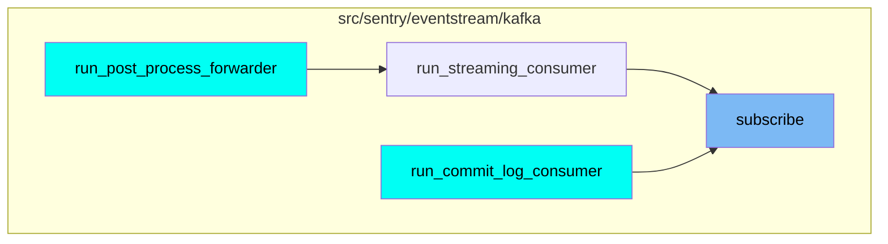
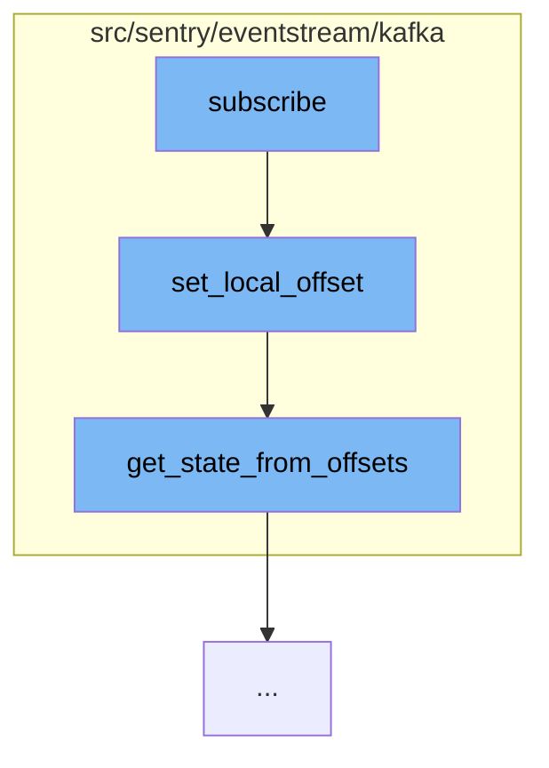

This document will cover the process of subscribing to a Kafka topic and updating the local offset in the Sentry event stream. The steps include:

1. Subscribing to a Kafka topic
2. Setting the local offset
3. Getting the state from offsets.

## Where is this flow used?

The flow starts with the function `subscribe`. It is called from multiple entry points as represented in the following diagram:



## The flow itself



# Subscribing to a Kafka topic

The `subscribe` function in `src/sentry/eventstream/kafka/consumer.py` is the entry point for this flow. It is responsible for subscribing to a Kafka topic.

<SwmSnippet path="/src/sentry/eventstream/kafka/state.py" line="92">

---

# Setting the local offset

The `set_local_offset` function updates the local offset for a topic and partition. If this update operation results in a state change, a callback function will be invoked. It also checks if the local offset has moved backwards and logs a warning if it has.

```python
    def set_local_offset(self, topic, partition, local_offset):
        """
        Update the local offset for a topic and partition.

        If this update operation results in a state change, the callback
        function will be invoked.
        """
        with self.__lock:
            previous_state, previous_offsets = self.partitions[(topic, partition)]
            if previous_offsets.local is not None and (
                local_offset is None or local_offset < previous_offsets.local
            ):
                logger.info(
                    "Local offset for %s/%s has moved backwards (current: %s, previous: %s)",
                    topic,
                    partition,
                    local_offset,
                    previous_offsets.local,
                )
            updated_offsets = Offsets(local_offset, previous_offsets.remote)
            updated_state = self.get_state_from_offsets(updated_offsets)
```

---

</SwmSnippet>

<SwmSnippet path="/src/sentry/eventstream/kafka/state.py" line="78">

---

# Getting the state from offsets

The `get_state_from_offsets` function derives the partition state by comparing local and remote offsets. It returns the state of the partition based on whether the local offset is behind, ahead, or synchronized with the remote offset.

```python
    def get_state_from_offsets(self, offsets):
        """
        Derive the partition state by comparing local and remote offsets.
        """
        if offsets.local is None or offsets.remote is None:
            return SynchronizedPartitionState.UNKNOWN
        else:
            if offsets.local < offsets.remote:
                return SynchronizedPartitionState.LOCAL_BEHIND
            elif offsets.remote < offsets.local:
                return SynchronizedPartitionState.REMOTE_BEHIND
            else:  # local == remote
                return SynchronizedPartitionState.SYNCHRONIZED
```

---

</SwmSnippet>

&nbsp;

*This is an auto-generated document by Swimm AI 🌊 and has not yet been verified by a human*

<SwmMeta version="3.0.0" repo-id="Z2l0aHViJTNBJTNBZGVtby1zZW50cnklM0ElM0Fzd2ltbWlv" repo-name="demo-sentry"><sup>Powered by [Swimm](/)</sup></SwmMeta>
