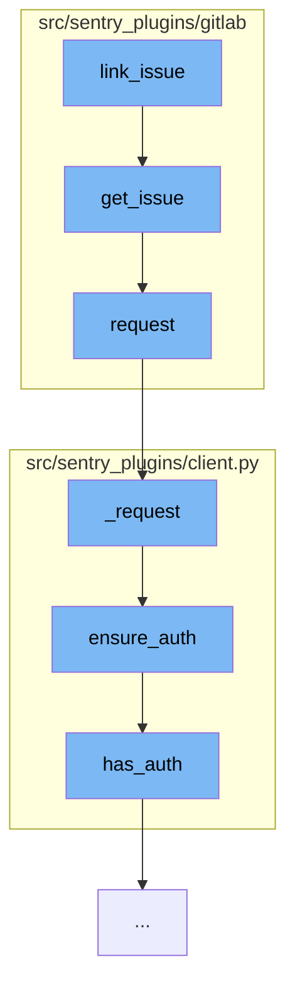

This document will cover the process of linking an issue in the GitLab plugin, which includes:

1. Retrieving the issue details
2. Making a request to the GitLab API
3. Ensuring authentication for the request



<SwmSnippet path="/src/sentry_plugins/gitlab/client.py" line="29">

---

# Retrieving the issue details

The `get_issue` function is used to retrieve the details of a specific issue from the GitLab API. It constructs the API endpoint using the provided `repo` and `issue_id` parameters, and makes a GET request to this endpoint.

```python
    def get_issue(self, repo, issue_id):
        try:
            return self.request(
                "GET", "/projects/{}/issues/{}".format(quote(repo, safe=""), issue_id)
            )
        except IndexError:
            raise ApiError("Issue not found with ID", 404)
```

---

</SwmSnippet>

<SwmSnippet path="/src/sentry_plugins/gitlab/client.py" line="19">

---

# Making a request to the GitLab API

The `request` function is used to make a request to the GitLab API. It sets the `Private-Token` header with the stored token, and calls the `_request` function with the provided method, path, and optional data and parameters.

```python
    def request(self, method, path, data=None, params=None):
        headers = {"Private-Token": self.token}
        return self._request(method, path, headers=headers, params=params, data=data)
```

---

</SwmSnippet>

<SwmSnippet path="/src/sentry_plugins/client.py" line="28">

---

# Ensuring authentication for the request

The `ensure_auth` function is used to ensure that the request is authenticated. If the `Authorization` header is not already set and authentication is available, it binds the authentication to the request.

```python
    def ensure_auth(self, **kwargs):
        headers = kwargs["headers"]
        if "Authorization" not in headers and self.has_auth() and "auth" not in kwargs:
            kwargs = self.bind_auth(**kwargs)
        return kwargs
```

---

</SwmSnippet>

&nbsp;

*This is an auto-generated document by Swimm AI 🌊 and has not yet been verified by a human*

<SwmMeta version="3.0.0" repo-id="Z2l0aHViJTNBJTNBZGVtby1zZW50cnklM0ElM0Fzd2ltbWlv" repo-name="demo-sentry"><sup>Powered by [Swimm](/)</sup></SwmMeta>
