This document will cover the process of validating and querying measurements in the Sentry application. The steps include:

1. Validating the request and parameters.
2. Querying the measurements based on the validated parameters.
3. Handling the query results and errors.
4. Building and returning the response.

```mermaid
graph TD;
subgraph src/sentry/api/endpoints
  validate:::mainFlowStyle --> get
end
subgraph src/sentry/snuba
  get:::mainFlowStyle --> query
end
subgraph src/sentry/api/endpoints
  get:::mainFlowStyle --> get_snuba_params
end
subgraph src/sentry/search/events
  query --> run_query
end
subgraph src/sentry/snuba
  query --> transform_results
end
subgraph src/sentry/utils
  run_query --> raw_snql_query
end
subgraph src/sentry/snuba
  transform_results --> transform_data
end
subgraph src/sentry/snuba
  transform_results --> transform_meta
end
subgraph src/sentry/api/endpoints
  get_snuba_params:::mainFlowStyle --> get
end
subgraph src/sentry/api
  get:::mainFlowStyle --> paginate
end
subgraph src/sentry/api/endpoints
  get:::mainFlowStyle --> query_suspect_span_groups
end
subgraph src/sentry/api
  paginate --> get_result
end
subgraph src/sentry/api/bases
  paginate --> on_results
end
subgraph src/sentry/utils
  get_result --> build_cursor
end
subgraph src/sentry/api
  get_result --> count_hits
end
subgraph src/sentry/api/bases
  on_results --> get
end
subgraph src/sentry/utils
  query_suspect_span_groups:::mainFlowStyle --> raw_snql_query
end
subgraph src/sentry/api/endpoints
  query_suspect_span_groups:::mainFlowStyle --> resolve_function
end
subgraph src/sentry/utils
  raw_snql_query --> _apply_cache_and_build_results
end
subgraph src/sentry/utils
  raw_snql_query --> incr
end
subgraph src/sentry/utils
  _apply_cache_and_build_results --> incr
end
subgraph src/sentry/utils
  _apply_cache_and_build_results --> _bulk_snuba_query
end
subgraph src/sentry/api
  incr --> put
end
subgraph src/sentry/utils
  incr --> _start
end
subgraph src/sentry/api/endpoints
  resolve_function:::mainFlowStyle --> get
end
subgraph src/sentry/api/endpoints
  get:::mainFlowStyle --> build_result_handler
end
subgraph src/sentry/utils
  get:::mainFlowStyle --> raw_snql_query
end
subgraph src/sentry/api
  get:::mainFlowStyle --> paginate
end
subgraph src/sentry/snuba
  get:::mainFlowStyle --> transform_results
end
subgraph src/sentry/search/events
  get:::mainFlowStyle --> resolve_conditions
end
subgraph src/sentry/api/bases
  build_result_handler --> get_event_stats_data
end
subgraph src/sentry/snuba
  build_result_handler --> top_events_timeseries
end
subgraph src/sentry/api/endpoints
  get_event_stats_data --> get_event_stats
end
subgraph src/sentry/api/bases
  get_event_stats_data --> get_snuba_params
end
subgraph src/sentry/snuba
  top_events_timeseries --> query
end
subgraph src/sentry/snuba
  top_events_timeseries --> get_timeseries_snuba_filter
end
subgraph src/sentry/search/events
  top_events_timeseries --> run_query
end
subgraph src/sentry/utils
  top_events_timeseries --> bulk_snql_query
end
subgraph src/sentry/snuba
  transform_data --> zerofill
end
subgraph src/sentry/snuba
  transform_data --> get_row
end
subgraph src/bitfield/types.py
  transform_data --> items
end
subgraph src/sentry/search/events
  transform_meta --> get_json_meta_type
end
subgraph src/sentry/search/events
  resolve_conditions:::mainFlowStyle --> resolve_boolean_conditions
end
subgraph src/sentry/search/events
  resolve_conditions:::mainFlowStyle --> resolve_having
end
subgraph src/sentry/search/events
  resolve_conditions:::mainFlowStyle --> parse_query
end
subgraph src/sentry/search/events
  resolve_boolean_conditions --> resolve_boolean_condition
end
subgraph src/sentry/search/events
  resolve_boolean_condition --> resolve_boolean_conditions
end
subgraph src/sentry/search/events
  resolve_boolean_condition --> resolve_having
end
subgraph src/sentry/search/events
  resolve_having --> convert_aggregate_filter_to_condition
end
subgraph src/sentry/search/events
  convert_aggregate_filter_to_condition --> resolve_function
end
subgraph src/sentry/search/events
  parse_query:::mainFlowStyle --> column
end
subgraph src/sentry/api
  parse_query:::mainFlowStyle --> parse_search_query
end
subgraph src/sentry/search/events
  column --> resolve_column_name
end
subgraph src/sentry/search/events
  resolve_column_name --> resolve_column
end
  parse_search_query:::mainFlowStyle --> ...

 classDef mainFlowStyle color:#000000,fill:#7CB9F4
  classDef rootsStyle color:#000000,fill:#00FFF4
```



<SwmSnippet path="/src/sentry/api/endpoints/organization_events_has_measurements.py" line="49">

---

# Validating the request and parameters

The `get` function in `organization_events_has_measurements.py` is responsible for validating the request and parameters. It checks if the organization has the required feature, parses the parameters, and handles any exceptions that may occur during this process.

```python
    def get(self, request: Request, organization) -> Response:
        if not self.has_feature(organization, request):
            return Response(status=404)

        with sentry_sdk.start_span(op="discover.endpoint", description="parse params"):
            try:
                # This endpoint only allows for a single project + transaction, so no need
                # to check `global-views`.
                params = self.get_snuba_params(request, organization, check_global_views=False)

                # Once an transaction begins containing measurement data, it is unlikely
                # it will stop. So it makes more sense to always query the latest data.
                #
                # Additionally, to account for periods of low volume, increase the range
                # to 7 days to have a better chance of finding an example event and provide
                # a more consistent experience.
                now = timezone.now()
                params["start"] = now - timedelta(days=7)
                params["end"] = now
            except NoProjects:
                return Response({"measurements": False})
```

---

</SwmSnippet>

<SwmSnippet path="/src/sentry/snuba/metrics_enhanced_performance.py" line="37">

---

# Querying the measurements

The `query` function in `metrics_enhanced_performance.py` is used to query the measurements based on the validated parameters. It handles the metrics query and the discover query separately, and returns the results.

```python
def query(
    selected_columns,
    query,
    params,
    equations=None,
    orderby=None,
    offset=None,
    limit=50,
    referrer=None,
    auto_fields=False,
    auto_aggregations=False,
    use_aggregate_conditions=False,
    allow_metric_aggregates=True,
    conditions=None,
    extra_snql_condition=None,
    functions_acl=None,
    use_snql=True,
    dry_run=False,
):
    metrics_compatible = not equations or dry_run

```

---

</SwmSnippet>

<SwmSnippet path="/src/sentry/api/endpoints/organization_events_spans_performance.py" line="151">

---

# Handling the query results and errors

The `get` function in `organization_events_spans_performance.py` handles the query results and errors. It uses the `handle_query_errors` function to handle any errors that may occur during the query. The results are then paginated using the `paginate` function.

```python
    def get(self, request: Request, organization: Organization) -> Response:
        if not self.has_feature(request, organization):
            return Response(status=404)

        try:
            params = self.get_snuba_params(request, organization)
        except NoProjects:
            return Response(status=404)

        serializer = SpansPerformanceSerializer(data=request.GET)
        if not serializer.is_valid():
            return Response(serializer.errors, status=400)
        serialized = serializer.validated_data

        fields = serialized.get("field", [])
        query = serialized.get("query")
        span_ops = serialized.get("spanOp")
        span_groups = serialized.get("spanGroup")
        min_exclusive_time = serialized.get("min_exclusive_time")
        max_exclusive_time = serialized.get("max_exclusive_time")

```

---

</SwmSnippet>

<SwmSnippet path="/src/sentry/api/base.py" line="320">

---

# Building and returning the response

The `paginate` function in `base.py` is used to build and return the response. It gets the result from the `get_result` function, applies any post-query filters, and returns the response.

```python
    def paginate(
        self,
        request,
        on_results=None,
        paginator=None,
        paginator_cls=Paginator,
        default_per_page=100,
        max_per_page=100,
        cursor_cls=Cursor,
        **paginator_kwargs,
    ):
        assert (paginator and not paginator_kwargs) or (paginator_cls and paginator_kwargs)

        per_page = self.get_per_page(request, default_per_page, max_per_page)

        input_cursor = self.get_cursor_from_request(request, cursor_cls=cursor_cls)

        if not paginator:
            paginator = paginator_cls(**paginator_kwargs)

        try:
```

---

</SwmSnippet>

&nbsp;

*This is an auto-generated document by Swimm AI 🌊 and has not yet been verified by a human*

<SwmMeta version="3.0.0" repo-id="Z2l0aHViJTNBJTNBZGVtby1zZW50cnklM0ElM0Fzd2ltbWlv" repo-name="demo-sentry"><sup>Powered by [Swimm](/)</sup></SwmMeta>
