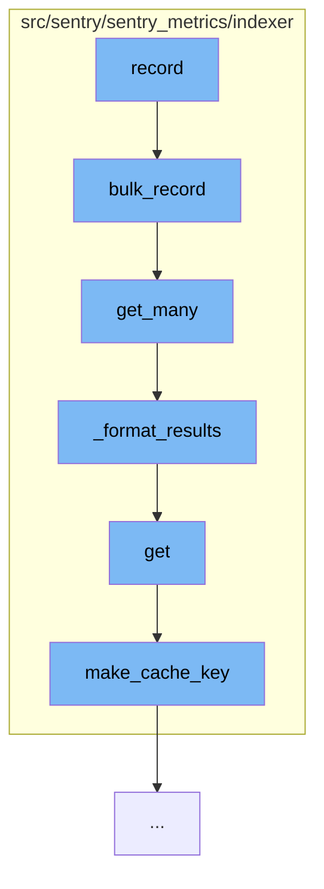

This document will cover the process of recording metrics in the Sentry application, which includes:

1. Bulk recording of metrics
2. Retrieving cached metrics
3. Formatting the results
4. Getting individual metrics
5. Making a cache key.



<SwmSnippet path="/src/sentry/sentry_metrics/indexer/postgres_v2.py" line="168">

---

# Bulk recording of metrics

The `bulk_record` function is the entry point for recording metrics. It takes a mapping of organization IDs to sets of strings and returns a mapping of those organization IDs to a string to ID mapping for each string in the set. The function follows three steps to get the IDs for strings: from cache, from existing database records, and from newly created database records.

```python
    def bulk_record(self, org_strings: Mapping[int, Set[str]]) -> Mapping[int, Mapping[str, int]]:
        """
        Takes in a mapping with org_ids to sets of strings.

        Ultimately returns a mapping of those org_ids to a
        string -> id mapping, for each string in the set.

        There are three steps to getting the ids for strings:
            1. ids from cache
            2. ids from existing db records
            3. ids from newly created db records

        Each step will start off with a KeyCollection and KeyResults:
            keys = KeyCollection(mapping)
            key_results = KeyResults()

        Then the work to get the ids (either from cache, db, etc)
            .... # work to add results to KeyResults()

        Those results will be added to `mapped_results`
            key_results.get_mapped_results()
```

---

</SwmSnippet>

<SwmSnippet path="/src/sentry/sentry_metrics/indexer/cache.py" line="61">

---

# Retrieving cached metrics

The `get_many` function is called within `bulk_record` to retrieve multiple cached metrics. It takes a sequence of keys and returns a mapping of keys to their corresponding values.

```python
    def get_many(self, keys: Sequence[str]) -> MutableMapping[str, Optional[int]]:
        cache_keys = {self.make_cache_key(key): key for key in keys}
        results: Mapping[str, Optional[int]] = cache.get_many(
            cache_keys.keys(), version=self.version
        )
        return self._format_results(keys, results)
```

---

</SwmSnippet>

<SwmSnippet path="/src/sentry/sentry_metrics/indexer/cache.py" line="29">

---

# Formatting the results

The `_format_results` function is used to format the results of the `get_many` function. It takes in keys and results and returns results that replace the hashed internal key with the externally used key.

```python
    def _format_results(
        self,
        keys: Sequence[str],
        results: Mapping[str, Optional[int]],
    ) -> MutableMapping[str, Optional[int]]:
        """
        Takes in keys formatted like "org_id:string", and results that have the
        internally used hashed key such as:
            {"indexer:org:str:b0a0e436f6fa42b9e33e73befbdbb9ba": 2}
        and returns results that replace the hashed internal key with the externally
        used key:
            {"1.2.0": 2}
        """
        formatted: MutableMapping[str, Optional[int]] = {}
        for key in keys:
            cache_key = self.make_cache_key(key)
            formatted[key] = results.get(cache_key)

        return formatted
```

---

</SwmSnippet>

<SwmSnippet path="/src/sentry/sentry_metrics/indexer/cache.py" line="49">

---

# Getting individual metrics

The `get` function is used to retrieve an individual metric from the cache. It takes a key and returns the corresponding value.

```python
    def get(self, key: str) -> int:
        result: int = cache.get(self.make_cache_key(key), version=self.version)
        return result
```

---

</SwmSnippet>

<SwmSnippet path="/src/sentry/sentry_metrics/indexer/cache.py" line="25">

---

# Making a cache key

The `make_cache_key` function is used to create a cache key for a given key. It hashes the key and returns a string that is used as the cache key.

```python
    def make_cache_key(self, key: str) -> str:
        hashed = md5_text(key).hexdigest()
        return f"indexer:org:str:{hashed}"
```

---

</SwmSnippet>

&nbsp;

*This is an auto-generated document by Swimm AI 🌊 and has not yet been verified by a human*

<SwmMeta version="3.0.0" repo-id="Z2l0aHViJTNBJTNBZGVtby1zZW50cnklM0ElM0Fzd2ltbWlv" repo-name="demo-sentry"><sup>Powered by [Swimm](/)</sup></SwmMeta>
