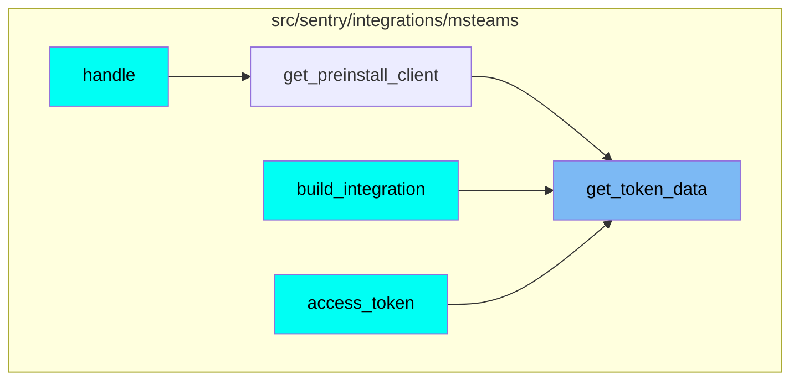
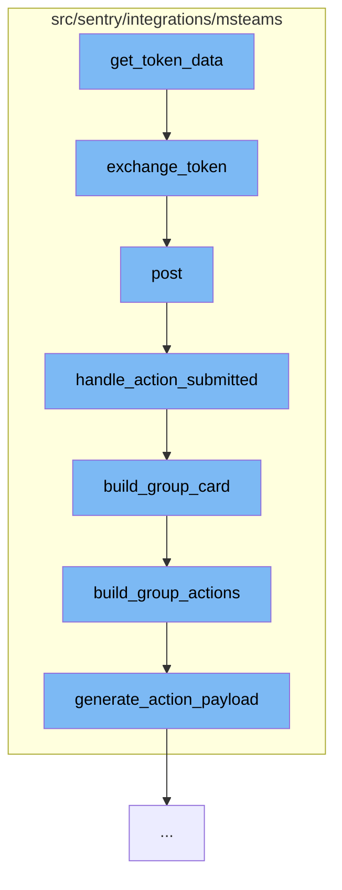

This document will cover the process of handling Microsoft Teams integration in the Sentry application. The process includes:

1. Token exchange
2. Posting a request
3. Handling action submission
4. Building a group card
5. Building group actions
6. Generating action payload.

## Where is this flow used?

The flow starts with the function `get_token_data`. It is called from multiple entry points as represented in the following diagram:



## The flow itself



<SwmSnippet path="/src/sentry/integrations/msteams/client.py" line="118">

---

# Token Exchange

The `exchange_token` function is used to exchange a token with Microsoft Teams. It prepares the necessary headers and data, then makes a POST request to the Microsoft Teams token URL.

```python
    def exchange_token(self):
        headers = {"Content-Type": "application/x-www-form-urlencoded"}
        data = {
            "client_id": self.client_id,
            "client_secret": self.client_secret,
            "grant_type": "client_credentials",
            "scope": "https://api.botframework.com/.default",
        }
        return self.post(self.TOKEN_URL, data=urlencode(data), headers=headers, json=False)
```

---

</SwmSnippet>

<SwmSnippet path="/src/sentry/integrations/msteams/webhook.py" line="144">

---

# Posting a Request

The `post` function handles the incoming POST request. It verifies the signature of the request, extracts the data, and based on the type of the message, it either handles an action submission or a conversation update.

```python
    def post(self, request: Request) -> Response:
        # verify_signature will raise the exception corresponding to the error
        verify_signature(request)

        data = request.data
        conversation_type = data.get("conversation", {}).get("conversationType")

        # only care about conversationUpdate and message
        if data["type"] == "message":
            # the only message events we care about are those which
            # are from a user submitting an option on a card, which
            # will always contain an "payload.actionType" in the data.
            if data.get("value", {}).get("payload", {}).get("actionType"):
                return self.handle_action_submitted(request)
            elif conversation_type == "channel":
                return self.handle_channel_message(request)
            else:
                return self.handle_personal_message(request)
        elif data["type"] == "conversationUpdate":
            channel_data = data["channelData"]
            event = channel_data.get("eventType")
```

---

</SwmSnippet>

<SwmSnippet path="/src/sentry/integrations/msteams/webhook.py" line="322">

---

# Handling Action Submission

The `handle_action_submitted` function handles the action submitted from the Microsoft Teams card. It extracts the necessary data from the request, validates the integration and group, and updates the state of the issue. Finally, it refreshes the group data and updates the card.

```python
    def handle_action_submitted(self, request: Request):
        # pull out parameters
        data = request.data
        channel_data = data["channelData"]
        tenant_id = channel_data["tenant"]["id"]
        payload = data["value"]["payload"]
        group_id = payload["groupId"]
        integration_id = payload["integrationId"]
        user_id = data["from"]["id"]
        activity_id = data["replyToId"]
        conversation = data["conversation"]
        if conversation["conversationType"] == "personal":
            conversation_id = conversation["id"]
        else:
            conversation_id = channel_data["channel"]["id"]

        try:
            integration = Integration.objects.get(id=integration_id)
        except Integration.DoesNotExist:
            logger.info(
                "msteams.action.missing-integration", extra={"integration_id": integration_id}
```

---

</SwmSnippet>

<SwmSnippet path="/src/sentry/integrations/msteams/card_builder.py" line="591">

---

# Building a Group Card

The `build_group_card` function builds a card for a group. It prepares the title, description, footer, and assignee note of the card. It also builds the group actions and combines all these elements into a card.

```python
def build_group_card(group, event, rules, integration):
    project = Project.objects.get_from_cache(id=group.project_id)

    title = build_group_title(group)
    body = [title]

    desc = build_group_descr(group)
    if desc:
        body.append(desc)

    footer = build_group_footer(group, rules, project, event)
    body.append(footer)

    assignee_note = build_assignee_note(group)
    if assignee_note:
        body.append(assignee_note)

    actions = build_group_actions(group, event, rules, integration)
    body.append(actions)

    return {
```

---

</SwmSnippet>

<SwmSnippet path="/src/sentry/integrations/msteams/card_builder.py" line="409">

---

# Building Group Actions

The `build_group_actions` function builds the actions for a group. Depending on the status of the group, it prepares the resolve, ignore, and assign actions. These actions are then combined into a container.

```python
def build_group_actions(group, event, rules, integration):
    status = group.get_status()

    if status == GroupStatus.RESOLVED:
        resolve_action = {
            "type": "Action.Submit",
            "title": "Unresolve",
            "data": generate_action_payload(ACTION_TYPE.UNRESOLVE, event, rules, integration),
        }
    else:
        resolve_action = {
            "type": "Action.ShowCard",
            "version": "1.2",
            "title": "Resolve",
            "card": {
                "type": "AdaptiveCard",
                "body": [
                    {"type": "TextBlock", "text": "Resolve", "weight": "Bolder"},
                    {
                        "type": "Input.ChoiceSet",
                        "id": "resolveInput",
```

---

</SwmSnippet>

<SwmSnippet path="/src/sentry/integrations/msteams/card_builder.py" line="19">

---

# Generating Action Payload

The `generate_action_payload` function generates the payload for an action. It takes the action type, event, rules, and integration as parameters and returns a payload object.

```python
def generate_action_payload(action_type, event, rules, integration):
    rule_ids = map(lambda x: x.id, rules)
    # we need nested data or else Teams won't handle the payload correctly
    return {
        "payload": {
            "actionType": action_type,
            "groupId": event.group.id,
            "eventId": event.event_id,
            "rules": rule_ids,
            "integrationId": integration.id,
        }
    }
```

---

</SwmSnippet>

&nbsp;

*This is an auto-generated document by Swimm AI 🌊 and has not yet been verified by a human*

<SwmMeta version="3.0.0" repo-id="Z2l0aHViJTNBJTNBZGVtby1zZW50cnklM0ElM0Fzd2ltbWlv" repo-name="demo-sentry"><sup>Powered by [Swimm](/)</sup></SwmMeta>
