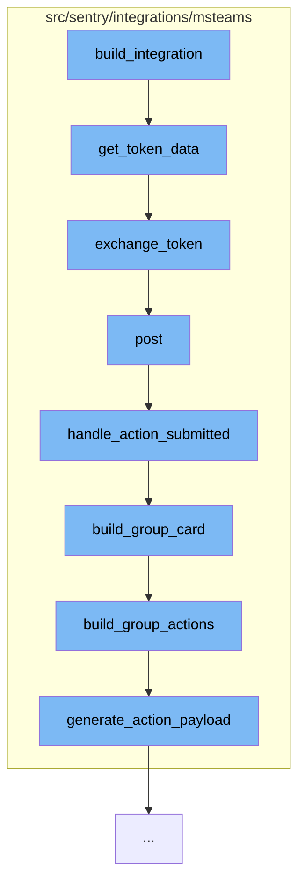

This document will cover the process of handling Microsoft Teams integration in the Sentry application. We'll cover:

1. How the integration is built
2. How tokens are exchanged
3. How messages are posted
4. How actions are handled
5. How group cards are built
6. How group actions are built
7. How action payloads are generated.



<SwmSnippet path="/src/sentry/integrations/msteams/integration.py" line="1">

---

# Building the Integration

The `build_integration` function in `src/sentry/integrations/msteams/integration.py` is the entry point for the Microsoft Teams integration. It initiates the process by calling the `get_token_data` function.

```python
import logging

from django.utils.translation import ugettext_lazy as _
from rest_framework.request import Request
from rest_framework.response import Response

from sentry import options
from sentry.integrations import (
    FeatureDescription,
    IntegrationFeatures,
```

---

</SwmSnippet>

<SwmSnippet path="/src/sentry/integrations/msteams/client.py" line="129">

---

# Exchanging Tokens

The `get_token_data` function retrieves the client ID and secret, and uses them to exchange tokens with the Microsoft Teams service. The `exchange_token` function is called to perform this exchange.

```python
def get_token_data():
    client_id = options.get("msteams.client-id")
    client_secret = options.get("msteams.client-secret")
    client = OAuthMsTeamsClient(client_id, client_secret)
    resp = client.exchange_token()
    # calculate the expiration date but offset because of the delay in receiving the response
    expires_at = int(time.time()) + int(resp["expires_in"]) - CLOCK_SKEW
    return {"access_token": resp["access_token"], "expires_at": expires_at}
```

---

</SwmSnippet>

<SwmSnippet path="/src/sentry/integrations/msteams/webhook.py" line="144">

---

# Posting Messages

The `post` function in `src/sentry/integrations/msteams/webhook.py` is responsible for posting messages to Microsoft Teams. It verifies the signature of the request and handles different types of messages based on their content.

```python
    def post(self, request: Request) -> Response:
        # verify_signature will raise the exception corresponding to the error
        verify_signature(request)

        data = request.data
        conversation_type = data.get("conversation", {}).get("conversationType")

        # only care about conversationUpdate and message
        if data["type"] == "message":
            # the only message events we care about are those which
            # are from a user submitting an option on a card, which
            # will always contain an "payload.actionType" in the data.
            if data.get("value", {}).get("payload", {}).get("actionType"):
                return self.handle_action_submitted(request)
            elif conversation_type == "channel":
                return self.handle_channel_message(request)
            else:
                return self.handle_personal_message(request)
        elif data["type"] == "conversationUpdate":
            channel_data = data["channelData"]
            event = channel_data.get("eventType")
```

---

</SwmSnippet>

<SwmSnippet path="/src/sentry/integrations/msteams/webhook.py" line="322">

---

# Handling Actions

The `handle_action_submitted` function handles actions submitted by users in Microsoft Teams. It retrieves necessary data from the request, checks the existence of the integration, and updates the state of the issue.

```python
    def handle_action_submitted(self, request: Request):
        # pull out parameters
        data = request.data
        channel_data = data["channelData"]
        tenant_id = channel_data["tenant"]["id"]
        payload = data["value"]["payload"]
        group_id = payload["groupId"]
        integration_id = payload["integrationId"]
        user_id = data["from"]["id"]
        activity_id = data["replyToId"]
        conversation = data["conversation"]
        if conversation["conversationType"] == "personal":
            conversation_id = conversation["id"]
        else:
            conversation_id = channel_data["channel"]["id"]

        try:
            integration = Integration.objects.get(id=integration_id)
        except Integration.DoesNotExist:
            logger.info(
                "msteams.action.missing-integration", extra={"integration_id": integration_id}
```

---

</SwmSnippet>

<SwmSnippet path="/src/sentry/integrations/msteams/card_builder.py" line="591">

---

# Building Group Cards

The `build_group_card` function builds a card for a group. It constructs the title, description, footer, and actions for the card.

```python
def build_group_card(group, event, rules, integration):
    project = Project.objects.get_from_cache(id=group.project_id)

    title = build_group_title(group)
    body = [title]

    desc = build_group_descr(group)
    if desc:
        body.append(desc)

    footer = build_group_footer(group, rules, project, event)
    body.append(footer)

    assignee_note = build_assignee_note(group)
    if assignee_note:
        body.append(assignee_note)

    actions = build_group_actions(group, event, rules, integration)
    body.append(actions)

    return {
```

---

</SwmSnippet>

<SwmSnippet path="/src/sentry/integrations/msteams/card_builder.py" line="409">

---

# Building Group Actions

The `build_group_actions` function builds actions for a group. It checks the status of the group and builds appropriate actions based on the status.

```python
def build_group_actions(group, event, rules, integration):
    status = group.get_status()

    if status == GroupStatus.RESOLVED:
        resolve_action = {
            "type": "Action.Submit",
            "title": "Unresolve",
            "data": generate_action_payload(ACTION_TYPE.UNRESOLVE, event, rules, integration),
        }
    else:
        resolve_action = {
            "type": "Action.ShowCard",
            "version": "1.2",
            "title": "Resolve",
            "card": {
                "type": "AdaptiveCard",
                "body": [
                    {"type": "TextBlock", "text": "Resolve", "weight": "Bolder"},
                    {
                        "type": "Input.ChoiceSet",
                        "id": "resolveInput",
```

---

</SwmSnippet>

<SwmSnippet path="/src/sentry/integrations/msteams/card_builder.py" line="19">

---

# Generating Action Payloads

The `generate_action_payload` function generates a payload for an action. It includes the action type, group ID, event ID, rules, and integration ID in the payload.

```python
def generate_action_payload(action_type, event, rules, integration):
    rule_ids = map(lambda x: x.id, rules)
    # we need nested data or else Teams won't handle the payload correctly
    return {
        "payload": {
            "actionType": action_type,
            "groupId": event.group.id,
            "eventId": event.event_id,
            "rules": rule_ids,
            "integrationId": integration.id,
        }
    }
```

---

</SwmSnippet>

&nbsp;

*This is an auto-generated document by Swimm AI 🌊 and has not yet been verified by a human*

<SwmMeta version="3.0.0" repo-id="Z2l0aHViJTNBJTNBZGVtby1zZW50cnklM0ElM0Fzd2ltbWlv" repo-name="demo-sentry"><sup>Powered by [Swimm](/)</sup></SwmMeta>
