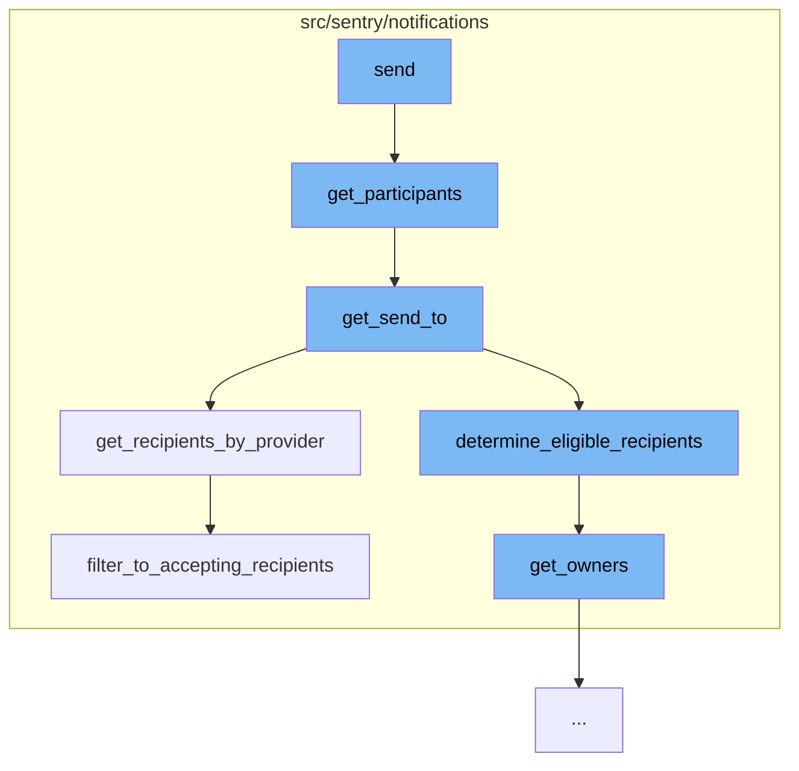

This document will cover the process of sending notifications in the Sentry application. We'll cover the following steps:

1. Gathering the participants for the notification
2. Determining the eligible recipients
3. Filtering the recipients by their notification preferences
4. Sending the notification.



<SwmSnippet path="/src/sentry/notifications/notifications/rules.py" line="52">

---

# Gathering the participants for the notification

The `get_participants` function is used to gather the participants for the notification. It calls the `get_send_to` function with the project, target type, target identifier, and event as parameters.

```python
    def get_participants(self) -> Mapping[ExternalProviders, Iterable[Team | User]]:
        return get_send_to(
            project=self.project,
            target_type=self.target_type,
            target_identifier=self.target_identifier,
            event=self.event,
        )
```

---

</SwmSnippet>

<SwmSnippet path="/src/sentry/notifications/utils/participants.py" line="239">

---

# Determining the eligible recipients

The `get_send_to` function determines the eligible recipients for the notification. It calls the `determine_eligible_recipients` function to get the recipients and then calls `get_recipients_by_provider` to filter the recipients by their notification provider.

```python
def get_send_to(
    project: Project,
    target_type: ActionTargetType,
    target_identifier: int | None = None,
    event: Event | None = None,
) -> Mapping[ExternalProviders, set[Team | User]]:
    recipients = determine_eligible_recipients(project, target_type, target_identifier, event)
    return get_recipients_by_provider(project, recipients)
```

---

</SwmSnippet>

<SwmSnippet path="/src/sentry/notifications/utils/participants.py" line="320">

---

# Filtering the recipients by their notification preferences

The `get_recipients_by_provider` function filters the recipients by their notification preferences. It calls the `filter_to_accepting_recipients` function to get the recipients who have accepted notifications from the project.

```python
def get_recipients_by_provider(
    project: Project, recipients: Iterable[Team | User]
) -> Mapping[ExternalProviders, set[Team | User]]:
    """Get the lists of recipients that should receive an Issue Alert by ExternalProvider."""
    teams, users = partition_recipients(recipients)

    # First evaluate the teams.
    teams_by_provider = NotificationSetting.objects.filter_to_accepting_recipients(project, teams)

    # Teams cannot receive emails so omit EMAIL settings.
    teams_by_provider = {
        provider: teams
        for provider, teams in teams_by_provider.items()
        if provider != ExternalProviders.EMAIL
    }

    # If there are any teams that didn't get added, fall back and add all users.
    users = set(users).union(get_users_from_team_fall_back(teams, teams_by_provider))

    # Repeat for users.
    users_by_provider = NotificationSetting.objects.filter_to_accepting_recipients(project, users)
```

---

</SwmSnippet>

<SwmSnippet path="/src/sentry/notifications/notifications/rules.py" line="1">

---

# Sending the notification

Finally, the `send` function is called to send the notification to the filtered recipients. The details of this function are not provided in the context.

```python
from __future__ import annotations
```

---

</SwmSnippet>

&nbsp;

*This is an auto-generated document by Swimm AI 🌊 and has not yet been verified by a human*

<SwmMeta version="3.0.0" repo-id="Z2l0aHViJTNBJTNBZGVtby1zZW50cnklM0ElM0Fzd2ltbWlv" repo-name="demo-sentry"><sup>Powered by [Swimm](/)</sup></SwmMeta>
