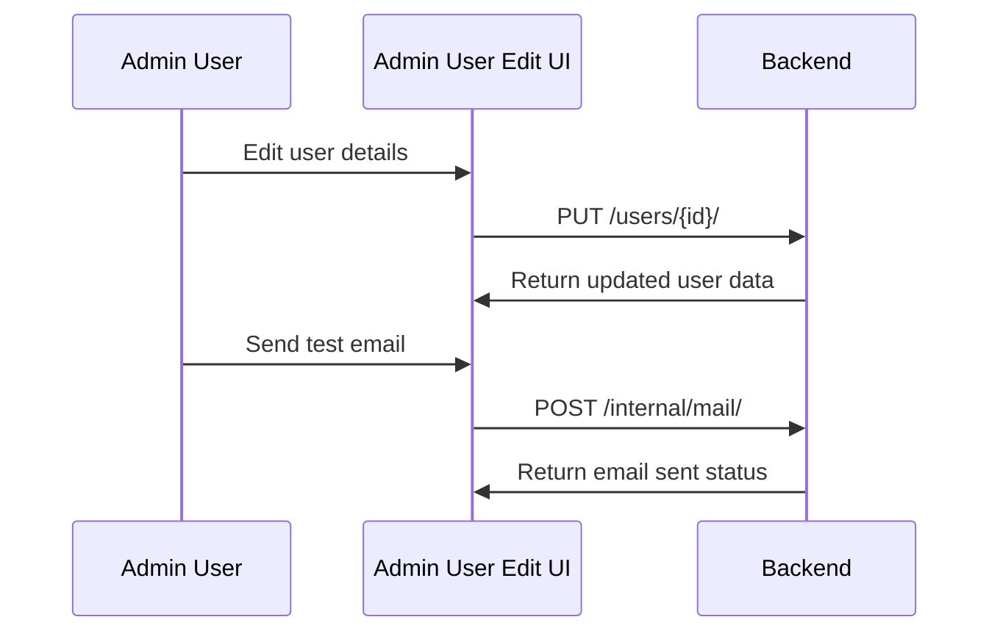

# Admin

In the context of the demo-sentry repository, 'Admin' refers to a set of components and functionalities that provide administrative control over the application. It includes various views and components such as `AdminNavigation`, `AdminOverview`, `AdminBuffer`, `AdminEnvironment`, and `AdminUsers`. These components are used to manage different aspects of the application like system status, user management, environment settings, and more. For instance, `AdminNavigation` provides a navigation menu for administrative tasks, `AdminOverview` provides a system overview, `AdminBuffer` manages buffers, `AdminEnvironment` handles environment settings, and `AdminUsers` is for user management. Each of these components is defined in their respective files under the `static/app/views/admin` directory.

<SwmSnippet path="/static/app/views/admin/adminUserEdit.tsx" line="128">

---

# Admin User Management

The `AdminUserEdit` component manages the editing of user details. It defines an endpoint (`userEndpoint`) to fetch and update user data. The `deleteUser` and `deactivateUser` methods use this endpoint to delete and deactivate a user, respectively.

```tsx
  get userEndpoint() {
    const {params} = this.props;
    return `/users/${params.id}/`;
  }

  getEndpoints(): ReturnType<AsyncView['getEndpoints']> {
    return [['user', this.userEndpoint]];
  }

  async deleteUser() {
    await this.api.requestPromise(this.userEndpoint, {
      method: 'DELETE',
      data: {hardDelete: true, organizations: []},
    });

    addSuccessMessage(t("%s's account has been deleted.", this.state.user?.email));
    browserHistory.replace('/manage/users/');
  }
```

---

</SwmSnippet>

<SwmSnippet path="/static/app/views/admin/adminMail.tsx" line="21">

---

# Admin Mail Settings

The `AdminMail` component manages the mail settings. It defines an endpoint (`/internal/mail/`) to fetch and update mail settings. The `sendTestEmail` method uses this endpoint to send a test email.

```tsx
  getEndpoints(): ReturnType<AsyncView['getEndpoints']> {
    return [['data', '/internal/mail/']];
  }

  sendTestEmail = async () => {
    const testMailEmail = this.state.data.testMailEmail;

    try {
      await this.api.requestPromise('/internal/mail/', {method: 'POST'});
      addSuccessMessage(t('A test email has been sent to %s', testMailEmail));
    } catch (error) {
      addErrorMessage(
        error.responseJSON
          ? error.responseJSON.error
          : t('Unable to send test email. Check your server logs')
      );
    }
```

---

</SwmSnippet>



&nbsp;

*This is an auto-generated document by Swimm AI 🌊 and has not yet been verified by a human*

<SwmMeta version="3.0.0" repo-id="Z2l0aHViJTNBJTNBZGVtby1zZW50cnklM0ElM0Fzd2ltbWlv" repo-name="demo-sentry"><sup>Powered by [Swimm](/)</sup></SwmMeta>
