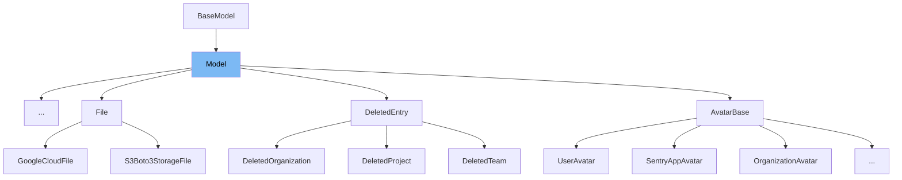

This document will cover the following aspects of the `Model` class in the `src/sentry/db/models/base.py` file:

1. What is `Model` and its purpose.
2. The variables and functions defined in `Model`.
3. An example of how `Model` is used in `EventProcessingIssue`.



# What is Model

`Model` is a class in `src/sentry/db/models/base.py` that serves as a base for other classes in the Sentry application. It provides a set of common functionalities and attributes that are shared among various models in the application. It is an abstract class, meaning it cannot be instantiated directly but can be subclassed.

<SwmSnippet path="/src/sentry/db/models/base.py" line="86">

---

# Variables and functions

`id` is a variable in the `Model` class. It is a primary key field that stores the unique identifier of each instance of the model.

```python
class Model(BaseModel):
    id = BoundedBigAutoField(primary_key=True)
```

---

</SwmSnippet>

<SwmSnippet path="/src/sentry/db/models/base.py" line="92">

---

`__repr__` is a function in the `Model` class. It is used to provide a string representation of the model instance. The `sane_repr` function is used to generate this representation, with `id` as the attribute to be displayed.

```python
    __repr__ = sane_repr("id")
```

---

</SwmSnippet>

<SwmSnippet path="/src/sentry/models/processingissue.py" line="90">

---

# Usage example

The `ProcessingIssue` class in `src/sentry/models/processingissue.py` is an example of how `Model` is used. `ProcessingIssue` extends `Model`, inheriting its attributes and methods. It defines additional fields like `project`, `checksum`, `type`, `data`, and `datetime`, and also uses the `Model`'s `id` field as its primary key.

```python
class ProcessingIssue(Model):
    __include_in_export__ = False

    project = FlexibleForeignKey("sentry.Project", db_index=True)
    checksum = models.CharField(max_length=40, db_index=True)
    type = models.CharField(max_length=30)
    data = GzippedDictField()
    datetime = models.DateTimeField(default=timezone.now)

```

---

</SwmSnippet>

&nbsp;

*This is an auto-generated document by Swimm AI 🌊 and has not yet been verified by a human*

<SwmMeta version="3.0.0" repo-id="Z2l0aHViJTNBJTNBZGVtby1zZW50cnklM0ElM0Fzd2ltbWlv" repo-name="demo-sentry"><sup>Powered by [Swimm](/)</sup></SwmMeta>
