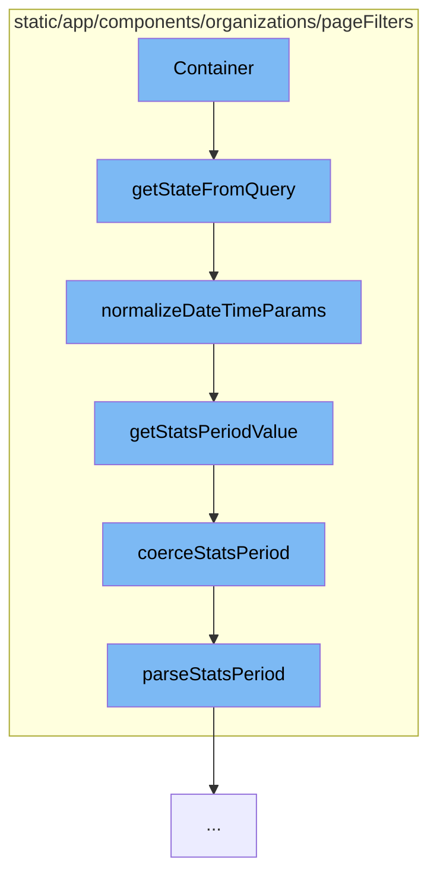

This document will cover the process of parsing and normalizing page filter parameters in the Sentry demo application. We'll cover:

1. The purpose of the Container function in the pageFilters directory
2. How the Container function calls other functions to parse and normalize parameters
3. The flow of function calls initiated by the Container function



<SwmSnippet path="/static/app/components/organizations/pageFilters/container.tsx" line="288">

---

# The Purpose of the Container Function

The `Container` function in `container.tsx` is the starting point of the flow. It calls the `getStateFromQuery` function to parse and normalize all page filter relevant parameters from a location query. This includes normalizing `project` and `environment` into a consistent list object, and normalizing date time filter parameters.

```tsx

```

---

</SwmSnippet>

<SwmSnippet path="/static/app/components/organizations/pageFilters/parse.tsx" line="216">

---

# The Flow of Function Calls Initiated by the Container Function

The `getStateFromQuery` function calls `normalizeDateTimeParams` to normalize the DateTime components of the page filters. This function has additional functionality for handling `page*` filters that will override the standard `start`/`end`/`statsPeriod` filters. It does not normalize the `project` or `environment` components of the page filter parameters.

```tsx
export function normalizeDateTimeParams(
  params: InputParams,
  options: DateTimeNormalizeOptions = {}
): ParsedParams {
  const {
    allowEmptyPeriod = false,
    allowAbsoluteDatetime = true,
    allowAbsolutePageDatetime = false,
    defaultStatsPeriod = DEFAULT_STATS_PERIOD,
  } = options;

  const {
    pageStatsPeriod,
    pageStart,
    pageEnd,
    pageUtc,
    start,
    end,
    period,
    statsPeriod,
    utc,
```

---

</SwmSnippet>

<SwmSnippet path="/static/app/components/organizations/pageFilters/parse.tsx" line="46">

---

`normalizeDateTimeParams` calls `getStatsPeriodValue` to normalize a string or string\[\] into a standard stats period string. If the input is an array, it finds and coerces a stats period string. If the input is a string, it directly coerces the stats period.

```tsx
/**
 * Normalizes a string or string[] into a standard stats period string.
 *
 * Undefined and null inputs are returned as undefined.
 */
function getStatsPeriodValue(maybe: ParamValue) {
  if (Array.isArray(maybe)) {
    const result = maybe.find(coerceStatsPeriod);

    return result ? coerceStatsPeriod(result) : undefined;
  }

  if (typeof maybe === 'string') {
    return coerceStatsPeriod(maybe);
  }

  return undefined;
}
```

---

</SwmSnippet>

<SwmSnippet path="/static/app/components/organizations/pageFilters/parse.tsx" line="37">

---

`getStatsPeriodValue` calls `coerceStatsPeriod` to normalize a stats period string. It calls `parseStatsPeriod` to parse a stats period into `period` and `periodLength`.

```tsx
/**
 * Normalizes a stats period string
 */
function coerceStatsPeriod(input: string) {
  const result = parseStatsPeriod(input);

  return result ? `${result.period}${result.periodLength}` : undefined;
}
```

---

</SwmSnippet>

<SwmSnippet path="/static/app/components/organizations/pageFilters/parse.tsx" line="19">

---

`coerceStatsPeriod` calls `parseStatsPeriod` to parse a stats period into `period` and `periodLength`. If the input does not match the STATS_PERIOD_PATTERN, it returns undefined.

```tsx
/**
 * Parses a stats period into `period` and `periodLength`
 */
export function parseStatsPeriod(input: string | IntervalPeriod) {
  const result = input.match(STATS_PERIOD_PATTERN);

  if (!result) {
    return undefined;
  }

  const period = result[1];

  // default to seconds. this behaviour is based on src/sentry/utils/dates.py
  const periodLength = result[2] || 's';

  return {period, periodLength};
}
```

---

</SwmSnippet>

&nbsp;

*This is an auto-generated document by Swimm AI 🌊 and has not yet been verified by a human*

<SwmMeta version="3.0.0" repo-id="Z2l0aHViJTNBJTNBZGVtby1zZW50cnklM0ElM0Fzd2ltbWlv" repo-name="demo-sentry"><sup>Powered by [Swimm](/)</sup></SwmMeta>
