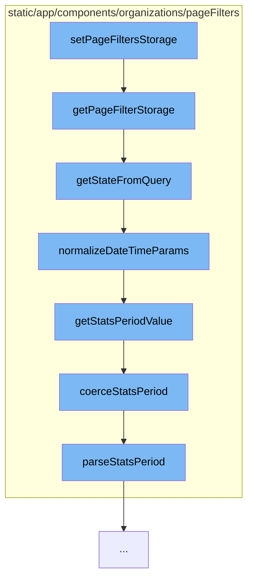

This document will cover the process of setting page filters in the Sentry application. The process includes:

1. Retrieving the page filters from local storage
2. Parsing and normalizing all page filter relevant parameters from a location query
3. Normalizing the DateTime components of the page filters
4. Normalizing a stats period string



<SwmSnippet path="/static/app/components/organizations/pageFilters/persistence.tsx" line="96">

---

# Retrieving the page filters from local storage

The function `getPageFilterStorage` retrieves the page filters from local storage. It takes an organization slug as a parameter and uses it to create a local storage key. The function then retrieves the value from local storage using this key. If a value is found, it is parsed from JSON into a `StoredObject`. The function then extracts the necessary properties from the `StoredObject` and uses them to create a `state` object by calling `getStateFromQuery`.

```tsx
/**
 * Retrives the page filters from local storage
 */
export function getPageFilterStorage(orgSlug: string) {
  const localStorageKey = makeLocalStorageKey(orgSlug);
  const value = localStorage.getItem(localStorageKey);

  if (!value) {
    return null;
  }

  let decoded: StoredObject;

  try {
    decoded = JSON.parse(value);
  } catch (err) {
    // use default if invalid
    Sentry.captureException(err);
    console.error(err); // eslint-disable-line no-console

    return null;
```

---

</SwmSnippet>

<SwmSnippet path="/static/app/components/organizations/pageFilters/parse.tsx" line="278">

---

# Parsing and normalizing all page filter relevant parameters from a location query

The function `getStateFromQuery` parses and normalizes all page filter relevant parameters from a location query. It takes a location query and normalization options as parameters. The function normalizes `project` and `environment` into a consistent list object and normalizes date time filter parameters by calling `normalizeDateTimeParams`.

```tsx
/**
 * Parses and normalizes all page filter relevant parameters from a location
 * query.
 *
 * This includes the following operations
 *
 *  - Normalizes `project` and `environment` into a consistent list object.
 *  - Normalizes date time filter parameters (using normalizeDateTimeParams).
 *  - Parses `start` and `end` into Date objects.
 */
export function getStateFromQuery(
  query: Location['query'],
  normalizeOptions: DateTimeNormalizeOptions = {}
) {
  const {allowAbsoluteDatetime} = normalizeOptions;

  const project = getProject(query[URL_PARAM.PROJECT]) ?? null;
  const environment = getEnvironment(query[URL_PARAM.ENVIRONMENT]) ?? null;

  const dateTimeParams = normalizeDateTimeParams(query, normalizeOptions);

```

---

</SwmSnippet>

<SwmSnippet path="/static/app/components/organizations/pageFilters/parse.tsx" line="206">

---

# Normalizing the DateTime components of the page filters

The function `normalizeDateTimeParams` normalizes the DateTime components of the page filters. It takes parameters and options as parameters. The function normalizes `statsPeriod`, `start`, `end`, and `utc` parameters.

```tsx
/**
 * Normalizes the DateTime components of the page filters.
 *
 * NOTE: This has some additional functionality for handling `page*` filters
 *       that will override the standard `start`/`end`/`statsPeriod` filters.
 *
 * NOTE: This does *NOT* normalize the `project` or `environment` components of
 *       the page filter parameters. See `getStateFromQuery` for normalization
 *       of the project and environment parameters.
 */
export function normalizeDateTimeParams(
  params: InputParams,
  options: DateTimeNormalizeOptions = {}
): ParsedParams {
  const {
    allowEmptyPeriod = false,
    allowAbsoluteDatetime = true,
    allowAbsolutePageDatetime = false,
    defaultStatsPeriod = DEFAULT_STATS_PERIOD,
  } = options;

```

---

</SwmSnippet>

<SwmSnippet path="/static/app/components/organizations/pageFilters/parse.tsx" line="37">

---

# Normalizing a stats period string

The function `coerceStatsPeriod` normalizes a stats period string. It takes a string as a parameter and normalizes it by calling `parseStatsPeriod`.

```tsx
/**
 * Normalizes a stats period string
 */
function coerceStatsPeriod(input: string) {
  const result = parseStatsPeriod(input);

  return result ? `${result.period}${result.periodLength}` : undefined;
}
```

---

</SwmSnippet>

&nbsp;

*This is an auto-generated document by Swimm AI 🌊 and has not yet been verified by a human*

<SwmMeta version="3.0.0" repo-id="Z2l0aHViJTNBJTNBZGVtby1zZW50cnklM0ElM0Fzd2ltbWlv" repo-name="demo-sentry"><sup>Powered by [Swimm](/)</sup></SwmMeta>
