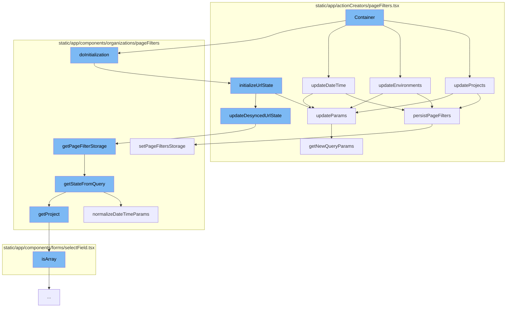

This document will cover the process of updating and initializing page filters in the Sentry application. The process includes:

1. Updating projects, environments, and date time.
2. Initializing URL state.
3. Persisting page filters.



<SwmSnippet path="/static/app/actionCreators/pageFilters.tsx" line="281">

---

# Updating Projects, Environments, and Date Time

The function `updateProjects` is used to update the store and selection URL param if `router` is supplied. It accepts `environments` from `options` to also update environments simultaneously as environments are tied to a project, so if you change projects, you may need to clear environments.

```tsx
/**
 * Updates store and selection URL param if `router` is supplied
 *
 * This accepts `environments` from `options` to also update environments
 * simultaneously as environments are tied to a project, so if you change
 * projects, you may need to clear environments.
 */
export function updateProjects(
  projects: ProjectId[],
  router?: Router,
  options?: Options & {environments?: EnvironmentId[]}
) {
  if (!isProjectsValid(projects)) {
    Sentry.withScope(scope => {
      scope.setExtra('projects', projects);
      Sentry.captureException(new Error('Invalid projects selected'));
    });
    return;
  }

  PageFiltersActions.updateProjects(projects, options?.environments);
```

---

</SwmSnippet>

<SwmSnippet path="/static/app/actionCreators/pageFilters.tsx" line="141">

---

# Initializing URL State

The function `initializeUrlState` is used to initialize the URL state. It parses and normalizes all page filter relevant parameters from a location query. This includes normalizing `project` and `environment` into a consistent list object and normalizing date time filter parameters.

```tsx
export function initializeUrlState({
  organization,
  queryParams,
  pathname,
  router,
  memberProjects,
  skipLoadLastUsed,
  shouldForceProject,
  shouldEnforceSingleProject,
  defaultSelection,
  forceProject,
  showAbsolute = true,
  skipInitializeUrlParams = false,
}: InitializeUrlStateParams) {
  const orgSlug = organization.slug;

  const parsed = getStateFromQuery(queryParams, {
    allowAbsoluteDatetime: showAbsolute,
    allowEmptyPeriod: true,
  });

```

---

</SwmSnippet>

<SwmSnippet path="/static/app/actionCreators/pageFilters.tsx" line="378">

---

# Persisting Page Filters

The function `persistPageFilters` is used to save a specific page filter to local storage. The pinned state is always persisted.

```tsx
/**
 * Save a specific page filter to local storage.
 *
 * Pinned state is always persisted.
 */
async function persistPageFilters(filter: PinnedPageFilter | null, options?: Options) {
  if (!options?.save) {
    return;
  }

  // XXX(epurkhiser): Since this is called immediately after updating the
  // store, wait for a tick since stores are not updated fully synchronously.
  // A bit goofy, but it works fine.
  await new Promise(resolve => window.setTimeout(resolve, 0));

  const {organization} = OrganizationStore.getState();
  const orgSlug = organization?.slug ?? null;

  // Can't do anything if we don't have an organization
  if (orgSlug === null) {
    return;
```

---

</SwmSnippet>

&nbsp;

*This is an auto-generated document by Swimm AI 🌊 and has not yet been verified by a human*

<SwmMeta version="3.0.0" repo-id="Z2l0aHViJTNBJTNBZGVtby1zZW50cnklM0ElM0Fzd2ltbWlv" repo-name="demo-sentry"><sup>Powered by [Swimm](/)</sup></SwmMeta>
