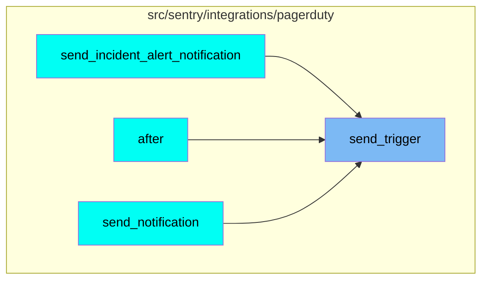
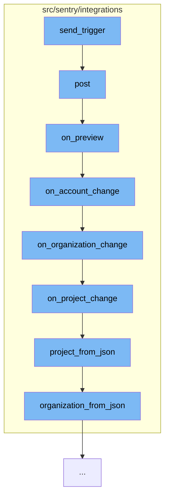

This document will cover the process of sending a trigger to PagerDuty and processing the response in the Sentry application. The process includes the following steps:

1. Sending the trigger to PagerDuty
2. Posting the response
3. Previewing the response
4. Changing the account, organization, and project based on the response
5. Converting the project and organization data from JSON.

## Where is this flow used?

The flow starts with the function `send_trigger`. It is called from multiple entry points as represented in the following diagram:



## The flow itself



<SwmSnippet path="/src/sentry/integrations/pagerduty/client.py" line="1">

---

# Sending the trigger to PagerDuty

The `send_trigger` function in the `client.py` file is the starting point of the flow. It is responsible for sending a trigger to PagerDuty.

```python
from sentry.api.serializers import ExternalEventSerializer, serialize
from sentry.eventstore.models import Event
from sentry.integrations.client import ApiClient

LEVEL_SEVERITY_MAP = {
    "debug": "info",
    "info": "info",
    "warning": "warning",
    "error": "error",
    "fatal": "critical",
```

---

</SwmSnippet>

<SwmSnippet path="/src/sentry/integrations/cloudflare/webhook.py" line="188">

---

# Posting the response

The `post` function receives the response from PagerDuty. It validates the response and logs any errors. Depending on the event type in the response, it calls the appropriate function.

```python
    def post(self, request: Request) -> Response:
        signature = request.META.get("HTTP_X_SIGNATURE_HMAC_SHA256_HEX")
        variant = request.META.get("HTTP_X_SIGNATURE_KEY_VARIANT")
        logging_data = {
            "user_id": request.user.id if request.user.is_authenticated else None,
            "signature": signature,
            "variant": variant,
        }

        payload = request.body
        try:
            data = request.data
        except (ValueError, TypeError):
            logger.error("cloudflare.webhook.invalid-json", extra=logging_data)
            return Response(status=400)

        event = data.get("event")
        logger.info(f"cloudflare.webhook.{event}", extra=logging_data)
        if not signature:
            logger.error("cloudflare.webhook.invalid-signature", extra=logging_data)
            return Response(status=400)
```

---

</SwmSnippet>

<SwmSnippet path="/src/sentry/integrations/cloudflare/webhook.py" line="81">

---

# Previewing the response

The `on_preview` function is called when the event type in the response is 'preview'. It checks if the user is authenticated and then calls the `on_account_change` function.

```python
    def on_preview(self, request: Request, data, is_test):
        if not request.user.is_authenticated:
            return Response({"install": data["install"], "proceed": True})

        return self.on_account_change(request, data, is_test)
```

---

</SwmSnippet>

<SwmSnippet path="/src/sentry/integrations/cloudflare/webhook.py" line="88">

---

# Changing the account, organization, and project based on the response

The `on_account_change`, `on_organization_change`, and `on_project_change` functions are called sequentially. They update the account, organization, and project based on the response data.

```python
    def on_account_change(self, request: Request, data, is_test):
        organizations = sorted(
            Organization.objects.get_for_user(request.user, scope="project:write"),
            key=lambda x: x.slug,
        )

        enum_choices = [str(o.id) for o in organizations]

        data["install"]["schema"]["properties"]["organization"] = {
            "type": "string",
            "title": "Sentry Organization",
            "order": 1,
            "enum": enum_choices,
            "enumNames": {str(o.id): o.slug for o in organizations},
            "required": True,
        }
        if not enum_choices:
            return self.on_organization_clear(request, data, is_test)

        if data["install"]["options"].get("organization") not in enum_choices:
            data["install"]["options"]["organization"] = enum_choices[0]
```

---

</SwmSnippet>

<SwmSnippet path="/src/sentry/integrations/cloudflare/webhook.py" line="52">

---

# Converting the project and organization data from JSON

The `organization_from_json` and `project_from_json` functions convert the organization and project data from JSON format. They are used in the `on_organization_change` and `on_project_change` functions respectively.

```python
    def organization_from_json(self, request: Request, data, scope="project:write"):
        try:
            organization_id = data["install"]["options"]["organization"]
        except KeyError:
            return None

        organizations = Organization.objects.get_for_user(request.user, scope=scope)
        for org in organizations:
            if str(org.id) == organization_id:
                return org
        return None

    def project_from_json(self, request: Request, data, scope="project:write"):
        try:
            project_id = data["install"]["options"]["project"]
        except KeyError:
            return None

        org = self.organization_from_json(request, data)

        projects = Project.objects.filter(
```

---

</SwmSnippet>

&nbsp;

*This is an auto-generated document by Swimm AI 🌊 and has not yet been verified by a human*

<SwmMeta version="3.0.0" repo-id="Z2l0aHViJTNBJTNBZGVtby1zZW50cnklM0ElM0Fzd2ltbWlv" repo-name="demo-sentry"><sup>Powered by [Swimm](/)</sup></SwmMeta>
