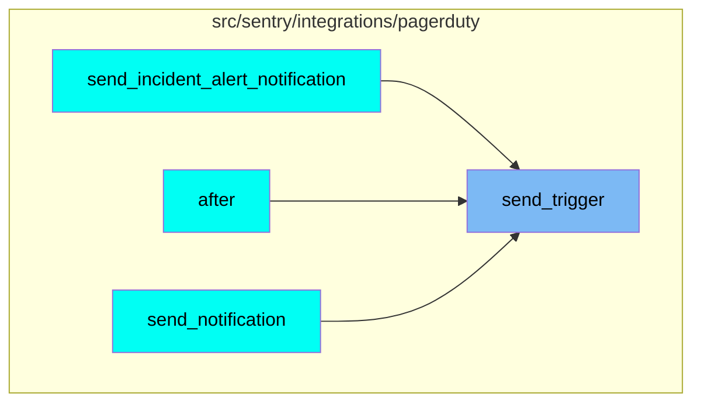
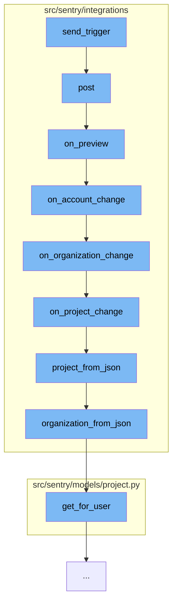

This document will cover the process of sending a trigger to PagerDuty and processing the response in the Sentry application. The process includes the following steps:

1. Sending the trigger
2. Posting the request
3. Previewing the request
4. Changing the account
5. Changing the organization
6. Changing the project
7. Retrieving the project from JSON
8. Retrieving the organization from JSON
9. Getting the user for the project.

## Where is this flow used?

The flow starts with the function `send_trigger`. It is called from multiple entry points as represented in the following diagram:



## The flow itself



<SwmSnippet path="/src/sentry/integrations/pagerduty/client.py" line="1">

---

# Sending the trigger

The `send_trigger` function in `src/sentry/integrations/pagerduty/client.py` is the starting point of the flow. It is responsible for sending a trigger to PagerDuty.

```python
from sentry.api.serializers import ExternalEventSerializer, serialize
from sentry.eventstore.models import Event
from sentry.integrations.client import ApiClient

LEVEL_SEVERITY_MAP = {
    "debug": "info",
    "info": "info",
    "warning": "warning",
    "error": "error",
    "fatal": "critical",
```

---

</SwmSnippet>

<SwmSnippet path="/src/sentry/integrations/cloudflare/webhook.py" line="188">

---

# Posting the request

The `post` function is called next. It handles the HTTP POST request, validates the request data, and determines the next step based on the event type.

```python
    def post(self, request: Request) -> Response:
        signature = request.META.get("HTTP_X_SIGNATURE_HMAC_SHA256_HEX")
        variant = request.META.get("HTTP_X_SIGNATURE_KEY_VARIANT")
        logging_data = {
            "user_id": request.user.id if request.user.is_authenticated else None,
            "signature": signature,
            "variant": variant,
        }

        payload = request.body
        try:
            data = request.data
        except (ValueError, TypeError):
            logger.error("cloudflare.webhook.invalid-json", extra=logging_data)
            return Response(status=400)

        event = data.get("event")
        logger.info(f"cloudflare.webhook.{event}", extra=logging_data)
        if not signature:
            logger.error("cloudflare.webhook.invalid-signature", extra=logging_data)
            return Response(status=400)
```

---

</SwmSnippet>

<SwmSnippet path="/src/sentry/integrations/cloudflare/webhook.py" line="81">

---

# Previewing the request

The `on_preview` function is called if the event type is 'preview'. It checks if the user is authenticated and if so, it proceeds to the account change step.

```python
    def on_preview(self, request: Request, data, is_test):
        if not request.user.is_authenticated:
            return Response({"install": data["install"], "proceed": True})

        return self.on_account_change(request, data, is_test)
```

---

</SwmSnippet>

<SwmSnippet path="/src/sentry/integrations/cloudflare/webhook.py" line="88">

---

# Changing the account

The `on_account_change` function is responsible for handling account changes. It retrieves the organizations for the user and updates the installation options.

```python
    def on_account_change(self, request: Request, data, is_test):
        organizations = sorted(
            Organization.objects.get_for_user(request.user, scope="project:write"),
            key=lambda x: x.slug,
        )

        enum_choices = [str(o.id) for o in organizations]

        data["install"]["schema"]["properties"]["organization"] = {
            "type": "string",
            "title": "Sentry Organization",
            "order": 1,
            "enum": enum_choices,
            "enumNames": {str(o.id): o.slug for o in organizations},
            "required": True,
        }
        if not enum_choices:
            return self.on_organization_clear(request, data, is_test)

        if data["install"]["options"].get("organization") not in enum_choices:
            data["install"]["options"]["organization"] = enum_choices[0]
```

---

</SwmSnippet>

<SwmSnippet path="/src/sentry/integrations/cloudflare/webhook.py" line="122">

---

# Changing the organization

The `on_organization_change` function handles organization changes. It retrieves the projects for the organization and updates the installation options.

```python
    def on_organization_change(self, request: Request, data, is_test):
        org = self.organization_from_json(request, data)

        projects = sorted(
            Project.objects.filter(
                organization=org,
                teams__in=Team.objects.get_for_user(org, request.user, scope="project:write"),
            ),
            key=lambda x: x.slug,
        )

        enum_choices = [str(o.id) for o in projects]

        data["install"]["schema"]["properties"]["project"] = {
            "type": "string",
            "title": "Sentry Project",
            "order": 2,
            "enum": enum_choices,
            "enumNames": {str(o.id): o.slug for o in projects},
            "required": True,
        }
```

---

</SwmSnippet>

<SwmSnippet path="/src/sentry/integrations/cloudflare/webhook.py" line="159">

---

# Changing the project

The `on_project_change` function handles project changes. It retrieves the project keys and updates the installation options.

```python
    def on_project_change(self, request: Request, data, is_test):
        project = self.project_from_json(request, data)

        keys = sorted(ProjectKey.objects.filter(project=project), key=lambda x: x.public_key)

        enum_choices = [o.get_dsn(public=True) for o in keys]

        data["install"]["schema"]["properties"]["dsn"] = {
            "type": "string",
            "title": "DSN",
            "description": "Your automatically configured DSN for communicating with Sentry.",
            "placeholder": "https://public_key@sentry.io/1",
            "order": 3,
            "enum": enum_choices,
            "required": True,
        }
        if not enum_choices:
            return self.on_dsn_clear(request, data, is_test)

        if data["install"]["options"].get("dsn") not in enum_choices:
            data["install"]["options"]["dsn"] = enum_choices[0]
```

---

</SwmSnippet>

<SwmSnippet path="/src/sentry/integrations/cloudflare/webhook.py" line="64">

---

# Retrieving the project from JSON

The `project_from_json` function retrieves the project information from the JSON data.

```python
    def project_from_json(self, request: Request, data, scope="project:write"):
        try:
            project_id = data["install"]["options"]["project"]
        except KeyError:
            return None

        org = self.organization_from_json(request, data)

        projects = Project.objects.filter(
            organization=org,
            teams__in=Team.objects.get_for_user(org, request.user, scope="project:write"),
        )
        for project in projects:
            if str(project.id) == project_id:
                return project
        return None
```

---

</SwmSnippet>

<SwmSnippet path="/src/sentry/integrations/cloudflare/webhook.py" line="52">

---

# Retrieving the organization from JSON

The `organization_from_json` function retrieves the organization information from the JSON data.

```python
    def organization_from_json(self, request: Request, data, scope="project:write"):
        try:
            organization_id = data["install"]["options"]["organization"]
        except KeyError:
            return None

        organizations = Organization.objects.get_for_user(request.user, scope=scope)
        for org in organizations:
            if str(org.id) == organization_id:
                return org
        return None
```

---

</SwmSnippet>

<SwmSnippet path="/src/sentry/models/project.py" line="74">

---

# Getting the user for the project

The `get_for_user` function retrieves the projects for a user.

```python
    # TODO(dcramer): we might want to cache this per user
    def get_for_user(self, team, user, scope=None, _skip_team_check=False):
        from sentry.models import Team

        if not (user and user.is_authenticated):
            return []

        if not _skip_team_check:
            team_list = Team.objects.get_for_user(
                organization=team.organization, user=user, scope=scope
            )

            try:
                team = team_list[team_list.index(team)]
            except ValueError:
                logging.info(f"User does not have access to team: {team.id}")
                return []

        base_qs = self.filter(teams=team, status=ProjectStatus.VISIBLE)

        project_list = []
```

---

</SwmSnippet>

&nbsp;

*This is an auto-generated document by Swimm AI 🌊 and has not yet been verified by a human*

<SwmMeta version="3.0.0" repo-id="Z2l0aHViJTNBJTNBZGVtby1zZW50cnklM0ElM0Fzd2ltbWlv" repo-name="demo-sentry"><sup>Powered by [Swimm](/)</sup></SwmMeta>
