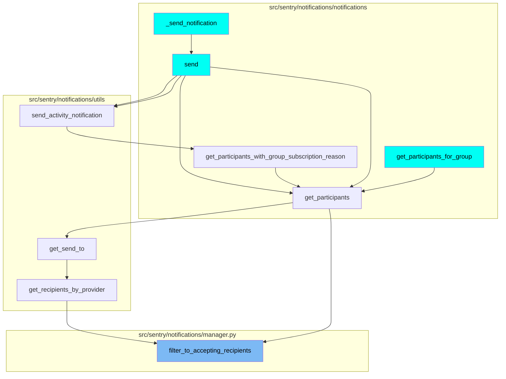
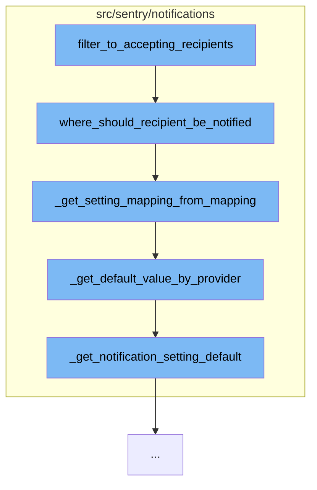

This document will cover the process of filtering and notifying recipients in the Sentry application. The process includes the following steps:

1. Filtering recipients who have opted into notifications.
2. Determining where each recipient should be notified.
3. Getting the setting mapping from the recipient's notification settings.
4. Getting the default value by the provider from the notification settings.
5. Getting the notification setting default.

## Where is this flow used?

The flow starts with the function `filter_to_accepting_recipients`. It is called from multiple entry points as represented in the following diagram: (Note - these are only some of the entry points of this flow)



## The flow itself



<SwmSnippet path="/src/sentry/notifications/manager.py" line="1">

---

# Filtering recipients who have opted into notifications

The function `filter_to_accepting_recipients` is the starting point of this process. It filters out the recipients who have opted into notifications.

```python
from __future__ import annotations

from collections import defaultdict
from typing import TYPE_CHECKING, Iterable, Mapping, MutableMapping, MutableSet, Sequence

from django.db import transaction
from django.db.models import Q, QuerySet

from sentry import analytics
from sentry.db.models.manager import BaseManager
```

---

</SwmSnippet>

<SwmSnippet path="/src/sentry/notifications/helpers.py" line="78">

---

# Determining where each recipient should be notified

The function `where_should_recipient_be_notified` is used to determine the list of providers where each recipient should be notified. It calls `_get_setting_mapping_from_mapping` function to get the mapping of notification settings.

```python
def where_should_recipient_be_notified(
    notification_settings_by_recipient: Mapping[
        Team | User,
        Mapping[NotificationScopeType, Mapping[ExternalProviders, NotificationSettingOptionValues]],
    ],
    recipient: Team | User,
    type: NotificationSettingTypes = NotificationSettingTypes.ISSUE_ALERTS,
) -> list[ExternalProviders]:
    """
    Given a mapping of default and specific notification settings by user,
    return the list of providers after verifying the user has opted into this notification.
    """
    mapping = _get_setting_mapping_from_mapping(
        notification_settings_by_recipient,
        recipient,
        type,
    )
    return [
        provider
        for provider, value in mapping.items()
        if value == NotificationSettingOptionValues.ALWAYS
```

---

</SwmSnippet>

<SwmSnippet path="/src/sentry/notifications/helpers.py" line="53">

---

# Getting the setting mapping from the recipient's notification settings

The function `_get_setting_mapping_from_mapping` is used to get the mapping of notification settings for each recipient. It calls `_get_default_value_by_provider` function to get the default value by the provider.

```python
def _get_setting_mapping_from_mapping(
    notification_settings_by_recipient: Mapping[
        Team | User,
        Mapping[NotificationScopeType, Mapping[ExternalProviders, NotificationSettingOptionValues]],
    ],
    recipient: Team | User,
    type: NotificationSettingTypes,
) -> Mapping[ExternalProviders, NotificationSettingOptionValues]:
    """
    XXX(CEO): may not respect granularity of a setting for Slack a setting for
     email but we'll worry about that later since we don't have a FE for it yet.
    """
    return merge_notification_settings_up(
        _get_default_value_by_provider(type),
        *(
            notification_settings_by_recipient.get(recipient, {}).get(scope, {})
            for scope in (
                NotificationScopeType.USER,
                NotificationScopeType.TEAM,
                get_scope_type(type),
            )
```

---

</SwmSnippet>

<SwmSnippet path="/src/sentry/notifications/helpers.py" line="44">

---

# Getting the default value by the provider from the notification settings

The function `_get_default_value_by_provider` is used to get the default value by the provider from the notification settings. It calls `_get_notification_setting_default` function to get the notification setting default.

```python
def _get_default_value_by_provider(
    type: NotificationSettingTypes,
) -> Mapping[ExternalProviders, NotificationSettingOptionValues]:
    return {
        provider: _get_notification_setting_default(provider, type)
        for provider in NOTIFICATION_SETTING_DEFAULTS.keys()
    }
```

---

</SwmSnippet>

<SwmSnippet path="/src/sentry/notifications/helpers.py" line="32">

---

# Getting the notification setting default

The function `_get_notification_setting_default` is used to get the notification setting default for each provider. This is the final step in the process of filtering and notifying recipients.

```python
def _get_notification_setting_default(
    provider: ExternalProviders,
    type: NotificationSettingTypes,
) -> NotificationSettingOptionValues:
    """
    In order to increase engagement, we automatically opt users into receiving
    Slack notifications if they install Slack and link their identity.
    Approval notifications always default to Slack being on.
    """
    return NOTIFICATION_SETTING_DEFAULTS[provider][type]
```

---

</SwmSnippet>

&nbsp;

*This is an auto-generated document by Swimm AI 🌊 and has not yet been verified by a human*

<SwmMeta version="3.0.0" repo-id="Z2l0aHViJTNBJTNBZGVtby1zZW50cnklM0ElM0Fzd2ltbWlv" repo-name="demo-sentry"><sup>Powered by [Swimm](/)</sup></SwmMeta>
