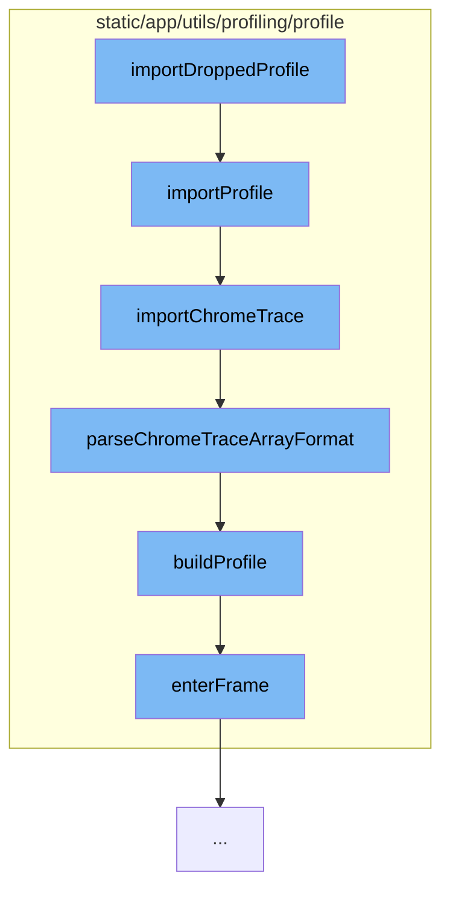

This document will cover the process of importing a profile in the Sentry application. The process includes the following steps:

1. Invoking the `importDroppedProfile` function
2. Calling the `importProfile` function
3. Invoking the `importChromeTrace` function
4. Parsing the Chrome trace array format with `parseChromeTraceArrayFormat`
5. Building the profile with `buildProfile`
6. Entering the frame with `enterFrame`.



<SwmSnippet path="/static/app/utils/profiling/profile/importProfile.tsx" line="32">

---

# Invoking the importDroppedProfile function

The `importProfile` function is the entry point for importing a profile. It takes an input and a traceID as arguments. The input can be of different types, and based on its type, different import functions are called. If the input is a JS profile, `importJSSelfProfile` is called. If it's a Chrome trace format, `importChromeTrace` is called. If it's a schema, `importSchema` is called. If the input type is unsupported, an error is thrown.

```tsx
export function importProfile(
  input: Profiling.Schema | JSSelfProfiling.Trace | ChromeTrace.ProfileType,
  traceID: string
): ProfileGroup {
  const transaction = Sentry.startTransaction({
    op: 'import',
    name: 'profiles.import',
  });

  try {
    if (isJSProfile(input)) {
      // In some cases, the SDK may return transaction as undefined and we dont want to throw there.
      if (transaction) {
        transaction.setTag('profile.type', 'js-self-profile');
      }
      return importJSSelfProfile(input, traceID, {transaction});
    }

    if (isChromeTraceFormat(input)) {
      // In some cases, the SDK may return transaction as undefined and we dont want to throw there.
      if (transaction) {
```

---

</SwmSnippet>

<SwmSnippet path="/static/app/utils/profiling/profile/importProfile.tsx" line="94">

---

# Invoking the importChromeTrace function

The `importChromeTrace` function is responsible for importing a Chrome trace. It checks the format of the input and based on that, it either throws an error if the format is not supported or calls `parseChromeTraceArrayFormat` if the format is an array.

```tsx
function importChromeTrace(
  input: ChromeTrace.ProfileType,
  traceID: string,
  options: ImportOptions
): ProfileGroup {
  if (isChromeTraceObjectFormat(input)) {
    throw new Error('Chrometrace object format is not yet supported');
  }

  if (isChromeTraceArrayFormat(input)) {
    return parseChromeTraceArrayFormat(input, traceID, options);
  }

  throw new Error('Failed to parse trace input format');
}
```

---

</SwmSnippet>

<SwmSnippet path="/static/app/utils/profiling/profile/chromeTraceProfile.tsx" line="254">

---

# Parsing the Chrome trace array format

The `parseChromeTraceArrayFormat` function takes the input, traceID, and options as arguments. It splits the events by process and trace ID, and for each process and thread ID, it builds a profile by calling the `buildProfile` function.

```tsx
export function parseChromeTraceArrayFormat(
  input: ChromeTrace.ArrayFormat,
  traceID: string,
  options?: ImportOptions
): ProfileGroup {
  const profiles: Profile[] = [];
  const eventsByProcessAndThreadID = splitEventsByProcessAndTraceId(input);

  for (const processId in eventsByProcessAndThreadID) {
    for (const threadId in eventsByProcessAndThreadID[processId]) {
      wrapWithSpan(
        options?.transaction,
        () =>
          profiles.push(
            buildProfile(
              processId,
              threadId,
              eventsByProcessAndThreadID[processId][threadId] ?? []
            )
          ),
        {
```

---

</SwmSnippet>

<SwmSnippet path="/static/app/utils/profiling/profile/chromeTraceProfile.tsx" line="80">

---

# Building the profile

The `buildProfile` function is responsible for building a profile from the events. It filters the events to only include begin, end, instant events, and metadata events. It then processes these events to build a profile.

```tsx
function buildProfile(
  processId: string,
  threadId: string,
  events: ChromeTrace.Event[]
): ChromeTraceProfile {
  let processName: string = `pid (${processId})`;
  let threadName: string = `tid (${threadId})`;

  // We dont care about other events besides begin, end, instant events and metadata events
  const timelineEvents = events.filter(
    e => e.ph === 'B' || e.ph === 'E' || e.ph === 'X' || e.ph === 'M'
  );

  const beginQueue: Array<ChromeTrace.Event> = [];
  const endQueue: Array<ChromeTrace.Event> = [];

  for (let i = 0; i < timelineEvents.length; i++) {
    const event = timelineEvents[i];

    // M events are not pushed to the queue, we just store their information
    if (event.ph === 'M') {
```

---

</SwmSnippet>

<SwmSnippet path="/static/app/utils/profiling/profile/eventedProfile.tsx" line="83">

---

# Entering the frame

The `enterFrame` method is called during the profile building process. It adds weight to frames and nodes, and pushes frames onto the stack.

```tsx
  enterFrame(frame: Frame, at: number): void {
    this.addWeightToFrames(at);
    this.addWeightsToNodes(at);

    const lastTop = lastOfArray(this.appendOrderStack);

    if (lastTop) {
      const sampleDelta = at - this.lastValue;

      if (sampleDelta < 0) {
        throw new Error(
          'Sample delta cannot be negative, samples may be corrupt or out of order'
        );
      }

      // If the sample timestamp is not the same as the same as of previous frame,
      // we can deduce that this is a new sample and need to push it on the stack
      if (sampleDelta > 0) {
        this.samples.push(lastTop);
        this.weights.push(sampleDelta);
      }
```

---

</SwmSnippet>

&nbsp;

*This is an auto-generated document by Swimm AI 🌊 and has not yet been verified by a human*

<SwmMeta version="3.0.0" repo-id="Z2l0aHViJTNBJTNBZGVtby1zZW50cnklM0ElM0Fzd2ltbWlv" repo-name="demo-sentry"><sup>Powered by [Swimm](/)</sup></SwmMeta>
