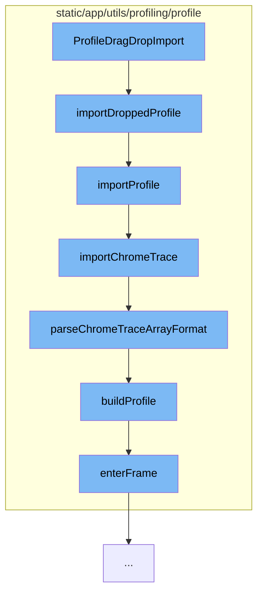

This document will cover the process of importing a profile in the Sentry application, which includes:

1. Dragging and dropping the profile
2. Reading the file as a string
3. Parsing the JSON file
4. Importing the profile based on its type
5. Building the profile from the parsed data.



<SwmSnippet path="/static/app/components/profiling/profileDragDropImport.tsx" line="1">

---

# Dragging and Dropping the Profile

The `ProfileDragDropImport` component in the `profileDragDropImport.tsx` file is the starting point of the profile import process. It handles the drag and drop event of the profile file and calls the `importDroppedProfile` function with the dropped file.

```tsx
import * as React from 'react';
import styled from '@emotion/styled';

import {t} from 'sentry/locale';
import {
  importDroppedProfile,
  ProfileGroup,
} from 'sentry/utils/profiling/profile/importProfile';

interface ProfileImportProps {
```

---

</SwmSnippet>

<SwmSnippet path="/static/app/utils/profiling/profile/importProfile.tsx" line="216">

---

# Reading the File as a String

The `importDroppedProfile` function reads the dropped file as a string. It then iterates over the parsers to parse the file contents into JSON.

```tsx
export async function importDroppedProfile(
  file: File,
  parsers: JSONParser[] = TRACE_JSON_PARSERS
): Promise<ProfileGroup> {
  const fileContents = await readFileAsString(file);

  for (const parser of parsers) {
    const [json] = parser(fileContents);

    if (json) {
      if (typeof json !== 'object' || json === null) {
        throw new TypeError('Input JSON is not an object');
      }

      return importProfile(json, file.name);
    }
  }

  throw new Error('Failed to parse input JSON');
}
```

---

</SwmSnippet>

<SwmSnippet path="/static/app/utils/profiling/profile/importProfile.tsx" line="32">

---

# Parsing the JSON File

The `importProfile` function is called with the parsed JSON and the file name. It determines the type of the profile (JS Self Profile, Chrome Trace, or Schema) and calls the corresponding import function.

```tsx
export function importProfile(
  input: Profiling.Schema | JSSelfProfiling.Trace | ChromeTrace.ProfileType,
  traceID: string
): ProfileGroup {
  const transaction = Sentry.startTransaction({
    op: 'import',
    name: 'profiles.import',
  });

  try {
    if (isJSProfile(input)) {
      // In some cases, the SDK may return transaction as undefined and we dont want to throw there.
      if (transaction) {
        transaction.setTag('profile.type', 'js-self-profile');
      }
      return importJSSelfProfile(input, traceID, {transaction});
    }

    if (isChromeTraceFormat(input)) {
      // In some cases, the SDK may return transaction as undefined and we dont want to throw there.
      if (transaction) {
```

---

</SwmSnippet>

<SwmSnippet path="/static/app/utils/profiling/profile/importProfile.tsx" line="94">

---

# Importing the Profile Based on its Type

The `importChromeTrace` function is called if the profile is of type Chrome Trace. It checks the format of the input and calls the `parseChromeTraceArrayFormat` function if the input is in array format.

```tsx
function importChromeTrace(
  input: ChromeTrace.ProfileType,
  traceID: string,
  options: ImportOptions
): ProfileGroup {
  if (isChromeTraceObjectFormat(input)) {
    throw new Error('Chrometrace object format is not yet supported');
  }

  if (isChromeTraceArrayFormat(input)) {
    return parseChromeTraceArrayFormat(input, traceID, options);
  }

  throw new Error('Failed to parse trace input format');
}
```

---

</SwmSnippet>

<SwmSnippet path="/static/app/utils/profiling/profile/chromeTraceProfile.tsx" line="254">

---

# Building the Profile from the Parsed Data

The `parseChromeTraceArrayFormat` function splits the events by process and trace ID, and builds the profile for each process and thread ID. The `buildProfile` function is called to build the profile from the events.

```tsx
export function parseChromeTraceArrayFormat(
  input: ChromeTrace.ArrayFormat,
  traceID: string,
  options?: ImportOptions
): ProfileGroup {
  const profiles: Profile[] = [];
  const eventsByProcessAndThreadID = splitEventsByProcessAndTraceId(input);

  for (const processId in eventsByProcessAndThreadID) {
    for (const threadId in eventsByProcessAndThreadID[processId]) {
      wrapWithSpan(
        options?.transaction,
        () =>
          profiles.push(
            buildProfile(
              processId,
              threadId,
              eventsByProcessAndThreadID[processId][threadId] ?? []
            )
          ),
        {
```

---

</SwmSnippet>

&nbsp;

*This is an auto-generated document by Swimm AI 🌊 and has not yet been verified by a human*

<SwmMeta version="3.0.0" repo-id="Z2l0aHViJTNBJTNBZGVtby1zZW50cnklM0ElM0Fzd2ltbWlv" repo-name="demo-sentry"><sup>Powered by [Swimm](/)</sup></SwmMeta>
