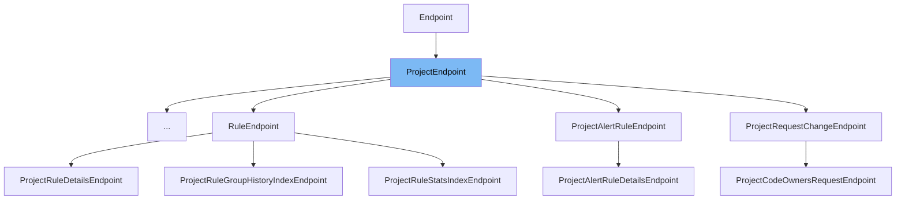

This document will cover the `ProjectEndpoint` class. We'll cover:

1. What is `ProjectEndpoint`
2. Variables and functions in `ProjectEndpoint`
3. Usage example of `ProjectEndpoint`.



# What is ProjectEndpoint

`ProjectEndpoint` is a class in the `sentry` project that provides a base for endpoints that require project-level permissions. It is used as a base class for various endpoints that need to perform operations on a project level.

<SwmSnippet path="/src/sentry/api/bases/project.py" line="92">

---

# Variables and functions

`permission_classes` is a variable that holds the permissions required for accessing the endpoint. In this case, it is set to `ProjectPermission`.

```python
class ProjectEndpoint(Endpoint):
    permission_classes = (ProjectPermission,)

```

---

</SwmSnippet>

<SwmSnippet path="/src/sentry/api/bases/project.py" line="95">

---

`convert_args` is a function that converts and validates the arguments passed in the request. It checks if the project exists and if it is visible, and then sets the project in the request.

```python
    def convert_args(self, request: Request, organization_slug, project_slug, *args, **kwargs):
        try:
            project = (
                Project.objects.filter(organization__slug=organization_slug, slug=project_slug)
                .select_related("organization")
                .prefetch_related("teams")
                .get()
            )
        except Project.DoesNotExist:
            try:
                # Project may have been renamed
                redirect = ProjectRedirect.objects.select_related("project")
                redirect = redirect.get(
                    organization__slug=organization_slug, redirect_slug=project_slug
                )
                # Without object permissions don't reveal the rename
                self.check_object_permissions(request, redirect.project)

                # get full path so that we keep query strings
                requested_url = request.get_full_path()
                new_url = requested_url.replace(
```

---

</SwmSnippet>

<SwmSnippet path="/src/sentry/api/bases/project.py" line="144">

---

`get_filter_params` is a function that gets the filter parameters from the request. It gets the start and end dates, and the environments from the request and returns them.

```python
    def get_filter_params(self, request: Request, project, date_filter_optional=False):
        """Similar to the version on the organization just for a single project."""
        # get the top level params -- projects, time range, and environment
        # from the request
        try:
            start, end = get_date_range_from_params(request.GET, optional=date_filter_optional)
        except InvalidParams as e:
            raise ProjectEventsError(str(e))

        environments = [env.name for env in get_environments(request, project.organization)]
        params = {"start": start, "end": end, "project_id": [project.id]}
        if environments:
            params["environment"] = environments

        return params
```

---

</SwmSnippet>

<SwmSnippet path="/src/sentry/api/bases/project.py" line="160">

---

`handle_exception` is a function that handles exceptions. If the exception is of type `ProjectMoved`, it returns a response with the new URL and slug of the project.

```python
    def handle_exception(self, request: Request, exc):
        if isinstance(exc, ProjectMoved):
            response = Response(
                {"slug": exc.detail["detail"]["extra"]["slug"], "detail": exc.detail["detail"]},
                status=exc.status_code,
            )
            response["Location"] = exc.detail["detail"]["extra"]["url"]
            return response
        return super().handle_exception(request, exc)
```

---

</SwmSnippet>

<SwmSnippet path="/src/sentry/api/endpoints/project_platforms.py" line="9">

---

# Usage example

`ProjectPlatformsEndpoint` is an example of a class that extends `ProjectEndpoint`. It overrides the `get` method to return a list of platforms for a given project.

```python
class ProjectPlatformsEndpoint(ProjectEndpoint):
    def get(self, request: Request, project) -> Response:
        queryset = ProjectPlatform.objects.filter(project_id=project.id)
        return Response(serialize(list(queryset), request.user))
```

---

</SwmSnippet>

&nbsp;

*This is an auto-generated document by Swimm AI 🌊 and has not yet been verified by a human*

<SwmMeta version="3.0.0" repo-id="Z2l0aHViJTNBJTNBZGVtby1zZW50cnklM0ElM0Fzd2ltbWlv" repo-name="demo-sentry"><sup>Powered by [Swimm](/)</sup></SwmMeta>
